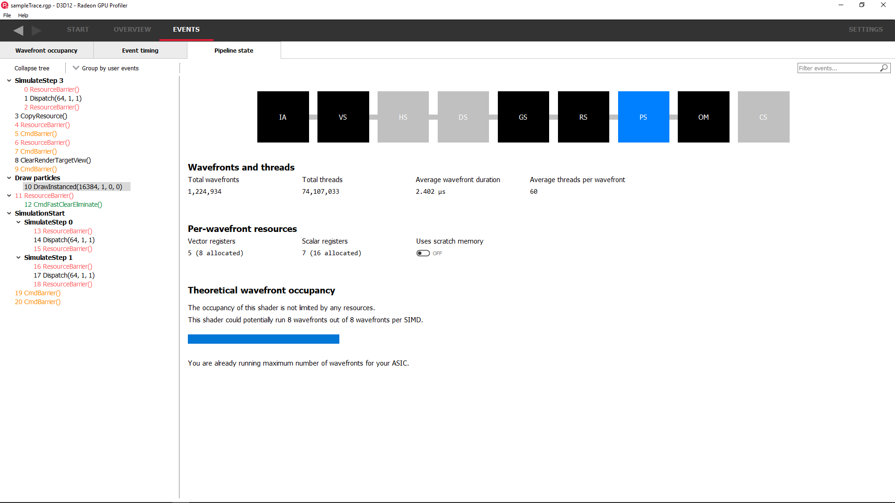
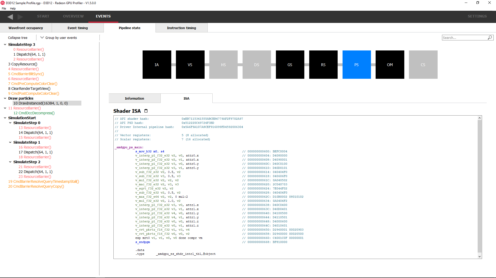
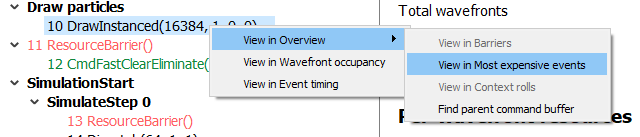

Pipeline state
--------------

The pipeline state window shows the render state information for
individual events by stage. In the example below the event is a
DirectX12 DrawInstanced call using a VS, GS, and a PS. Active stages are
rendered in black and can be selected, gray stages are inactive on this
draw and cannot be selected.

The user has selected the PS stage for viewing and it is rendered in
blue to indicate this. Below is a tabbed display to allow switching between
a summary of the wavefront activity for this draw and the per-wavefront
register resources used by the shader, and the shader ISA disassembly.

The register values indicate the number of registers that the shader is
using. The value in parentheses is the number of registers that have
been allocated for the shader.

From this information and knowledge about the GCN architecture we can
calculate the theoretical maximum wavefront occupancy for the pixel
shader. In this case the maximum of 8 wavefronts per SIMD are
theoretically possible, but may be limited by other factors.

Switching to the ISA tab will show the shader code at the ISA level. At the
top, some general information will be given, such as the number of registers
used and allocated and the various hash values for this event.

**Grouping modes**

The grouping modes are the same as in the Event timing pane.

The user can also right-click on any of the events and navigate to the
Wavefront occupancy or Event timing panes, as well as the Barriers, Most
expensive events, Context rolls, Render/depth targets, and Pipelines panes
within the Overview tab.  The user can view the selected event in these panes,
as well as in the side panels.  Below is a screenshot of what the right-click
context menu looks like.

**Note:** The Output Merger stage of a DirectX 12 application may report
the LogicOp as D3D12\_LOGIC\_OP\_COPY, even though it is set in an
application as D3D12\_LOGIC\_OP\_NOOP. These 2 operations are
semantically the same if blending is enabled. A no-op indicates that no
transform of the data is to be performed so the output is the same as
the source.

**Note:** For OpenCL applications, the pipeline state does not show the
graphics specific stages since they are not active during compute dispatches.
