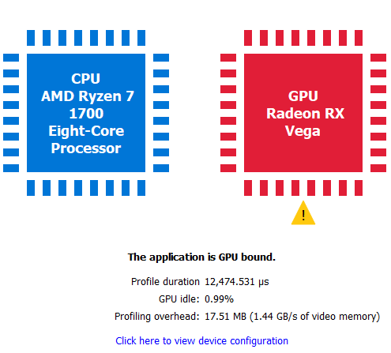

Profile summary (OpenCL)
------------------------

This window describes the structure of a profile from a number of
different perspectives.

.. image:: media_rgp/RGP_ProfileSummary_1.png

The System activity section displays a system-level view of when command buffers were submitted to the GPU.
Speaking in general terms, all profiles contain two types of data: command buffer
timing data and SQTT timing data. This pane displays the former, and the
rest of RGP displays the latter. For OpenCL applications multiple dispatches that can be submitted
without host synchronization are grouped into command buffers automatically by the OpenCL driver.
This grouping reduces submission overhead.

Along the top, we find a series of controls:

-  **Workload views:** Provide twelve different ways to view the same data:

   -  **Sequential**: An alternate view which shows data linearly as
      opposed to stacked. The dark right-most portion of command buffers
      and submits indicates execution time on the GPU.

   -  **GPU only**: A flat view of the data which represents solely GPU
      work. This helps visualize parallelism among all GPU queues.

-  **CPU submission markers:** Draw vertical lines to help visualize
   when the CPU issued certain types of workloads to the GPU.

-  **Zoom controls:** Consistent with the rest of the tool, these allow
   users to drill down into points of interest.  See the section entitled
   :ref:`Zoom Controls<zoom_controls>` for more information.

In the middle, we find the actual view. Each queue applicable to OpenCL (Compute, Copy)
gets its own section. Note that command buffers are visualized using two shades of the
same color. The lighter shade represents time spent prior to reaching the GPU, and
the darker shade represents actual execution.

Please note that the view is interactive, making it possible for users to
select and highlight command buffers, sync objects, and submission
points.

Along the bottom, we find information about user selections:

-  **Submit time:** Specifies when work was issued by the CPU

-  **Submit duration:** Specifies the full duration of the submit

-  **Enqueue duration:** Specifies how long the work was queued before
   beginning on the GPU

-  **GPU duration:** Specifies how long the GPU took to execute it.

   Below the queue timings view we find the following summary:

..

This shows an interpretation of queue timings data to determine which
processor is the bottleneck. By default, if the GPU is idle more than
5% of the time then the profile is considered to be CPU-bound. This
percentage may be adjusted in RGP settings.

Please note that the value displayed for **Profile duration** is sourced
from SQTT data. In other words, it is based on duration and shader clock
frequency used in other RGP panes such as Wavefront occupancy.

The **Profiling overhead** shows the amount of SQTT data that was written
to video memory by the hardware while gathering the RGP profile. The
profiling overhead is also expressed in terms of memory bandwidth used
to write the SQTT data.

The **Event statistics** pie chart and table show the event counts
colored by different OpenCL APIs. In the example below, there are 89
clEnqueueNDRangeKernel calls and 7 clEnqueueFillBuffer calls. The meaning
of CmdBarrier() is explained in the Barriers section.

.. image:: media_rgp/RGP_ProfileSummary_3.png
..
