Events Windows
==============

This section of RGP is where users will perform most analysis at the
event level. An RGP event is simply an API call within a command buffer
that was issued by either the application or the driver.

The event windows allow filtering of the event string. The event string
consists of the event index, the API call and parameters. Only events
containing the filter string will be displayed. This works for the whole
event string, not just the event index. For example, if the filter string
is '8', event 31 may be displayed if any of its parameters contain '8'.

Wavefront occupancy
-------------------

This section presents users with an interactive timeline that shows GPU
utilization, GPU counter data, and all events in the profile.

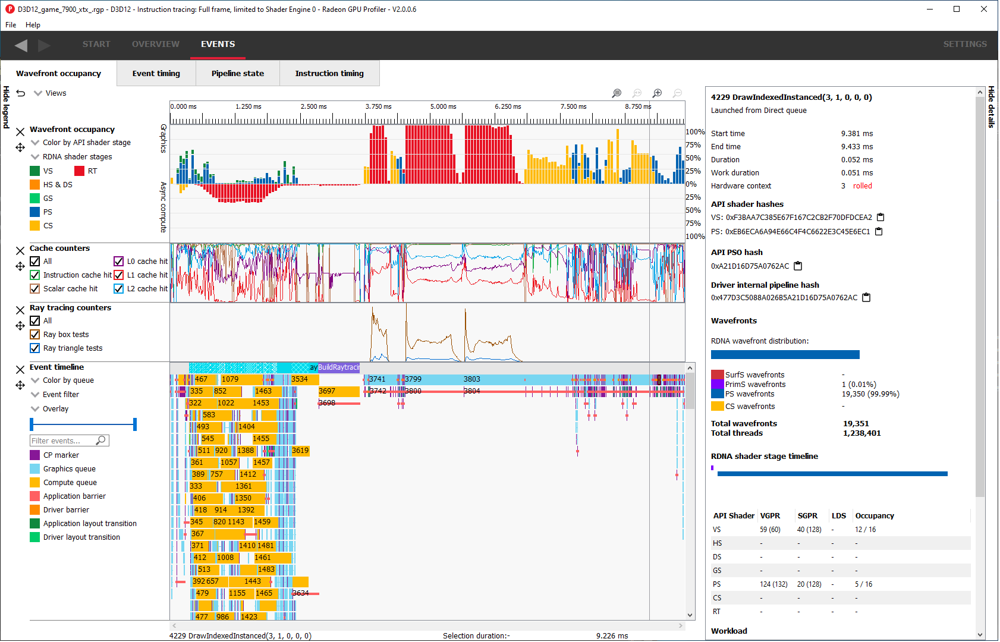

There are five components, the Legend side panel, the Wavefront timeline view, one or more Counter views,
the Events timeline view, and the Details side panel.

Note that the counter views are only available if the "Collect counters" checkbox is enabled in RDP.

\ **Legend side panel**

Pressing \ **Hide Legend** on the top left will hide the side panel with
visualization controls and a color coded legend for each view. 
The contents of each individual legend depends on its view.

\ **Wavefront timeline view**

This section shows how many wavefronts were in flight. All wavefronts
are grouped into buckets which are represented by vertical bars. The top
half shows wavefronts on the graphics queue, and the bottom half shows
wavefronts on the async compute queue.

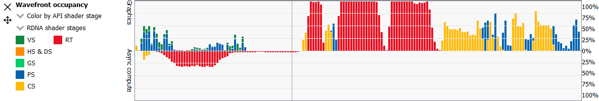

Users may examine regions by selecting ranges within the graph and using
the zoom buttons on the top right of the tab. Users may also hover over this view
and use mouse wheel to zoom and center in on a particular spot. A region
of wavefronts can be selected by using the mouse button to drag over the
desired region as shown below.

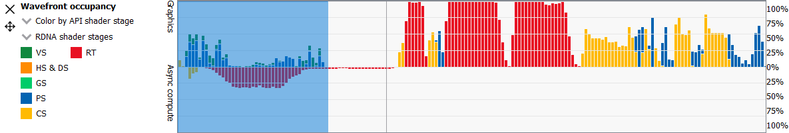

You can zoom into the region by selecting Ctrl + Z, or by clicking on
"Zoom to selection" (result shown below).

.. image:: media_rgp/rgp_wavefront_occupancy_4.png

You can also drag the graph if you are zoomed in. Hold down the space
bar first, then hold the mouse button down. The graph will now move with
the mouse.

Users may use the Color by combo-box on the top of the Wavefront occupancy
legend to visualize wavefronts in different ways:

-  **Color by API stage.** Default. Shows which wavefronts
   correspond to which Vulkan/DX12 pipeline stage.

-  **Color by RDNA (or GCN) shader stage.** Shows which wavefronts correspond to which
   RDNA/GCN pipeline stage.

-  **Color by hardware context.** Shows which hardware context (0-7) the
   wavefronts ran on. This can be useful to visualize the amount of
   context rolls that occurred.

-  **Color by limiting factor.** Shows the limiting factor for the occupancy 
   of that shader.

-  **Color by shader engine.** Shows which shader engine the wavefronts
   ran on.

-  **Color by event.** Shows which wavefronts correspond to which event
   of the profile. Each event is assigned a unique color.

-  **Color by pass.** Groups wavefronts into different passes depending
   on which render target or attachment type (color, depth-only,
   compute, raytrace). These four types are assigned a base color, and
   each pass within each type is assigned a different shade of the
   base color. This can be useful to visualize when the application
   attempted to render different portions of a scene.

-  **Color by API PSO** Shows which wavefronts correspond to which
   shader, based on the shader's API PSO hash value.

-  **Color by ray tracing** Shows which wavefronts correspond to shaders
   which perform ray tracing. Wavefronts from traditional ray tracing events as
   well as wavefronts from shaders with inlined ray tracing will be shown using
   the specified ray tracing color. All other waves will be shown as grey.

-  **Color by indirect command** Shows which wavefronts correspond to which
   indirect commands of the profile. Each indirect command is assigned a unique
   color. All other waves will be shown as grey.

Color modes can be synchronized across the Wavefront occupancy and Event timing
panes. To do this, simply hold down the Ctrl key when selecting a mode from any
Color by combo box. The selected color mode will be used for the Wavefront
timeline and the Event timeline in the Wavefront occupancy pane as well as for
the Event timing pane.

Beneath the Color by combo-box there is another combo-box to help visualize
the occupancy of certain RDNA or GCN pipeline stages. Beneath the pipeline stage combo-box is
a color coded legend which serve as color reminders. Note these
colors can be customized within Settings.

The RGP wavefront occupancy for OpenCL or HIP has only compute in the wavefront occupancy.
This is because compute APIs such as OpenCL or HIP only dispatch compute shader waves.
For this same reason, a number of the coloring options such as hardware context
and RDNA/GCN stages are not applicable for OpenCL or HIP.

.. image:: media_rgp/rgp_wavefront_occupancy_opencl.png

\ **Cache counters**

This section visualizes the cache counter data collected while profiling.
Cache counter data is only available on Radeon RX 5000 series and newer
GPUs. While profiling, counter data is sampled at a fixed rate, roughly
one sample every 4096 clock cycles.

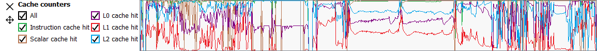

Each counter is presented as a line graph that shows how the value of that
particular counter varies through the frame. By correlating the counter data
with both wavefront occupancy and the events in the frame, you can get a better
understanding of how well different parts of the frame utilize the various GPU
caches.

There are currently five cache counters collected while profiling. Each cache
counter reports a hit percentage, which is the percentage of requests that hit
data already in the cache.

-  **Instruction cache hit** The percentage of read requests made that hit the data
   in the Instruction cache. The Instruction cache supplies shader code to an
   executing shader. Each request is 64 bytes in size.

- **Scalar cache hit** The percentage of read requests made from executing shader
  code that hit the data in the Scalar cache. The Scalar cache contains data that
  does not vary in each thread across the wavefront. Each request is 64 bytes in
  size.

- **L0 cache hit** The percentage of read requests that hit the data in the L0
  cache. The L0 cache contains vector data, which is data that may vary in each
  thread across the wavefront. Each request is 128 bytes in size.

- **L1 cache hit** The percentage of read or write requests that hit the data in
  the L1 cache. The L1 cache is shared across all WGPs in a single shader engine.
  Each request is 128 bytes in size.

- **L2 cache hit** The percentage of read or write requests that hit the data in
  the L2 cache. The L2 cache is shared by many blocks across the GPU, including the
  Command Processor, Geometry Engine, all WGPs, all Render Backends, and others.
  Each request is 128 bytes in size.

The description of each counter can be viewed by hovering the mouse over the
counter name in the legend left of the counter graph.

The sizes of the L0, L1 and L2 caches, which may vary depending on the GPU, are
reported in the System information pane in the Overview tab.

Users may use the legend on the left to choose which counters to
include in the graph.

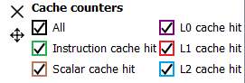

Each counter key in the legend is a tri-state button. Pressing the button cycles
through 3 states: visible, visible and selected, and not visible.

Selecting a counter will cause the area under the line for the selected counter to be filled in. 
This can be done for one or more counters simultaneously. In this image, the user has clicked the color boxes
for both the L1 and L2 cache hit counters.

A tooltip will be shown when the mouse hovers over the counter graphs. This tooltip
shows the counter value of the closest point to the cursor, as well as the number
of **Requests**, **Hits**, and **Misses** associated with that point. When a region
is selected in the wavefront occupancy view, the tooltip will show aggregated data
representing the selected region. Pressing the Ctrl key on the keyboard will
temporarily hide the tooltip.

.. image:: media_rgp/rgp_wavefront_occupancy_counters_3.png

Collection of cache counters can be disabled when capturing a profile in the
Radeon Developer Panel. In this case, the cache counter graphs will not be visible.

For a better understanding of the cache memory hierarchy for RDNA hardware, please
refer to the following visual representation. This is taken from the RDNA architecture
presentation found on gpuopen.com.

.. image:: media_rgp/rgp_rdna_cache_hierarchy.png

\ **Ray tracing counters**

When profiling a game that uses ray tracing, a second row of counter data will show
ray tracing counter values. These counters are only available on Radeon RX 6000
series and newer GPUs.

There are currently two ray tracing counters collected while profiling. These counters
provide information on the number of ray tests performed by the frame.

-  **Ray box tests** The number of ray box intersection tests.

- **Ray triangle tests** The number of ray triangle intersection tests.

The user interaction for the ray tracing counters is identical to the user interaction
for the cache counters.

\ **Events timeline view**

This section shows all events in your profile. This includes both
application-issued and driver-issued submissions. Each event can consist
of one or more active shader stages and these are shown with rectangular
blocks. The longer the block, the longer the shader took to execute. If
there is more than 1 shader active, then each shader stage is connected
with a thin line to indicate they belong to the same event. This view
just shows actual shader work; it doesn't show when the event was
submitted.

.. image:: media_rgp/rgp_wavefront_occupancy_5.png

Users may single-click on individual events to see detailed information
on the details side panel described below. Zooming into this graph is done by
selecting the desired region in the wavefront graph above. Additionally,
zooming in on a single event can be done by selecting the event and
clicking on ‘Zoom to selection’. More information can be found under
the :ref:`Zoom Controls<zoom_controls>` section.

Users may use the **Color by** combo-box on the left to visualize
events in different ways:

-  **Color by queue.** Default. Shows which events were submitted to
   graphics or async compute queues. In addition, the CP marker is shown
   in a unique color, as well as the barriers and layout transitions so
   they can be easily distinguished. Note that barrier and layout transitions
   originating from the driver are colored differently to those from the
   application, and this is shown in the legend below the timeline view.

-  **Color by hardware context.** Shows which events ran on which
   context. This can be useful to visualize the amount of context rolls
   that occurred.

-  **Color by context rolls.** Shows which events had their context rolled 
   since the previous event.

-  **Color by limiting factor.** Shows the largest limiting factor for the 
   occupancy for any shader in that event.

-  **Color by event.** Will show each event in a unique color.

-  **Color by pass.** Groups events into different passes depending on
   which render target or attachment type (color, depth-only, compute).
   These three types are assigned a base color, and each pass within
   each type is assigned a different shade of the base color. This can
   be useful to visualize when the application attempted to render
   different portions of a scene.

-  **Color by command buffer.** Shows each event in a color associated
   with its command buffer, so making it easy to see events are in the same
   command buffer.

-  **Color by user events.** Will colorize each event depending on which
   user event it is surrounded by.

-  **Color by API PSO** will color events by their API PSO hash values.

-  **Color by instruction timing** will only colorize events which contain
   detailed instruction timing information. All other events will be greyed
   out.

-  **Color by ray tracing** will only colorize raytracing events. All other
   events will be greyed out.

-  **Color by indirect command** Will colorize each event based on which 
   indirect command the event came from. Events launched from the same
   indirect command get the same unique color. All other events will be greyed out.

Beneath the **Color by** combo-box is the **Event filter** combo-box.
This allows the user to visualize only certain types of events on the timeline.
For example, the user can select to see draws, dispatches, clears, barriers,
layout transitions, copies, resolves, events containing instruction trace data,
and raytracing events. There is also an option to switch the CP marker on or off.
Switching the CP marker off will just show the active shader blocks.

Beneath the **Event filter** combo-box is the **Overlay** combo-box. This allows
the user to select which fixed "Overlays" to show in the timeline. Overlays are
shown in one or more rows at the top of the timeline. They are useful to
visualize the various states for each event. More than one Overlay can be
enabled. The following Overlays are supported:

-  **All.** All available overlays will be shown

-  **User events.** Default. Displays all user events, if the captured frame
   contains any such events. The user events are stacked according to the
   nesting level, and a cross pattern indicates multiple overlapping user
   event regions. Moving the mouse cursor over one of the user events will
   show a tool-tip listing all user events under the cursor including timing
   information for each user event interval.

-  **Hardware context.** Displays all hardware contexts. Each hardware
   context has its own row. This allows the user to visualize the lifetime
   of each context.

-  **Command buffer.** Displays all command buffers. The command buffers are
   stacked according to the time of submission, so that if one command
   buffer is submitted before a previous command buffer has completed, the
   new command buffer will be stacked below the previous command buffer.

-  **Render target.** Displays all render targets. If more than one render
   target is active for a given time period, then the active render targets
   will be stacked. This allows the user to visualize the usage of render
   targets over the duration of the frame.

The event duration percentile filter allows users to only see events
whose durations fall within a certain percentile. For example, selecting
the rightmost-region of the slider will highlight the most expensive
events. When using the slider buttons on the duration percentile filter,
a tooltip will display the time duration range that corresponds to the
selected percentiles. One will also find a textbox to filter the timeline
by event name.

.. image:: media_rgp/rgp_wavefront_occupancy_7.png

The same zooming and dragging that is available on the wavefront
timeline view is also available here.

Lastly, there are colored legends on the bottom which serve as color
reminders. Note these colors can be customized within Settings.

\ **Details side panel**

Pressing \ **Hide Details** on the top right will hide the side panel with
more in-depth information. The contents of this panel will change,
depending on what the user last selected. If a single event was selected
in the Events timeline the details side panel will look like below:

.. image:: media_rgp/rgp_details_panel_1.png

The Details side panel for a single event contains the following data:

*  The event’s API call name

*  The queue it was launched on

*  User event hierarchy (if present)

*  Start, End, and Duration timings

*  Hardware context and if it was rolled

*  The API shader hashes for all shaders used by the event

*  The API PSO hash for the event

*  The Driver internal pipeline hash for the event

*  Colored bar showing wavefront distribution per RDNA or GCN hardware stage

*  List of RDNA or GCN hardware stages and wavefront counts

*  Total wavefront count

*  Total threads

*  RDNA or GCN shader timeline graphic showing active stages and duration

*  A table showing resource usage for each API shader stage:

   * The VGPR and SGPR columns refer to the vector and scalar general
     purpose registers being used, and the number of registers that have
     been allocated shown in parentheses.

   * The LDS column refers to the amount of Local Data Store that each
     shader stage is using, reported in bytes.

   * The Occupancy column refers to the Theoretical wavefront occupancy
     for the shader. This is reported 'A / B', where A is the number of
     wavefronts that can be run and 'B' is the maximum number of wavefronts
     supported by the hardware.

   * Tooltips explaining the data are available by hovering the mouse over
     the table header.

*  The :ref:`API Shader Stage Control <api_shader_stage_control>` indicates
   which shader stages are active for the selected event.

*  Primitive, vertex, control point, and pixel counts

The ‘Duration’ shows the time from the start of the first shader to the
end of the last shader, including any space between shaders where no
actual work is done (denoted by a line connecting the shader ‘blocks’).
The ‘Work duration’ only shows the time when the shaders are actually
doing work. This is the sum of all the shader blocks, ignoring the
connecting lines where no work is being done. If there is overlap
between shaders, the overlap time is only accounted for once. If all
shaders are overlapping, then the duration will be the same as the work
duration.

If the user selects a range by clicking and dragging the mouse, the
details side panel shows a summary of all the wavefront data contained in
the selected region as shown below:

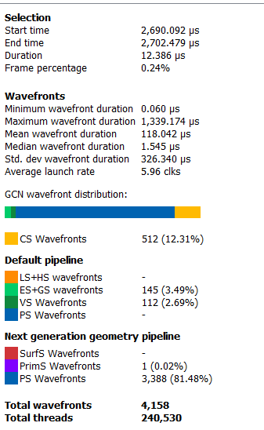

If the user selects a barrier, the details side panel will show information
relating to the barrier, such as the barrier flags and any layout
transitions associated with this barrier. It will also show the barrier
type (whether it came from the application or the driver). Note that the
barrier type is dependent on whether the video driver has support for
this feature. If not, then it will be indicated as 'N/A'. An example of
a user-inserted barrier is shown below:

.. image:: media_rgp/rgp_details_panel_3.png

If the driver needed to insert a barrier, a detailed reason why this barrier
was inserted is also displayed, as shown below:

.. image:: media_rgp/rgp_details_panel_5.png

If the user selects a layout transition, the details side panel will show
information relating to the layout transition as shown below:

.. image:: media_rgp/rgp_details_panel_4.png

The user can also right-click on any event or overlay in the Events
timeline view and navigate to the Event timing, Pipeline state,
or Instruction timing pane, or to one of the panes in the Overview tab.
The selected event or overlay will be shown in the chosen view.

In addition, the user can zoom into an event using the "Zoom to
selection" option from this context menu.

Below is a screenshot of what the right-click context menu looks like.

.. image:: media_rgp/rgp_wavefront_occupancy_6.png

.. rubric:: Wavefront occupancy customization

The Wavefront occupancy section of RGP is customizable. Users can hide
and reorder the vertical position of views. Users can also resize the height of the views.

To hide a view, simply press the X button next to the view.

To show a hidden view, use the Views combo box in the top left of the tab.

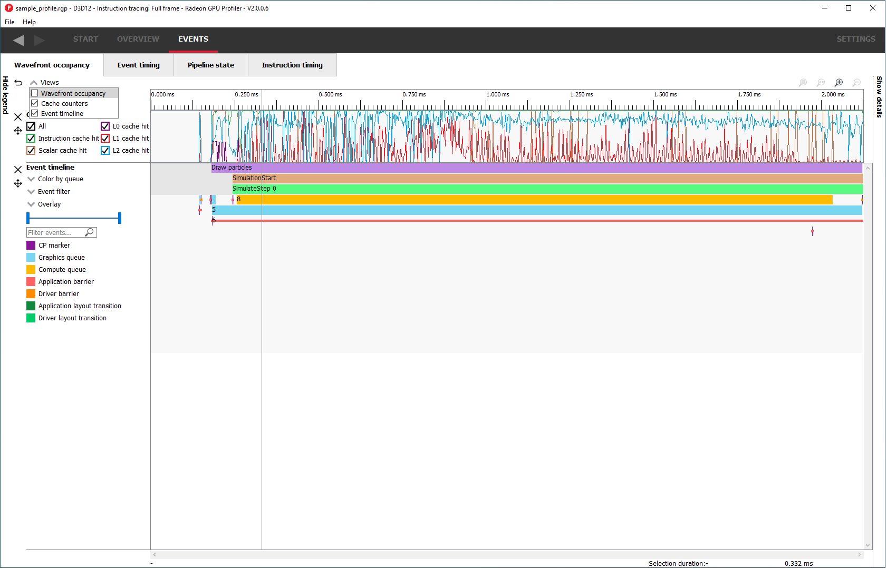

The Views combo box can also be used to hide views.

To reorder a view's vertical position within the tab, you can drag the view you
want to reorder and drop it into a new position.

To do this, move the mouse above the drag button next to the view you
want to move. A dashed blue rectangle will appear around the view to
indicate which view will be dragged.

Press, and hold, the drag button. A solid blue line will appear to
indicate what the new position of the view will be after letting
go of the mouse.

The view will be dropped into its new position and remain there
until you move it again. The Views combo box will be updated to
reflect its new position.

The views can also be resized by clicking and dragging the bottom of the view.

The customization of the Wavefront occupancy section is treated like a
normal RGP setting and persists upon closing and reopening RGP.

To return the Wavefront occupancy customization to its original state,
press the Restore to default button in the top left of the tab.

Note that the visibility state of the legends side panel is also saved.

Event timing
------------

The event timing window shows a list of events and their corresponding
timings. The tree view in the left-hand column shows each event name and
its unique index, starting at 0, and are listed in sequential order.
Events can be ordered into groups, and group categories are shown in
bold text.

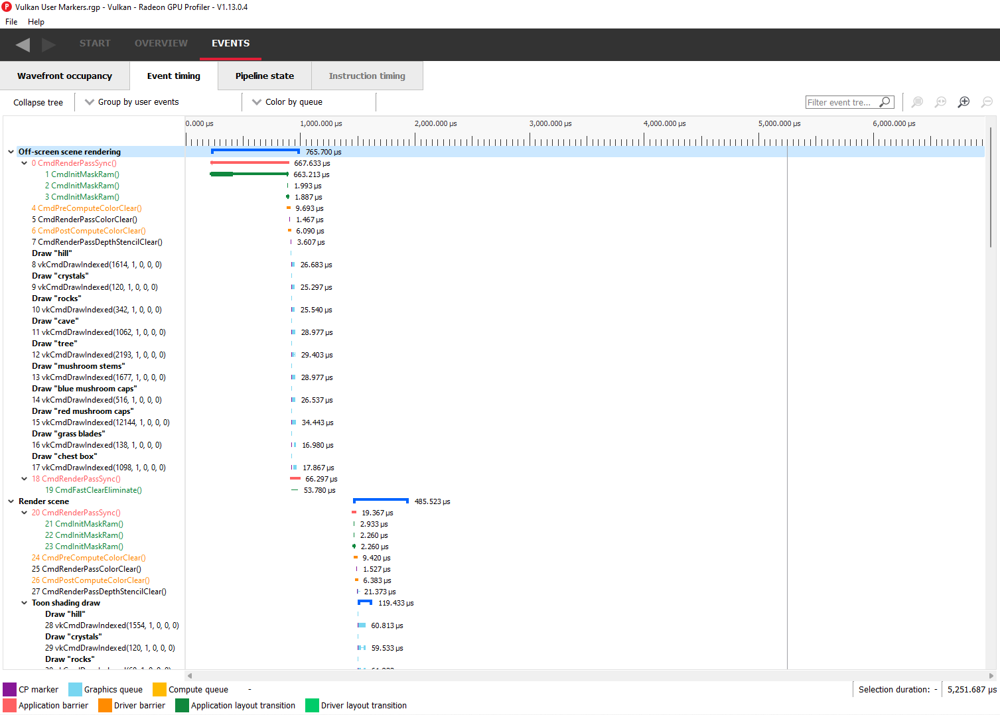

The pane to the right of the tree view shows a graphical representation
of the duration for each event. The darker blue span to the right of
each tree node shows the duration of all the events in that node.

In the graphic for each event (shown in light blue above) the first
small block at the left is the CP marker, indicating when the event was
issued. This is followed, some time later, by actual work done by the
shaders. The delay between the CP marker and the start of actual work
may indicate bottlenecks in the application. One of the shaders may be
waiting for a resource which is currently being used by another wave in
flight and cannot start until it obtains that resource. The time when
the first shader started work and the last shader finished work is the
number indicated in this column. Each shader stage is represented by a
rectangular block. The longer the block, the longer the shader took to
execute. Shaders are linked by a solid line to show that they are
connected in the pipeline. For groups, a dark line spans all events
within the group, showing the time taken for that group to complete
work.

Zoom settings on this pane are similar to the Wavefront occupancy pane.
More information can be found under the :ref:`Zoom Controls<zoom_controls>`
section.

\ **Grouping modes**

The events can be grouped together. Normally these groups don't affect
the event ordering but sometimes can (sort by state bucket).

-  **Group by pass** will show events depending on the render
   target or attachment type (color, depth-only, compute, raytrace).

-  **Group by hardware context** will group events by their hardware
   context, making it easy to see which events caused the context to
   change.

-  **Group by state bucket** **(unsorted)** will order the events by
   state bucket but won't sort the state buckets by duration.
   Theoretically, all events in a state bucket use the same shaders. The
   duration of a state bucket is represented by the dark blue line
   corresponding to the state bucket group text.

-  **Group by state bucket** **(serialized)** will take all the event
   timings within the group and sum the total time that the shaders were
   busy, ignoring all empty space between events. This has the effect of
   serializing the shader work and doesn't take into account that some
   shaders will be executing in parallel. This is used to highlight when
   you have a lot of small shaders whose cumulative work can be
   extensive. As an example, if you have 2 shaders which start at the
   same time and one takes 2000 clks and another takes 10000 clks, the
   total duration would be 12000 clks.

-  **Group by state bucket (overlapped)** takes into account the
   parallelism of the shader execution so will highlight shaders which
   take a long time to execute. Using the same example above, since both
   shaders start together, the total duration in this case would be
   10000 clks.

-  **Group by command buffer** will group events depending on which
   command buffer they are on.

-  **Group by user events** will group the events depending on which
   user event(s) they are surrounded by.

-  **Group by PSO** will group events by their API PSO hash values.

The default grouping mode is by user event if user events are present in
the profile. Otherwise the default will be to group by pass.

Note that grouping by hardware context or command buffer will group
events by queue first. Grouping by pass or user event will
chronologically group events irrespective of which queue they originated
from. Grouping by state bucket just shows events in the graphics queue.
Grouping by hardware context is shown below:

Note that when profiling an application that uses indirect drawing via the
**ExecuteIndirect** D3D12 call, the event tree view will logically group the
individual draw calls under the same parent node. This can be seen below where
the individidual **DrawInstanced** events are grouped under a parent node with
the same name:

**Color modes**

The events can be rendered using different color schemes in the same manner
as in the Wavefront occupancy view.

The user can also right-click on any of the events and navigate to
Wavefront occupancy or Pipeline state panes, as well as Barriers, Most
expensive events and Context rolls panes within the Overview tab, and view
the selected event in these panes, as well as in the side panels.

**Wavefront occupancy and event timing window synchronization**

Zooming of the time scale and horizontal panning of the Wavefront occupancy
view and Event timing view can be synchronized or adjusted independently. More
information on synchronization can be found under the
:ref:`Zoom Synchronization heading <zoom_synchronization>`

The anatomy of an event
-----------------------
Two examples of typical draw call events are shown below:

.. image:: media_rgp/rgp_event_1.png
.. image:: media_rgp/rgp_event_2.png

**A** shows the CP marker. This is the point the command processor in the
GPU issues work to be done. It is then queued up until the GPU can process
the workload.

**B** shows the work being done by the various shader stages. The gap between
the CP marker and the start of **B** indicates that the GPU didn't start on
the workload straight away and was busy doing other things, for example, previous
draw calls.

**C** shows any fixed-function work that needs doing after the shaders have
finished executing. This occurs when a draw call is doing depth-only rendering.
The fixed function work shown is the primitive assembly and scan conversion
of the vertices shaded by the vertex shader.

Users may also obtain information about an event's parent command buffer
by right-clicking on an event. This will bring up a context menu which
contains a menu item to find the event's parent command buffer. Selecting
this menu item will navigate to the Frame summary pane and set focus on the
selected event's parent command buffer. Once here, users can obtain valuable
system-level insight about the surrounding context for the event in question.

Compute dispatches have a simpler structure. A sample compute event is shown below.

.. image:: media_rgp/rgp_compute_event.png

In a compute event, only compute shader waves are launched.
Also, compute dispatches do not have any fixed function work after the shader
work is finished.

Pipeline state
--------------

The pipeline state window shows the render state information for
individual events by stage. In the example below the event is a
DirectX12 DrawInstanced call using a VS, GS, and a PS. Active stages are
rendered in black and can be selected, grey stages are inactive on this
draw and cannot be selected.

The user has selected the PS stage for viewing and it is rendered in
blue to indicate this. Below is a tabbed display to allow switching between
a summary of the wavefront activity for this draw and the per-wavefront
register resources used by the shader, and the shader ISA disassembly.

The register values indicate the number of registers that the shader is
using. The value in parentheses is the number of registers that have
been allocated for the shader.

From this information and knowledge about the RDNA or GCN architecture we
can calculate the theoretical maximum wavefront occupancy for the pixel
shader. In this case the maximum of 8 wavefronts per SIMD are
theoretically possible, but may be limited by other factors.

Switching to the ISA tab will show the shader code at the ISA level. At the
top, some general information will be given, such as the number of registers
used and allocated and the various hash values for this event.

.. image:: media_rgp/rgp_pipeline_state_3.png

More information on the ISA tab can be found under the :ref:`ISA View <isa_view>` section.

**Grouping modes**

The grouping modes are the same as in the Event timing pane.

The user can also right-click on any of the events and navigate to the
Wavefront occupancy or Event timing panes, as well as the Barriers, Most
expensive events, Context rolls, Render/depth targets, and Pipelines panes
within the Overview tab. The user can view the selected event in these panes,
as well as in the side panels. Below is a screenshot of what the right-click
context menu looks like.

.. image:: media_rgp/rgp_pipeline_state_2.png

**Note:** The Output Merger stage of a DirectX 12 application may report
the LogicOp as D3D12\_LOGIC\_OP\_COPY, even though it is set in an
application as D3D12\_LOGIC\_OP\_NOOP. These 2 operations are
semantically the same if blending is enabled. A no-op indicates that no
transform of the data is to be performed so the output is the same as
the source.

**Note:** For OpenCL or HIP applications, the pipeline state does not show the
graphics specific stages since they are not active during compute dispatches.

\ **Raytracing events**

For raytracing events, there are two possible compilation modes: **Unified**
and **Indirect**. The AMD driver and compiler will choose the mode for each
raytracing event. The compilation mode chosen for a particular event will be
evident in the event name: events which use the Unified mode will have a
**<Unified>** suffix, while events which use the Indirect mode will have an
**<Indirect>** suffix. In the case of DirectX Raytracing, the full event names
are **DispatchRays<Unified>** or **ExecuteIndirect<Rays><Unified>** and
**DispatchRays<Indirect>** or **ExecuteIndirect<Rays><Indirect>**. For Vulkan,
the full event names are **vkCmdTraceRaysKHR<Unified>** or **vkCmdTraceRaysIndirectKHR<Unified>**
and **vkCmdTraceRaysKHR<Indirect>** or **vkCmdTraceRaysIndirectKHR<Indirect>**.
The main difference between these two compilation modes has to do with how the
individual shaders in the raytracing pipeline are compiled. In Unified mode,
the individual shaders are inlined into a single shader, resulting in a
single set of ISA. In Indirect mode, the individual shaders are compiled
separately, and the functions in each shader end up as their own set of ISA
instructions. Function call instructions are generated in the ISA to allow one
function to call another. For the indirect mode, the overall occupancy of the
event is affected by the resource usage of all shaders, even those that have
a zero call count. Even if the shader function that uses the highest number of
vector registers is not actually executed, the fact that it uses the most
registers means that it could be the reason for lower overall occupancy for the
event.

When selecting a raytracing event that uses the indirect compilation mode,
the Pipeline state pane will look a bit different.

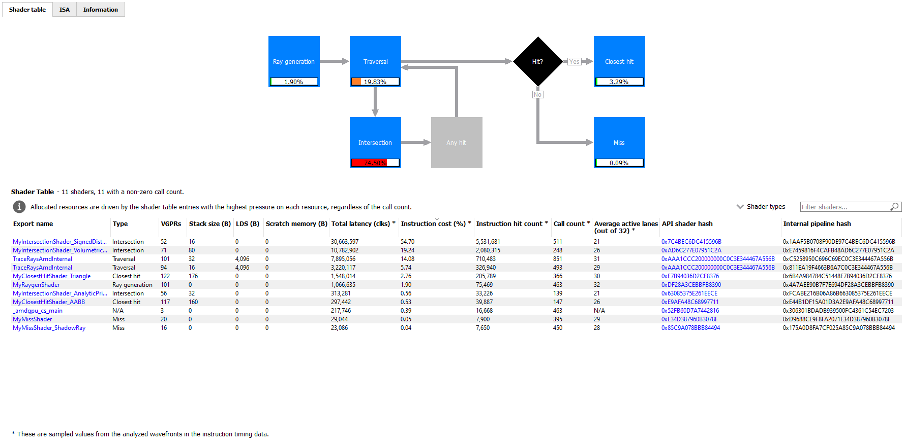

There are three tabs available: **Shader table**, **ISA**, and **Information**.

The Shader table tab contains two main parts: an interactive flowchart
representing the raytracing pipeline and a table containing the list of
shader functions. Each shader function has an associated type. This type can be
**Ray generation**, **Traversal**, **Intersection**, **Any hit**,
**Closest hit**, **Miss** or **Callable**. The shader table lists each shader
function, its type, resource usage statistics, instruction timing statistics,
and both the API shader hash and the Internal pipeline hash. You can filter the
table by shader type using the **Shader types** combo box. You can also filter
the table by Export name using the **Filter shaders...** field. If you click on
any hyperlinked text in the shader table, it will navigate to the ISA tab and
show the ISA for the selected shader function. You can also use the right-click
context menu to navigate to either the ISA tab or to the Instruction timing
view. The context menu also allows you to analyze the pipeline binary for that
shader function in the Radeon GPU Analyzer.

If the **Enable shader instrumentation** checkbox was checked in Radeon
Developer Panel when the profile was captured, the table will also include
a column showing the number of average active lanes for each shader function,
across all calls made to the function. The number of active lanes is sampled
near the beginning of execution for each shader, giving an indication of the
amount of thread divergence in the entire raytracing pipeline. When hovering
the mouse over a cell in this column, a tooltip will be displayed to show the
distribution of the number of active lanes for individual calls. This can
give an indication of how many different execution paths through the pipeline
were taken at runtime. Please note that enabling this setting in the Radeon
Developer Panel may cause additional runtime overhead for the application that
is being profiled.

.. image:: media_rgp/rgp_pipeline_state_raytracing_4.png

The flowchart gives a visual representation of the raytracing pipeline, as well as
shows the relative percent cost of the shader functions in each stage. The percentage
bars are color-coded as follows: Red indicates that a stage contains shaders that
represent over 50% of the total cost for the event. Orange indicates that a stage
contains shaders whose total cost is in the range of 10% to 50%, and green indicates
that a stage's total cost is less than 10%.

The flowchart also provides a quick way to filter the shader table. When a stage is
clicked, the table will only show shader functions from that stage. You can filter
more than one stage by holding down the CTRL key and clicking additional stages.
Selected stages are shown as blue, unselected stages are shown as black, and
disabled stages (stages with no corresponding shader functions) are shown as grey.
You can remove all filters by clicking in any whitespace area in the flowchart.

Both the table and the flowchart will contain a full set of data for profiles
captured with Instruction tracing enabled. For profiles captured without Instruction
tracing, several columns in the table will show **N/A** instead of actual data.
Similarly, the flowchart will not show the percent bars for profiles captured without
Instruction tracing enabled.

The following screenshot shows how this view will look when Instruction timing data
is not available.

The ISA tab will also look different for raytracing events that use the indirect
compilation mode. In addition to the normal ISA listing, there is also a drop down
combo box that allows for viewing the ISA from a different shader function. For the
selected shader function, the corresponding row from the shader table is also
displayed for reference.

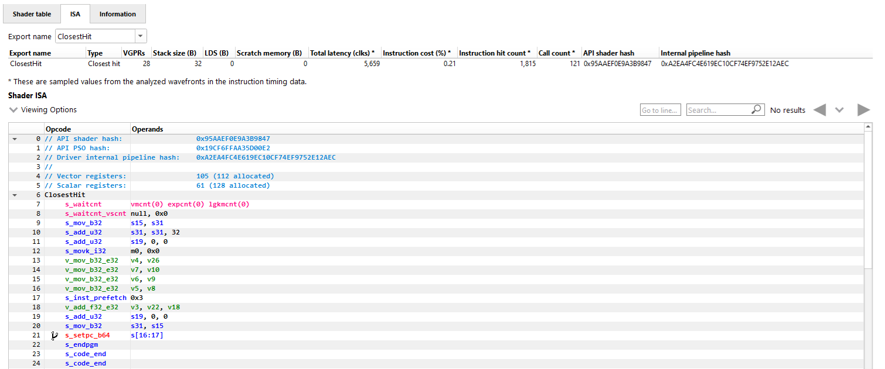

Instruction timing
------------------

The Instruction timing pane shows the average issue latency of each instruction of a single shader.
The instruction timing information is generated using hardware support on AMD RDNA and GCN GPUs.
Generating instruction timing does not require recompilation of shaders or insertion of any
instrumentation into shaders.

The Instruction timing pane shows RDNA or GCN ISA. For more details on the ISA, please refer the following resources:

 - The **AMD GPU ISA Documentation** on `GPUOpen <https://gpuopen.com/amd-isa-documentation/>`_. These guides provide detailed definitions of the instructions you may see in RGP.
 - The **User Guide for AMDGPU Backend** as part of the `LLVM User Guides <https://llvm.org/docs/AMDGPUUsage.html>`_. This guide provides details on some minor differences you may see in the Instruction timing pane versus what you might read in the ISA guides on GPUOpen. For instance some VALU instructions may appear with an extra suffix to provide more information on the instruction encoding. These suffixes, which are added by the LLVM-based AMDGPU disassembler, are described `here <https://llvm.org/docs/AMDGPUUsage.html#valu>`_.

The Instruction timing pane for a shader is shown below.

.. image:: media_rgp/rgp_instruction_timing_1.png

.. rubric:: Latency

Each shader line in the Instruction timing view shows the time taken between the issue of an
instruction and the one after that. To provide information on what Latency means some sample
ISA statements are shown below.

**Best Case Instruction Issue:** In the below image, we see five instructions. The *1 clk*
denotes the latency between the issue of each of the instructions and the issue of the
following instruction.  This example shows an ideal performance case where each
instruction is issued at an interval of 1 clock.

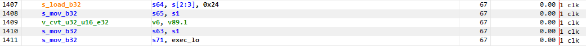

**Delays in Instruction Issue:** In the below image, we see four export instructions. The
first *exp* instruction has a rather long interval of 4,162 clocks. This can be expected since the
export instruction's issue can be delayed for reasons such as unavailable memory resources
which may be in use by other wavefronts. As a result, there is a long duration in the instruction.
Since the latency waiting for memory resources was seen for the first export instruction,
the subsequent exports, have a much shorter duration.

.. image:: media_rgp/rgp_instruction_timing_example_2.png

**Waitcounts and Instruction Issue:** In the below image, we see seven instructions. There are
two scalar buffer loads and three scalar ALU instructions, all of which issue with little latency.
We then see a *s_waitcnt* instruction. The *s_waitcnt* has a longer issue interval of 2,088 clocks.
The short latencies of the previous *s_buffer_load_dword* instructions may seem counter intuitive
since those are memory load instructions. However, this is expected as *s_waitcnt* is a shader
instruction used for synchronization to wait for previous instructions, such as the previous buffer
loads, to finish. The *s_waitcnt* instruction will issue and then wait (in this
case 2,088 clocks) until the next instruction which is the *v_add_f32_e64* can be issued.

.. image:: media_rgp/rgp_instruction_timing_example_3.png

By default, the Latency between any two instructions is an average of the latency measured per hit
for that instruction. The latency can also be displayed as an average per wavefront or as a total
across all wavefronts. This can be toggled using the normalization mode drop down shown below.

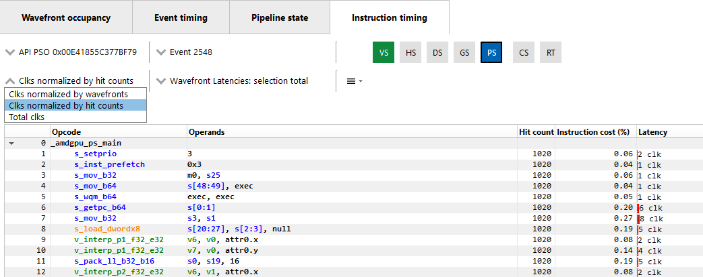

The number of clock cycles shown for a given instruction is also represented by a bar. The length of
the bar corresponds to the number of clock cycles worth of latency for an instruction. Different colors
are used in the bars to indicate which parts of an instruction's latency were hidden by work performed
on other wave slots while the subsequent instruction was waiting to be issued on its slot. This can
be seen in the image below.

.. image:: media_rgp/rgp_instruction_timing_latency_bars.png

Solid green indicates how much of a given instruction's latency was hidden by VALU work. Solid yellow
indicates how much latency was hidden by SALU or SMEM work. A diagonal hatch pattern made up of both
green and yellow indicates how much latency was hidden by both VALU and SALU work.
Sections with a black diagonal hatch pattern are the portion of the stall that is the pre-issue stall.
Finally, solid red indicates how much latency was not hidden by other work being done on the GPU.
It is likely that bars with large red segments indicate a stall occurring while the shader is executing.
When the mouse hovers over a row in the Latency column, a tooltip appears showing the exact breakdown of that
instruction's latency.

In the image above, the total latency of the instruction is 845 clocks. Of those 845 clocks, 197 clocks
worth of latency are hidden by SALU work on other slots and 453 clocks worth of latency are hidden by
VALU work. The 197 clocks where both SALU and VALU work was being done is shown using the hatch pattern.
The segment between 197 and 453 clocks is shown as green since only VALU work is being done. The segment
between 453 and 845 clocks is shown as red since there is no other work being done. Since there is more
VALU work being done at the same time, green is more prevalent than yellow in this bar.

Contrast this with the image below, where an instruction is shown where more latency is hidden by SALU
work. In this case, yellow is more prevalent than green.

.. image:: media_rgp/rgp_instruction_timing_latency_bars_2.png

When the amount of latency hidden by SALU and VALU work is greater than the the pre-issue
stall, no black diagonal hatch pattern will be displayed, and the tooltip will display that the pre-issue
stall is completely hidden. If the amount of latency hidden by SALU and VALU work is less than the 
pre-issue stall, the duration after the VALU and SALU work will have the black diagonal hatch pattern,
as shown in the image below.

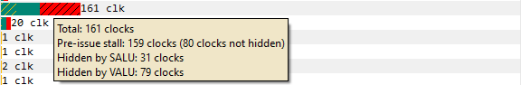

A red indicator will be shown in the vertical scroll bar corresponding to the location of the
instruction with the highest latency. This allows you to quickly find the hotspot within the shader.

.. rubric:: Hit Count

The *Hit count* for each instruction shows the number of times the instruction was executed for the
selected event. Any basic blocks that have a hit count of zero across all wavefronts in a shader will 
automatically be collapsed when viewing an event for the first time, as shown below.

Basic blocks with a current hit count of zero based on the current latency range and latency selection
mode will also be grayed out, as shown below.

.. image:: media_rgp/rgp_instruction_timing_disabled_block.png

.. rubric:: Instruction Cost Percent

The *Instruction Cost* for each ISA instruction shows the percentage of the Total Issue Latency of
the whole shader. For shaders with branches where consecutive instructions can have varying hit
counts, the Instruction Cost incorporates the extra hit counts for that instruction. This allows us
to find the hot-spot in the shader.

The Instruction Cost for an ISA instruction is calculated as follows:

*Instruction Cost = 100 * (Sum of All Latencies for ISA Instruction) / (Sum of All Latencies for
the shader)*

.. rubric:: Filtering wavefronts

By default the *Latency*, *Hit count* and *Instruction cost* values are calculated using all
wavefronts that have been analyzed for a given shader. Information about the fastest wavefront and
the slowest wavefront can also be displayed, providing insight into any outliers in terms of
performance. The *Wavefront latencies* drop down (shown below) can be used to toggle between showing
all wavefronts, the fastest wavefront and the slowest wavefront.

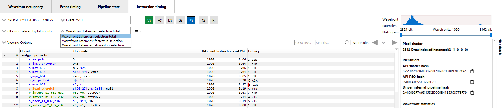

It is also possible to filter which wavefronts are analyzed using the *Wavefront Latencies Histogram*
(shown below).

This histogram provides a visual representation of the full set of wavefronts for the current shader.
The fastest wavefronts are on the left side of the histogram and the slowest wavefronts are on the
right. Latency values increase moving from left to right. The height of each bar in the histogram
gives a relative indication of how many wavefronts correspond to each set of latency values represented
by the bars.

Below the histogram is a slider control that can be used to filter wavefronts. The two sliders allow
you to specify a clock range for the wavefronts to analyze. Only wavefronts that fall into the specified
range will contribute to the Latency, Hit count and Instruction cost percentage values displayed. If a
range is set, the *fastest in selection* and *slowest in selection* filters will show information from
the fastest and slowest waves within that range.

If all analyzed wavefronts have the same total latency, the histogram will be hidden, as all wavefronts
would end up in a single bucket. Because of this, the histogram is hidden when there is only a single
wavefront analyzed for the selected shader. Any time the histogram is hidden, the *Wavefront latencies*
drop down and the *Timeline* in the *Wavefront statistics* section of the side panel will also be hidden.

.. rubric:: Instruction Timing Capture Granularity

Instruction timing information is generated for the whole RGP profile, but data is limited to a
single shader engine. Only waves executed by a single shader engine contribute to the hit counts
and timing information shown in the Instruction timing pane. Please see the Radeon Developer Panel
documentation for more information on how to capture instruction timing information.

To view all the events that have instruction timing information, the developer can choose the
"Color by instruction timing" option in the Wavefront occupancy or the Event timing views.

.. rubric:: Availability of Instruction Timing

In certain cases it is possible that the instruction timing information may not be available for
all events. The main reasons why instruction timing information may not be present
for an event are described below.

\ **Hardware Architecture and Draw Scheduling**: Instruction timing information is only sampled
from some of the compute units on a single shader engine of the GPU. As a result, it is possible
for events with very few waves to not have instruction data. This can happen if the
GPU schedules the waves on a shader engine or compute unit that doesn't have instruction trace enabled.

\ **Internal Events**: It should be noted that it is not possible to view instruction timing
information for internal events such as Clear().

.. rubric:: Navigation

The instruction timing for an event can be accessed by right clicking on that event and choosing
the "View In Instruction timing" option. Since it is common to use the same shader in multiple
events, RGP provides an easy way to toggle between multiple events that use the same shader using
the event drop down shown below.

.. image:: media_rgp/rgp_instruction_timing_2.png

This allows the developer to study the behavior of the shader for different events. It is
recommended to use the keyboard shortcuts, (Shift + Up and Shift + Down) to change the API PSO
selection and (Shift + Left and Shift + Right) to move across different events using the same
shader. The :ref:`API Shader Stage Control <api_shader_stage_control>` indicates which shader
stages are active for the selected event. When an active stage is clicked, the Instruction
timing pane will update to show the timing data for the selected shader stage.

.. rubric:: Navigation of Raytracing events

For certain Raytracing events, an additional **Export name** drop down will be available. Whether
or not this drop down is shown depends on the compilation mode chosen by the AMD driver and compiler
for the selected event. There are two possible compilation modes: **Unified** and **Indirect**. The
compilation mode chosen for a particular event will be evident in the event name: events which use
the Unified mode will have a **<Unified>** suffix, while events which use the Indirect mode will have
an **<Indirect>** suffix. In the case of DirectX Raytracing, the full event names are
**DispatchRays<Unified>** or **ExecuteIndirect<Rays><Unified>** and **DispatchRays<Indirect>** or
**ExecuteIndirect<Rays><Indirect>**. For Vulkan, the full event names are
**vkCmdTraceRaysKHR<Unified>** or **vkCmdTraceRaysIndirectKHR<Unified>** and
**vkCmdTraceRaysKHR<Indirect>** or **vkCmdTraceRaysIndirectKHR<Indirect>**. The main difference
between these two compilation modes has to do with how the individual shaders in the raytracing
pipeline are compiled. In Unified mode, the individual shaders are inlined into a single shader,
resulting in a single set of ISA. In Indirect mode, the individual shaders are compiled separately,
and the functions in each shader end up as their own set of ISA instructions. Function call
instructions are generated in the ISA to allow one function to call another.

The way the ISA code is presented in the Instruction timing view follows the way the driver and compiler
handle the shaders. For Unified mode, there is a single stream of ISA and the Instruction timing view
treats it as a single shader. For Indirect mode, there are multiple streams of instructions, one for
each shader in the raytracing pipeline. The instruction streams and their associated costs are displayed
per-shader and appear one after the other in the Instruction timing view. Only shader functions with
non-zero cost are displayed in the Instruction timing view. Shaders with zero cost can still be viewed
in the Pipeline state pane.

To help with navigation among the various shader functions, the **Export name** drop down is available
for any events that use the indirect compilation mode. This drop down allows the developer to toggle
between the multiple shaders. The drop down contains the list of exports along with their Instruction
cost. The exports will be sorted by the Instruction cost. Ctrl + Shift + Up and Ctrl + Shift + Down
can be used to move among the list of Export names. This **Export name** drop down is shown below.

.. image:: media_rgp/rgp_instruction_timing_exports.png

.. rubric:: Navigation in Compute profiles

In profiles collected for OpenCL or HIP applications, the navigation controls are slightly different.
Instead of the API PSO drop down, there is a event name/kernel name drop down. This drop down contains
an entry for each unique kernel dispatch found in the profile. Once an event name or kernel name is
selected, the Event drop down can be used to choose between events that dispatch the selected kernel.
The API Shader Stage Control is not available in Compute profiles. Keyboard shortcuts can be used to
cycle through the available kernel names (Shift + Up and Shift + Down) and to move across different
events using the selected kernel (Shift + Left and Shift + Right). The navigation controls for a
Compute profile are shown below.

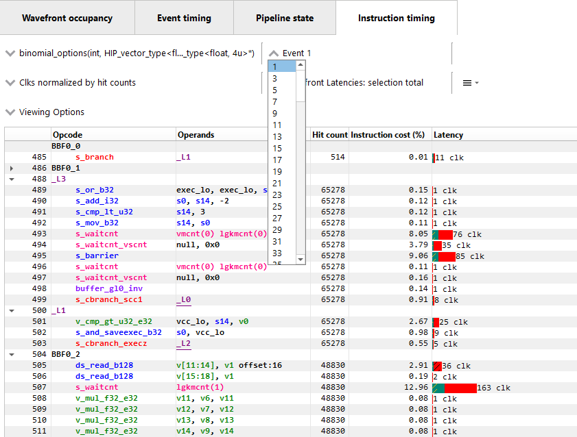

The pipeline binary of an event can also be exported for analysis in the Radeon GPU Aanalyzer from the 
instruction timing pane. Select the hamburger drop down as shown in the image below and select 
"Analyze pipeline in Radeon GPU Analyzer". Selecting this option for indirect raytracing events will 
save and open the pipeline binary for the currently selected export name.

More information on some of the features available in the Instruction timing pane can be found under
the :ref:`ISA View <isa_view>` section.

\ **Instruction Timing Side Panel**

The Instruction timing side panel provides additional information about the shader shown.

.. image:: media_rgp/rgp_instruction_side_panel.png

The main sections in the side panel are:

\ **Identifiers**: This section includes multiple hashes that can be used to identify the shaders
used and the pipeline that they are a part of.

\ **Wavefront Statistics**: The wavefront statistics provide information about the selected range
of wavefronts. As such, the information displayed depends on both the selected mode in the
**Wavefront latencies** drop down as well as the range selected in the **Wavefront Latencies Histogram**.

The **Timeline** provides a visual representation of when the selected wavefronts were executed. When
the Histogram is used to limit the range of wavefronts, the Timeline is updated such that waves that
do not fall within the specified range are displayed as grey. Only waves that fall within the range are
displayed as blue. This allows you to see where particular waves were executed. For instance, it might
be expected that slower waves were executed early on if, for instance, memory caches were not yet warm.
Using the Timeline in conjunction with the Histogram can help determine where a bottleneck might be.

The **Branches** table denotes the number of branch instructions in the shader and the percentage of
the total number of branches that were taken by the shader.

The **Instruction Types** table provides information about the dynamic instruction mix of the
shader's execution. The columns denote the different types of instructions supported by RDNA and GCN.
The counts denote the number of instructions of each category.

Each category's count denote the instruction count for that shader's invocation in the event.
Different executions of the same shader could have different Instruction statistics based on
factors such as the number of wavefronts launched for the shader and loop parameters. The
instruction categories are briefly described below. Please see the `AMD GPU ISA Documentation <https://gpuopen.com/amd-isa-documentation/>`_
for more details.

- VALU: Includes vector ALU instructions

- SALU: Includes scalar ALU instructions

- VMEM: Includes vector memory and flat memory instructions

- SMEM: Includes scalar memory instructions

- LDS: Includes Local Data Share instructions

- IMMEDIATE: Includes the immediate instructions such as s_nop and s_waitcnt

- EXPORT: Includes export instructions

- MISC: Includes other miscellaneous instructions such as s_endpgm

- RAYTRACE: Includes the BVH instructions used during raytracing. Only shown when viewing profiles captured on a GPU that supports ray tracing

- WMMA: Includes the WMMA instructions used during wave matrix multiply accumulate operations. Only shown when viewing profiles captured on a GPU that supports WMMA instructions

The instruction types table provides a useful summary of the shader's structure especially for very
long shaders.

\ **Hardware Utilization**: The Hardware utilization bar charts show the utilization of each
functional unit of the GPU on a per-shader basis.

It should be noted that utilization shown is only for the shader being viewed. For example, in the
image shown, the VALU utilization of the shader is 67.6%. This means that the Raytracing shader shown
used 67.6% of the VALU capacity of the GPU. Other shaders may be concurrently executing on the GPU.
Their usage of the VALU is not considered when showing the bar charts.

A functional unit's utilization is calculated as follows:

*Utilization % = 100 * (Hit Count of all instructions executed on the functional unit) / (Duration
of analyzed wavefronts)*

\ **Shader Statistics**: The shader statistics section provides useful information about the shader

- Shader Duration: This denotes the execution duration of the whole shader. It can be correlated
  with the timings seen for the same shader in other RGP views such as the Wavefront occupancy and
  the Event timing views.

- Wavefronts: This denotes the total number of wavefronts in the shader and the number of
  wavefronts analyzed as part of building the instruction timing visualizations. It is expected that
  not all waves in the shader will be analyzed. This is for the same reasons described above when
  discussing the availability of instruction timing.

- Theoretical Occupancy: From the register information and knowledge about the GPU architecture we
  can calculate the theoretical maximum wavefront occupancy for the shader.

- Vector and Scalar Registers: The register values indicate the number of registers that the shader
  is using. The value in parentheses is the number of registers that have been allocated for the
  shader.

- Local Data Share Size: This value indicates how many bytes of local data share are used by the
  shader. This is only displayed for Compute Shaders.

\ **Call Targets**: While viewing data for a shader that calls other functions, a Call targets list
is displayed in the side panel whenever a "s_swappc" or "s_setpc" instruction with a non-zero hit count
is selected. In the ISA view, a glyph is displayed next to any such instruction. For a "s_swappc"
instruction, the Call targets list shows the names of the exports that control may jump to, along
with a hit count indicating how many times each target was called. For a "s_setpc" instruction, the
Call targets list shows the name of the export that control will return to. This feature is currently
supported for pipelines used by **<Indirect>** raytracing events as well as for HIP kernels that call
additional functions in their execution.

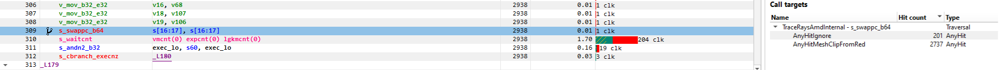

.. rubric:: Instruction Timing for RDNA

On RDNA GPUs, instruction timing can include certain instructions with a hit count of 0. Usually
this will be an instruction called *s_code_end* and may also be present after the shader's
*s_endpgm* instruction. This is expected since this is an instruction added by the compiler to
allow for instruction prefetching or for padding purposes. The hardware does not execute this
instruction.

Such instructions may also be present in the ISA view in the Pipeline state pane.
