The Radeon GPU Profiler
=======================

The Radeon GPU Profiler is a performance tool that can be used by
developers to optimize DirectX12© and Vulkan© applications for AMD GCN
hardware. It is part of a suite of tools comprised of the following
software:

-  **Radeon Developer Mode Driver** - This is shipped as part of the AMD
   public Adrenaline driver and supports the developer mode features required for
   profiling.

-  **Radeon Developer Service (RDS)** - A system tray application that
   unlocks the Developer Mode Driver features and supports
   communications with high level tools. A headless version is also
   available called RadeonDeveloperServiceCLI.

-  **Radeon Developer Panel (RDP)** - A GUI application that allows the
   developer to configure driver settings and generate profiler data
   from DirectX12 and Vulkan applications.

-  **Radeon GPU Profiler (RGP)** - A GUI tool used to visualize and
   analyze the profile data.

   This document describes how to generate a profile using the Radeon
   Developer Panel and how the Radeon GPU Profiler can be used to
   examine the output profiles. The Radeon GPU Profiler is currently
   designed to work with frame based graphics applications only. It is
   specifically designed to address the issues that developers are
   dealing with in the move from traditional graphics APIs to explicit
   APIs. It also provides the visualization of GCN hardware specific
   information allowing the developer to tune their application to the
   full potential of the architecture. The tool provides unique
   visualizations of queue synchronization using fences and semaphores,
   asynchronous compute, and barrier timings. Currently, it supports the
   explicit APIs (DirectX12 and Vulkan) and will NOT work with older
   APIs such as DirectX11 or OpenGL.

Supported graphics APIs, GCN hardware, and operating systems
------------------------------------------------------------

**Supported graphics APIs**

-  DirectX12

-  Vulkan

\ **Supported GCN hardware**

-  AMD RX Vega 64 and RX Vega 56

-  AMD Radeon™ R9 Fury and Nano series

-  AMD Radeon™ RX 400 and RX 500 series

-  AMD Tonga R9 285, R9 380

\ **Supported Operating Systems**

-  Windows 10

-  Windows 7

-  Ubuntu 16.04.3

Radeon GPU Profiler - Quick Start
=================================

How to generate a profile
-------------------------

The first thing you will need to do is generate a profile. Currently,
this is done via the Radeon Developer Panel. Read the documentation
provided with this distribution for information on how to create a profile.
This can be obtained from within the Radeon Developer Panel or from the
link on the Radeon GPU Profiler "Welcome" view.

Starting the Radeon GPU Profiler
--------------------------------

The following executables can be found in the download directory.

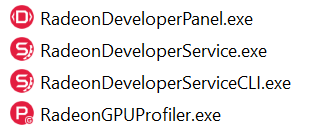

Start **RadeonGPUProfiler.exe** (this is the tool used to view profile
data).

How to load a profile
---------------------

There are a few ways to load a profile into RGP.

1) Use the “File/Open profile” pull down menu, or the “File/Recent
   profile” pull down menu item.

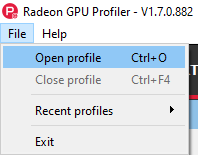

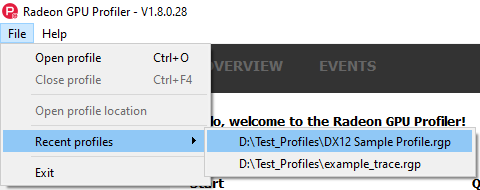

2) Go to the “Welcome” view and click on the “Open a Radeon GPU
   Profile…”

3) Go to the “Welcome” view and click on a profile that you have
   previously loaded in the Recent list.

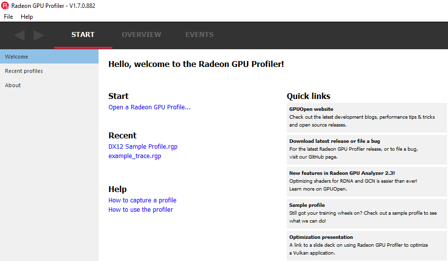

1) Go to the Recent profiles view to see a full list of all your recent
   profiles.

2) Load a profile into a new instance of the **Radeon GPU Profiler**
   from the **Radeon Developer Panel**. Select a profile in the list and
   click on “Open profile”.

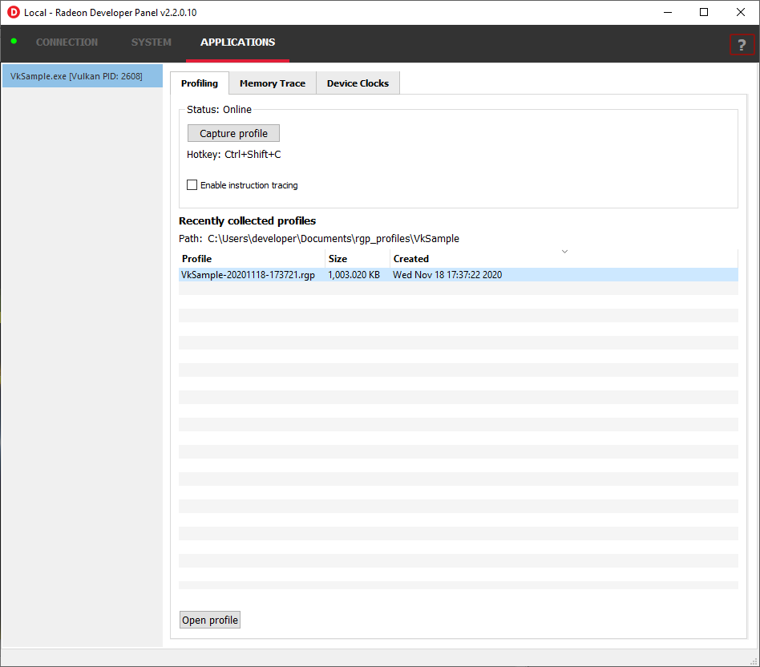

3) Drag and drop a profile onto the **Radeon GPU Profiler** executable,
   or, onto an already open RGP instance.

The Radeon GPU Profiler user interface
--------------------------------------

There are four main menus in the Radeon GPU Profiler and each has a
number of sub-windows. The two main UIs that deal with the analysis of
the profile data are within the **Overview** and **Events** sections.

1. **Start**

   a. **Welcome** - Shows links to help documentation, and a list of
      recently opened profiles, and a sample profile.

   b. **Recent profiles** - Displays a list of the recently opened
      profiles.

   c. **About** - Shows build information about RGP and useful links.

2. **Overview**

   a. **Frame Summary** - Contains summaries of structure of the
      graphics frame.

   b. **Barriers** - Details of the barrier usage in the profiled frame.

   c. **Most expensive events** - List of the most expensive events.

   d. **Context rolls** - Details of the hardware context register usage.

   e. **Render/depth targets** - Overview of render targets used throughout
      the graphics frame.

   f. **Device Configuration** - Information about the GPU the profile
      was generated on.

3. **Events**

   a. **Wavefront occupancy** - Shows detailed information about
      wavefront occupancy and event timings.

   b. **Event timing** - Tree view of profile events and their timing
      data.

   c. **Pipeline state** - Tree view of profile events and their
      graphics/compute pipeline state.

4. **Settings**

   a. **General** - Adjust desired time units, state buckets, GPU boundness
      percentage, and wavefront view detail levels.

   b. **Themes and colors** - Customize colors for graphics API and
      hardware data.

   c. **Keyboard shortcuts** - Shortcuts for navigating the wavefront
      occupancy UI.

Settings
========

General
-------
**Units:** This tells profiler whether to work in clocks, nanoseconds, microseconds,
or milliseconds. Refer to the keyboard binding in the secion below to quickly
toggle between these time units.

**State buckets:** Specify how the profiler should generate its own state buckets.
This can be based off a combination of shader base address, depth buffer address,
and render target address.

**Sync event time windows:** Keep the Wavefront Occupancy and Event Timing
panes in sync while browsing through different time ranges.

**Processor boundness:** Specific to the Frame Summary, this value will tell
RGP at which point to consider an application as being GPU bound or CPU bound.

**Wavefront occupancy detail:** Increase the visual quality of wavefronts in
the Wavefront Occupancy pane. This allows users to see a more accurate
representation of GPU occupancy at the expense of some profiler performance.

Themes and colors
-----------------
The profiler makes heavy use of coloring to display its information.
This pane allows users to thoroughly customize those colors.

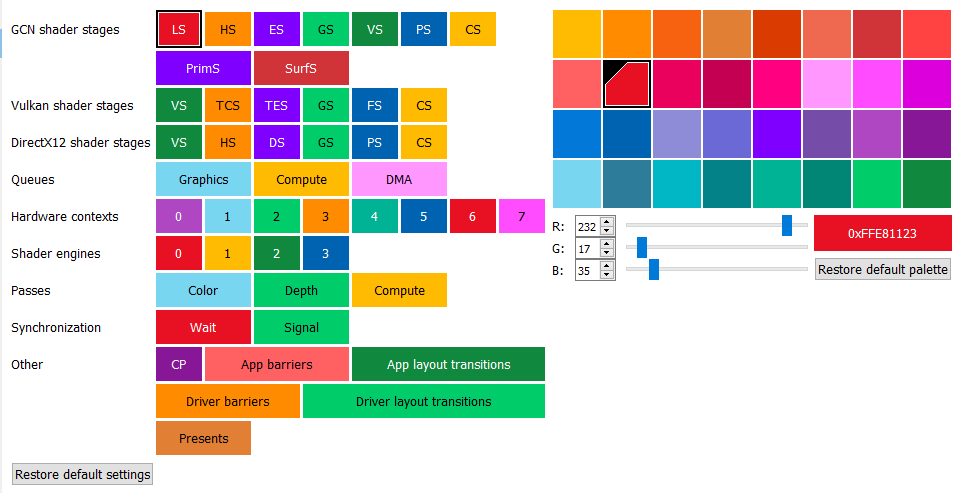

Keyboard shortcuts
------------------

Here users will find the **Keyboard shortcuts** pane:

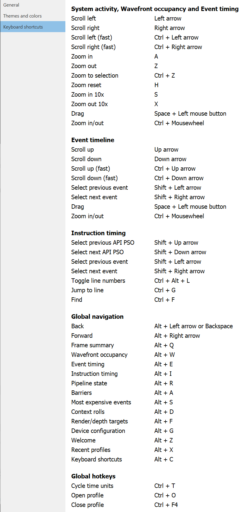

The **System activity, Wavefront occupancy and Event timing** shortcuts
are specific to zooming and panning operations that can be performed
within the Frame Summary and Events subtabs (see below):

.. image:: media_rgp/RGP_Tabs_1.png
  :width: 3.49135in
  :height: 0.55208in

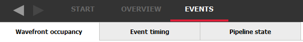

The **Event timeline** section refers to panning and event selection
operations for the bottom graph within the Wavefront occupancy view.

The **Global navigation** section refers to keystrokes that aid user
navigation, and are always detected regardless of which pane is visible.

The **Global hotkeys** section refers to any hotkeys available anywhere
in the product. Currently there is just one setting that allows you to
cycle through the different time units from any pane, rather than having
to go to the settings. This allows you to view a timeline in clock
cycles, milliseconds, microseconds or nanoseconds very quickly.

We encourage all users to adopt these keystrokes while using RGP.

UI Navigation
-------------

In an effort to improve workflow, RGP supports keyboard shortcuts and
back and forward history to quickly navigate throughout the UI.

Back and forward navigation
~~~~~~~~~~~~~~~~~~~~~~~~~~~

RGP tracks navigation history, which allows users to navigate back and
forward between all of RGP’s panes. This is achieved using global
navigation **hotkeys** shown above, or the back and forward **buttons**
shown below:

.. image:: media_rgp/RGP_Navigation.png
  :width: 1.45225in
  :height: 1.00000in

Currently, back and forward navigation is restricted to pane switches
and moving between events within a pane, but further releases may
support navigation history of more detailed user actions within panes.

Overview Windows
================

Frame summary
-------------

This window describes the structure of a profile from a number of
different perspectives.

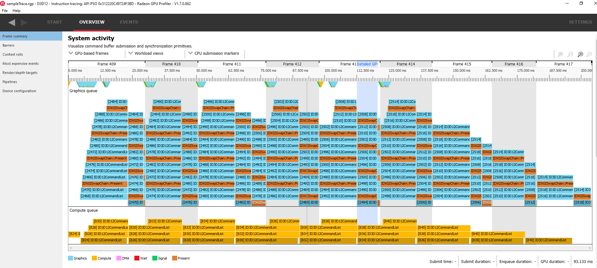

The System activity section displays a system-level view of sync
operations and when command buffers were submitted to the GPU. Speaking
in general terms, all profiles contain two types of data: command buffer
timing data and SQTT timing data. This pane displays the former, and the
rest of RGP displays the latter.

Along the top, we find a series of controls:

-  **GPU and CPU based frames:** Controls how to display frame
   boundaries, which are also bracketed by black markers. The difference
   in time between both modes can help to visualize latency between
   workload submission and execution. The driver provides each command
   buffer with a frame number, a CPU submit timestamp, a GPU start
   timestamp, and a GPU end timestamp.

   -  **GPU-based frames:** Interprets frame boundaries to begin when
      a present finished on the GPU.

   -  **CPU-based frames:** Interprets frame boundaries to begin when
      a present was submitted on the CPU.

-  **Workload views:** Provide twelve different ways to view the same data:

   -  **Command buffers:** Shows a list of all command buffers in a
      submission. Disabling this will condense all command buffers into
      a single submission block which also specifies the number of
      contained command buffers.

   -  **Sync objects**: Toggles whether to display signals and waits.

   -  **Sequential**: An alternate view which shows data linearly as
      opposed to stacked. The dark right-most portion of command buffers
      and submits indicates execution time on the GPU.

   -  **GPU only**: A flat view of the data which represents solely GPU
      work. This helps visualize parallelism among all GPU queues.

-  **CPU submission markers:** Draw vertical lines to help visualize
   when the CPU issued certain types of workloads to the GPU.

-  **Zoom controls:** Consistent with the rest of the tool, these allow
   users to drill down into points of interest.

   In the middle, we find the actual view. Each queue (Graphics,
   Compute, Copy) gets its own section. The alternating grey and white
   backgrounds indicate frame boundaries. The blue region indicates
   which command buffers were profiled with SQTT data, for more detailed
   event analysis in other sections of the tool. Note that command
   buffers are visualized using two shades of the same color. The
   lighter shade represents time spent prior to reaching the GPU, and
   the darker shade represents actual execution.

   Please note that the view is interactive, making it possible for users to
   select and highlight command buffers, sync objects, and submission
   points.

   Starting with RGP 1.2 it is possible to correlate between command buffer
   timing data and SQTT data. Users may do this by right-clicking on a command
   buffer within the "Detailed GPU events" region, which will bring up an event
   finder context menu. This menu shows three options for finding the first
   event  within the selected command buffer. Selecting an option will
   trigger the profiler to navigate to the appropriate pane and focus on the
   first event.

   Along the bottom, we find information about user selections:

-  **Submit time:** Specifies when work was issued by the CPU

-  **Submit duration:** Specifies the full duration of the submit

-  **Enqueue duration:** Specifies how long the work was queued before
   beginning on the GPU

-  **GPU duration:** Specifies how long the GPU took to execute it.

   Below the queue timings view we find the following summary:

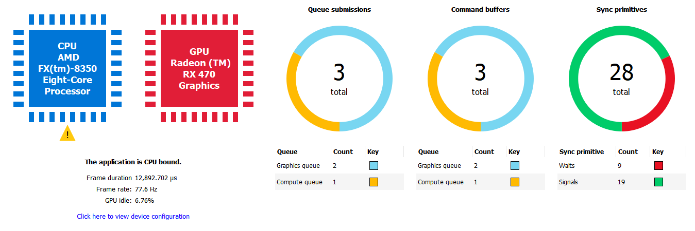
..

   This shows an interpretation of queue timings data to determine which
   processor is the bottleneck. By default, if the GPU is idle more than
   5% of the time then the profile is considered to be CPU-bound. This
   percentage may be adjusted in RGP settings.

   Please note that the values displayed under **Frame duration** and
   **Frame rate** are sourced from SQTT data. In other words, they are
   based on duration and shader clock frequency used in other RGP panes
   such as Wavefront occupancy.

   The **Queue submissions** and **Command buffers** pie charts show the
   number of queue submissions and command buffers in the frame broken down
   by the Direct and Compute queues. Compute submissions are colored in yellow
   and graphics submissions are colored in light blue. The **Sync Primitives**
   section counts how many unique signal and wait objects were detected
   throughout the profile.

.. image:: media_rgp/RGP_FrameSummary_3.png
  :width: 8.73428in
  :height: 4.44337in
..

   The **Event statistics** pie chart and table show the event counts
   colored by type. In the above example there are 281 Dispatch and
   1,633 DrawIndexedInstanced events. The **Instanced primitives**
   histogram shows the number of events that drew N (1 to 16+)
   instances. In the example above we see that most events drew just a
   single instance, whereas a lesser number of events drew 2-9 and 16
   instances.

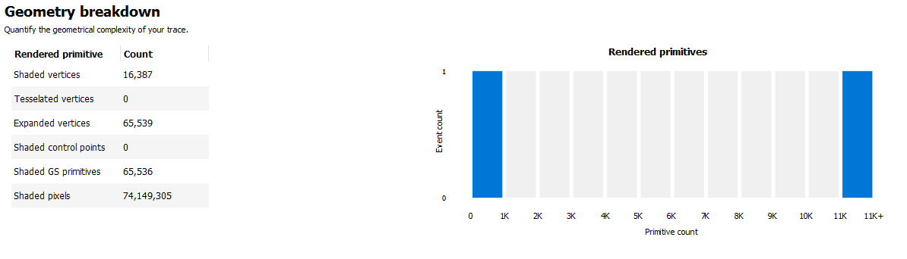
..

   **Geometry breakdown** gives a summary of the vertices,
   shaded primitives, shaded pixels, and instanced primitives. In the
   above example we can see that the GS is being used to expand the
   number of shaded primitives. Also, looking at the **Rendered
   Primitives** histogram we can see that one draw uses between 0 and 1K
   primitives, and the other draw call uses 11k or more primitives. This
   makes sense given that the profile is from the D3D12nBodyGravity SDK
   sample.

Barriers
--------

The developer is now responsible for the use of barriers in their
application to control when resources are ready for use in specific
parts of the frame. Poor usage of barriers can lead to poor performance
but the effects on the frame are not easily visible to the developer -
until now. The Barriers UI gives the developer a list of barriers in use
on the graphics queue, including the additional barriers inserted by the
driver.

Note that in older profiles or if the barrier origin isn't known, all
barriers and layout transitions will be shown as 'N/A'.

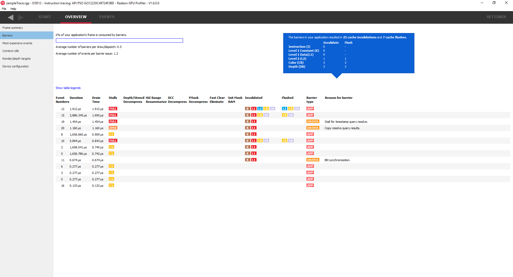

The table gives a summary at the top left of the UI that quickly lets
the developer know if there is an issue with barrier usage in the frame.
In the case above the barrier usage is taking up 0% of the frame - below
the recommended max value of 5%.

The table shows the following information:

1. **Event Numbers** - ID of the barrier - selecting and event in this
   UI will select it on the other Events windows

2. **Duration** - Lifetime of the barrier

3. **Drain time** - This is the amount of time the barrier spends waiting
   for the pipeline to drain, or work to finish. Once the pipeline is empty,
   new wavefronts can be dispatched

4. **Stalls** - The type of stalls associated with the barrier - where
   in the graphics pipe we need the work to drain from

5. **Layout transitions** - A blue check box indicates if the barrier is
   associated with a layout transition. There are 6 columns indicating the
   type of layout transition

6. **Invalidated** - A list of invalidated caches

7. **Flushed** - A list of flushed caches

8. **Barrier type** - Whether the barrier originated from the application
   or from the driver (or 'N/A' if unknown)

9. **Reason for barrier** - In the case of driver-inserted barriers, a brief
   description of why this barrier was inserted

   **NOTE**: Selecting a barrier in this list will select the same event
   in the other Event windows.

   The user can also right-click on any of the rows and navigate to
   Wavefront occupancy, Event timing or Pipeline state panes and view
   the event represented by the selected row in these panes, as well as
   in the side panels.

   In addition, the user can also see the parent command buffer in the Overview
   pane. If selected, the Overview pane will be opened and the parent command
   buffer will be selected.

   Below is a screenshot of what the right-click context menu looks like:

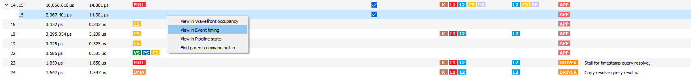

Most expensive events
---------------------

The Most Expensive events UI allows the developer to quickly locate the
most expensive events by duration. At the top of the window is a
histogram of the event durations. The least expensive events are to the
left of the graph and the most expensive to the right. A blue summary
bar with an arrow points to the bucket that is the most costly by time.
The events in this bucket are most in need of optimization. The double
slider below the chart can be used to select different regions of the
histogram. The summary and table below will update as the double
slider’s position is changed. In the example below we can see that the
most expensive 5% of events take 44% of the frame time.

Below the histogram is a summary of the frame. In this case, the top 10%
of events take 70% of the frame time, with 56% of the selected region
consisting of graphics events and 44% async compute events.

The table below the summary shows a list of the events in the selected
region with the most expensive at the top of the list.

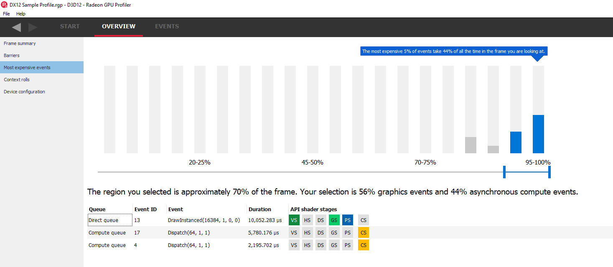

**NOTE**: Selecting an event in this list will select the same event in
the other Event windows.

The user can also right-click on any of the rows and navigate to
Wavefront occupancy, Event timing or Pipeline state panes and view the
event represented by the selected row in these panes, as well as in the
side panels. Below is a screenshot of what the right-click context menu
looks like.

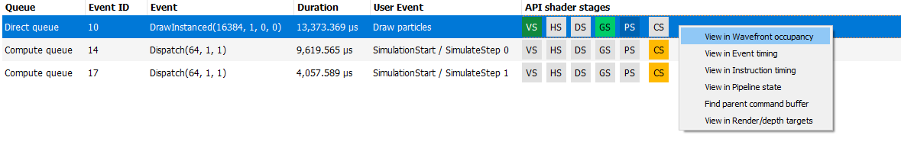

Context rolls
-------------

Context rolling is a hardware feature specific to the GCN graphics
architecture and needs to be taken into consideration when optimizing
draws for AMD GPUs. Each draw requires a set of hardware context
registers that describe the rendering state for that specific draw. When
a new draw that requires a different render state enters the pipeline,
an additional set of context registers is required. The process of
assigning a set of context registers is called context rolling. A set of
context registers follows the draw through the graphics pipeline until
it is completed. On completion of the draw, that associated set of
registers is free to be used by the next incoming draw.

On GCN hardware there are 8 logical banks of context registers, of which
only seven are available for draws. The worst-case scenario is that 8
subsequent draws each require a unique set of context register. In this
scenario the last draw has to wait for the first draw to finish before
it can use the context registers. This causes a stall that can be
measured and visualized by RGP.

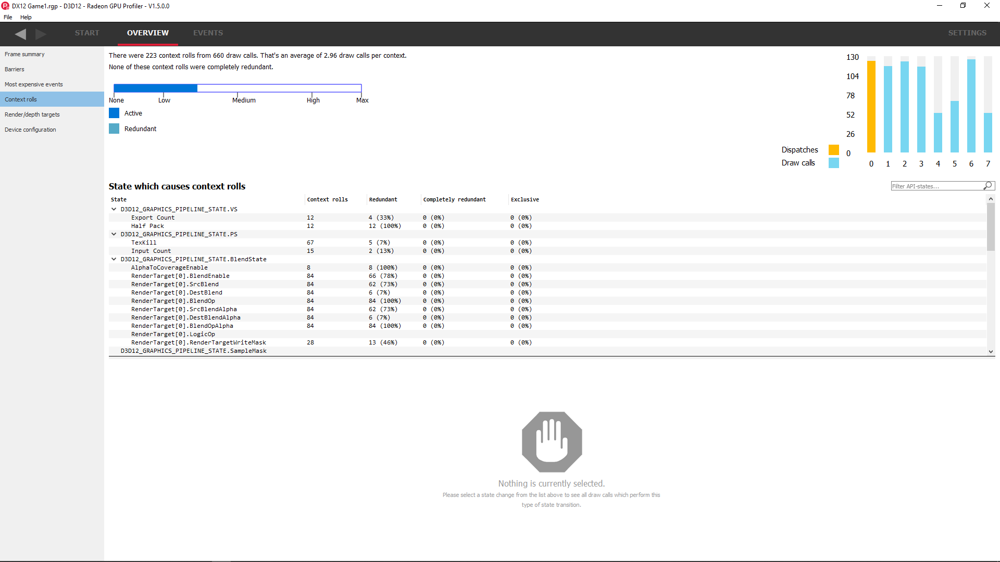

In the example above, a DirectX 12 application, we can see that there
are 223 context rolls in the frame and none of them are redundant.
The Radeon GPU Profiler compares the context register values across state
changes to calculate if the context roll was redundant. Redundant context
rolls can be caused by the application and the driver. Ineffective draw
batching can be a cause on the application’s end.

The chart to the right shows the number of times each context was
rolled. The fact that contexts 2,3,4 and 6 were used ~120 times probably
indicates that stalls were generated.

The table underneath shows the state from the API's perspective, and
which parts of the state were involved in context rolls. The first column
indicates how many context rolls it was involved in, and the second column
indicates how many of these changes were redundant (the state was written
with the exact same value). The next column indicates the number of
context rolls that were completely redundant (the whole context was redundant,
not just the state). The final column shows the number of context rolls of
this state where this was the only thing that changed in the event.

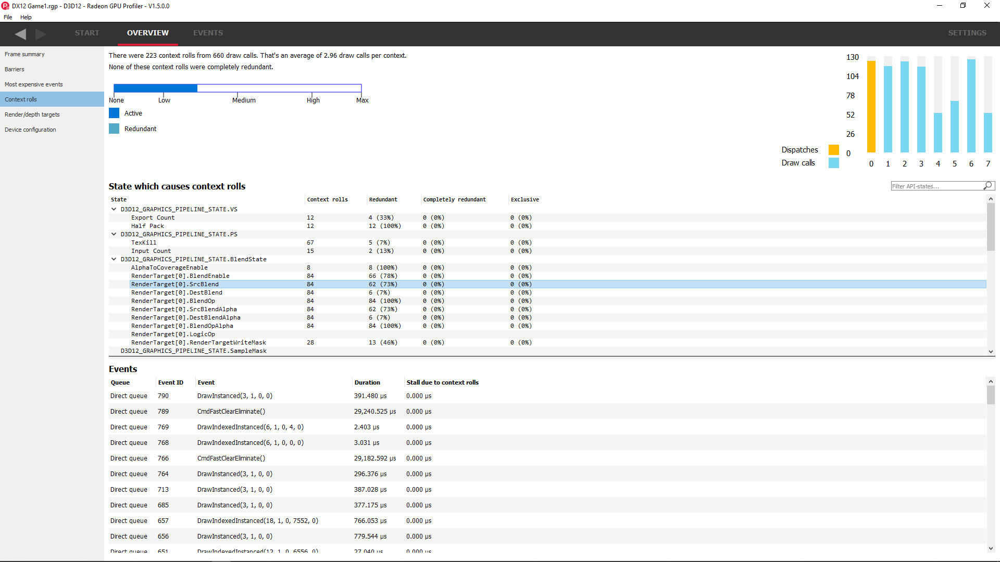

Selecting an API-state shows all the draw calls in the second table,
called the Events table, that rolled context due to this state
changing, with or without other states changing too.

The search box in the top-right corner of the state table works
similarly to the other search boxes in the application and filters
API-state tree in real-time as you type.

**NOTE**: Selecting an event in this list will select the same event in
the other Event windows.

The user can also right-click on any of the rows and navigate to
Wavefront occupancy, Event timing or Pipeline state panes and view the
event represented by the selected row in these panes, as well as in the
side panels. Below is a screenshot of what the right-click context menu
looks like.

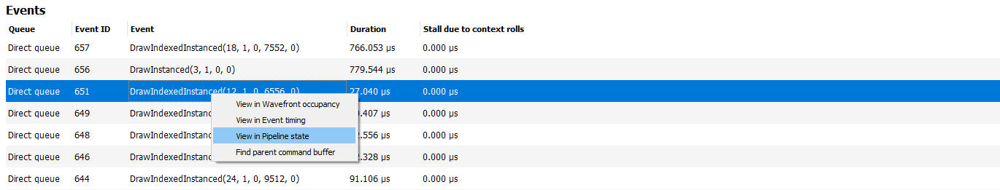

**NOTE**: When selecting events on the event panes and using the
right-click context menu to jump between panes, the option to "View in
context rolls" will only be available if the selected event is currently
present in the events table on the context rolls pane.

Render/depth targets
--------------------

This UI provides an overview of all buffers that have been used as render
targets in draw calls throughout the frame.

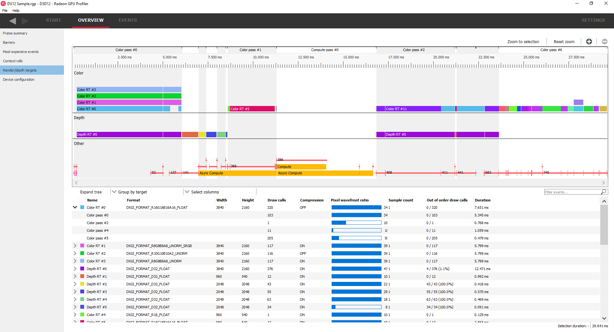

The screen is split into two sections, a timeline view and a treeview listing:

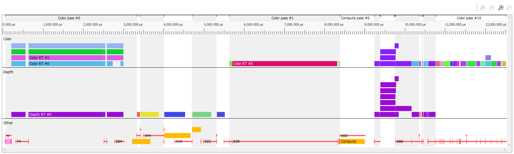
..

  The graphical timeline view illustrates the usage of render targets over
  the duration of the frame. Other events like copies, clears and barriers are shown
  at the bottom of this view.

Users can use the same selection and zooming facilities as in other views.
Each solid block in this view represents a series of events that overlap and draw to the same
render target within the same pass. A single click on on one of these highlights the corresponding
entry in the treeview. Zooming in on a single item can be done by selecting it and clicking on
“Zoom to selection”.

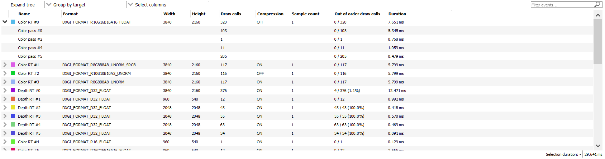
..
  The treeview shows a listing of all render targets and their properties found in the frame.

This section lists all of the render targets found in the frame. Based on the active
grouping mode it either shows a top-level listing of render targets or passes.
The grouping can be configured in two ways:

- **Group by target** The top level consists of all render targets found in the frame, plus
  per-frame stats. Child entries show *per-pass* stats for each render target.
- **Group by pass** The top level consists of all passes found in the frame. Child
  entries show per-pass stats for each render target.

Here are the currently available columns:

- **Name** The name of the render target. Currently this is sequential and based on the
  first occurrence of each render target in the frame.
- **Format** The format of each render target.
- **Width** Width of the render target.
- **Height** Height of the render target.
- **Draw calls** Number of draw calls that output to this render target.
- **Compression** Indicates whether compression is enabled for this render target or not.
- **Sample count** MSAA sample count of the render target.
- **Out of order draw calls** Number of out of order draw calls issued to this render target.
- **Duration** The total duration of all the events that rendered to the render target. For
  example, if 3 events write to a depth buffer the duration will be the sum of these 3 event
  durations.

**NOTE:**

- Selecting any item in either the timeline view or the treeview will select the corresponding
  item in the other view.
- Selecting any item in either the timeline view or the treeview will select the earliest event
  represented by that item  in other sections of the tool.

Device configuration
--------------------

This UI reports the GPU configuration of the system that was used to
generate the profile. The Radeon Developer Panel can retrieve profiles
from remote systems so the GPU details can be different from the system
that you are using to view the data. The clock frequencies refer to the
clock frequency running when the capture was taken. The number in
parentheses represents the peak clock frequency the graphics hardware
can run at.

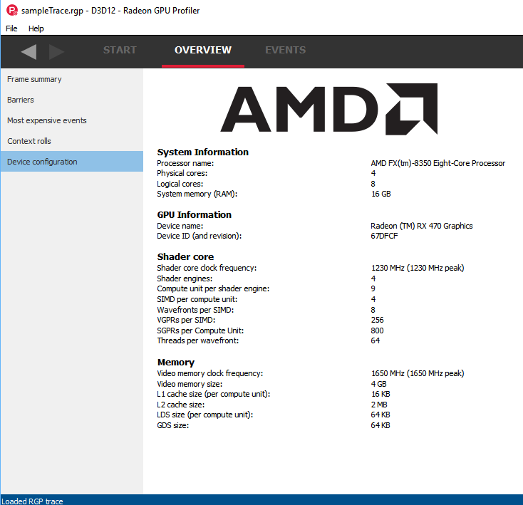

Events Windows
==============

This section of RGP is where users will perform most analysis at the
event level. An RGP event is simply an API call within a command buffer
that was issued by either the application or the driver.

Wavefront occupancy
-------------------

This section presents users with an interactive timeline that shows GPU
utilization and all events in the profile.

.. image:: media_rgp/RGP_WavefrontOccupancy_1.png
  :width: 9.73301in
  :height: 5.47482in

There are three components, the Wavefront timeline view, the Events
timeline view, and the Details panel.

\ **Wavefront timeline view**

This section shows how many wavefronts were in flight. All wavefronts
are grouped into buckets which are represented by vertical bars. The top
half shows wavefronts on the graphics queue, and the bottom half shows
wavefronts on the async compute queue.

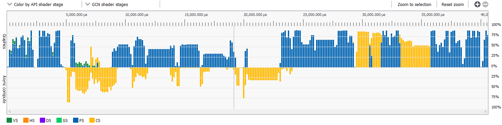

Users may examine regions by selecting ranges within the graph and using
the zoom buttons on the top right. Users may also hover over this view
and use mouse wheel to zoom and center in on a particular spot. A region
of wavefronts can be selected by using either mouse button to drag over
the desired region as shown below.

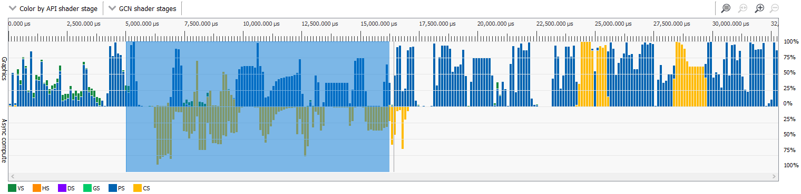

You can zoom into the region by selecting Ctrl + Z, or by clicking on
“Zoom to selection” (result shown below).

.. image:: media_rgp/RGP_WavefrontOccupancy_4.png
  :width: 9.83002in
  :height: 2.46397in

You can also drag the graph if you are zoomed in. Hold down the space
bar first, then hold the mouse button down. The graph will now move with
the mouse.

Users may use the combo-box on the top left to visualize wavefronts in
different ways:

-  **Color by API stage.** Default, and shows which wavefronts
   correspond to which Vulkan/DX12 pipeline stage.

-  **Color by GCN stage.** Shows which wavefronts correspond to which
   GCN pipeline stage.

-  **Color by hardware context.** Shows which GCN context (0-7) the
   wavefronts ran on. This can be useful to visualize the amount of
   context rolls that occurred.

-  **Color by shader engine.** Shows which shader engine the wavefronts
   ran on.

-  **Color by event.** Shows which wavefronts correspond to which event
   of the profile. Each event is assigned a unique color.

-  **Color by pass.** Groups wavefronts into different passes depending
   on which render target or attachment type (color, depth-only,
   compute). These three types are assigned a base color, and each pass
   within each type is assigned a different shade of the base color.
   This can be useful to visualize when the application attempted to
   render different portions of a scene.

Additionally, there are filters along the top intended to help visualize
the occupancy of only certain GCN pipeline stages. Lastly, there are
colored legends on the bottom which serve as color reminders. Note these
colors can be customized within Settings.

\ **Events timeline view**

This section shows all events in your profile. This includes both
application-issued and driver-issued submissions. Each event can consist
of one or more active shader stages and these are shown with rectangular
blocks. The longer the block, the longer the shader took to execute. If
there is more than 1 shader active, then each shader stage is connected
with a thin line to indicate they belong to the same event. This view
just shows actual shader work; it doesn't show when the event was
submitted.

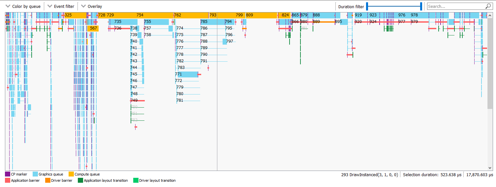

Users may single-click on individual events to see detailed information
on the details pane described below. Zooming into this graph is done by
selecting the desired region in the wavefront graph above. Additionally,
zooming in on a single event can be done by selecting the event and
clicking on ‘Zoom to selection’.

Users may use the combo-box on the top left to visualize events in
different ways:

-  **Color by queue.** Default, and shows which events were submitted to
   graphics or async compute queues. In addition, the CP marker is shown
   in a unique color, as well as the barriers and layout transitions so
   they can be easily distinguished. Note that barrier and layout transitions
   originating from the driver are colored differently to those from the
   application, and this is shown in the legend below the timeline view.

-  **Color by hardware context.** Shows which events ran on which
   context. This can be useful to visualize the amount of context rolls
   that occurred.

-  **Color by event.** Will show each event in a unique color.

-  **Color by pass.** Groups events into different passes depending on
   which render target or attachment type (color, depth-only, compute).
   These three types are assigned a base color, and each pass within
   each type is assigned a different shade of the base color. This can
   be useful to visualize when the application attempted render
   different portions of a scene.

-  **Color by command buffer.** Shows each event in a color associated
   with its command buffer, so making it easy to see events are in the same
   command buffer.

-  **Color by user events.** Will colorize each event depending on which
   user event it is surrounded by.

Additionally, there are also filters to help visualize only certain
types of events. For example, users can select to see draws, dispatches,
barriers, clears, copies and resolves. There is also an option to switch
the CP marker on or off. Switching the CP marker off will just show the
active shader blocks. The event duration percentile filter allows users
to only see events whose durations fall within a certain percentile. For
example, selecting the rightmost-region of the slider will highlight the
most expensive events. One will also find a textbox to filter out by
event name.

The same zooming and dragging that is available on the wavefront
timeline view is also available here.

Lastly, there are colored legends on the bottom which serve as color
reminders. Note these colors can be customized within Settings.

\ **Details pane**

Pressing \ **Show Details** on the top right will open a side panel with
more in-depth information. The contents of this panel will change,
depending on what the user last selected. If a single event was selected
in the Events timeline the details panel will look like below:

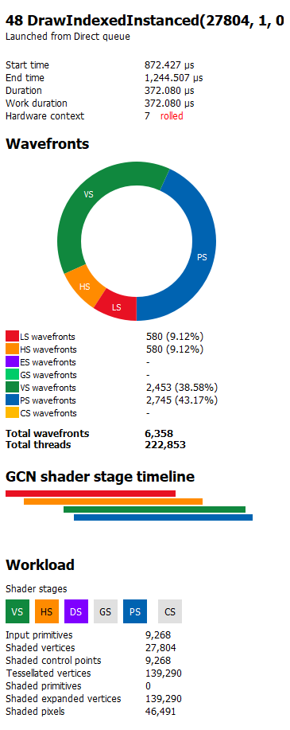

The Details panel for a single event contains the following data:

*  The event’s API call name

*  The queue it was launched on

*  User event hierarchy (if present)

*  Start, End, and Duration timings

*  Hardware context and if it was rolled

*  List of GCN hardware stages and wavefront counts

*  Colored bar showing wavefront distribution per GCN hardware stage

*  Total wavefront count

*  Total threads

*  GCN shader timeline graphic showing active stages and duration

*  A table showing resource usage for each API shader stage:

   * The VGPR and SGPR columns refer to the vector and scalar general
     purpose registers being used, and the number of registers that have
     been allocated shown in parentheses.

   * The LDS column refers to the amount of Local Data Store that each
     shader stage is using, reported in bytes.

   * The Occupancy column refers to the Theoretical wavefront occupancy
     for the shader. This is reported 'A / B', where A is the number of
     wavefronts that can be run and 'B' is the maximum number of wavefronts
     supported by the hardware.

   * Tooltips explaining the data are available by hovering the mouse over
     the table header.

*  Block diagram of active pipeline stages

*  Primitive, vertex, control point, and pixel counts

The ‘Duration’ shows the time from the start of the first shader to the
end of the last shader, including any space between shaders where no
actual work is done (denoted by a line connecting the shader ‘blocks’).
The ‘Work duration’ only shows the time when the shaders are actually
doing work. This is the sum of all the shader blocks, ignoring the
connecting lines where no work is being done. If there is overlap
between shaders, the overlap time is only accounted for once. If all
shaders are overlapping, then the duration will be the same as the work
duration.

If the user selects a range of wavefronts in the wavefront timeline the
details panel contains a summary of all the wavefronts in the selected
region as shown below:

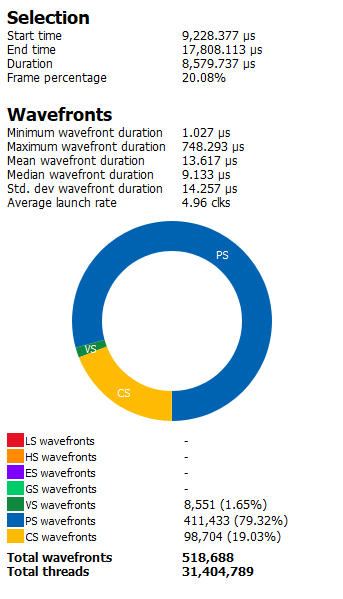

If the user selects a barrier, the details panel will show information
relating to the barrier, such as the barrier flags and any layout
transitions associated with this barrier. It will also show the barrier
type (whether it came from the application or the driver). Note that the
barrier type is dependent on whether the video driver has support for
this feature. If not, then it will be indicated as 'N/A'. An example of
a user-inserted barrier is shown below:

.. image:: media_rgp/RGP_DetailsPanel_3.png
  :width: 4.12758in
  :height: 4.71899in

If the driver needed to insert a barrier, a detailed reason why this barrier
was inserted is also displayed, as shown below:

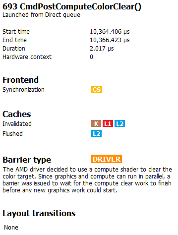

If the user selects a layout transition, the details panel will show
information relating to the layout transition as shown below:

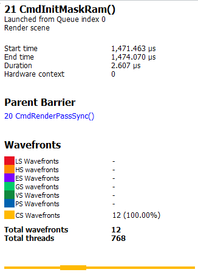

The user can also right-click on any of the events in the Events
timeline view and navigate to Event timing or Pipeline state panes, as
well as Barriers, Most expensive events and Context rolls panes within
Overview tab, and view the selected event in these panes, as well as in
the side panels.

In addition, the user can zoom into an event using the “Zoom to
selection” option from this context menu.

Below is a screenshot of what the right-click context menu looks like.

.. image:: media_rgp/RGP_WavefrontOccupancy_6.png
  :width: 8.03391in
  :height: 2.71875in

Event timing
------------

The event timing window shows a list of events and their corresponding
timings. The treeview in the left hand column shows each event name and
its unique index, starting at 0, and are listed in sequential order.
Events can be ordered into groups, and group categories are shown in
bold text.

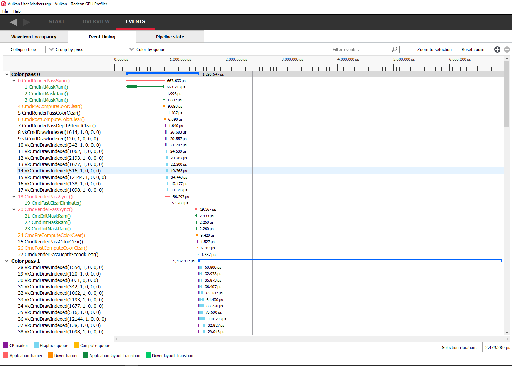

The pane to the right of the treeview shows a graphical representation
of the duration for each event. The darker blue span to the right of
each tree node shows the duration of all the events in that node.

In the graphic for each event (shown in light blue above) the first
small block at the left is the CP marker, indicating when the event was
issued. This is followed, some time later, by actual work done by the
shaders. The delay between the CP marker and the start of actual work
may indicate bottlenecks in the application. One of the shaders may be
waiting for a resource which is currently being used by another wave in
flight and cannot start until it obtains that resource. The time when
the first shader started work and the last shader finished work is the
number indicated in this column. Each shader stage is represented by a
rectangular block. The longer the block, the longer the shader took to
execute. Shaders are linked by a solid line to show that they are
connected in the pipeline. For groups, a dark line spans all events
within the group, showing the time taken for that group to complete
work.

Control on this pane is similar to the Wavefront occupancy pane. Zooming
can be done by clicking on the zoom buttons or selecting a region with
the mouse and clicking on ‘Zoom to selection’. ‘Zoom to selection’ will
also zoom in on an event if the line for that event is selected in the
table. If zoomed in, dragging is also possible using the same method
described previously.

\ **Grouping modes**

The events can be grouped together. Normally these groups don't affect
the event ordering but sometimes can (sort by state bucket).

-  **Group by pass** will show events depending on the render
   target or attachment type (color, depth-only, compute).

-  **Group by hardware context** will group events by their hardware
   context, making it easy to see which events caused the context to
   change.

-  **Group by state bucket** **(unsorted)** will order the events by
   state bucket but won't sort the state buckets by duration.
   Theoretically, all events in a state bucket use the same shaders. The
   duration of a state bucket is represented by the dark blue line
   corresponding to the state bucket group text.

-  **Group by state bucket** **(serialized)** will take all the event
   timings within the group and sum the total time that the shaders were
   busy, ignoring all empty space between events. This has the effect of
   serializing the shader work and doesn't take into account that some
   shaders will be executing in parallel. This is used to highlight when
   you have a lot of small shaders whose cumulative work can be
   extensive. As an example, if you have 2 shaders which start at the
   same time and one takes 2000 clks and another takes 10000 clks, the
   total duration would be 12000 clks.

-  **Group by state bucket (overlapped)** takes into account the
   parallelism of the shader execution so will highlight shaders which
   take a long time to execute. Using the same example above, since both
   shaders start together, the total duration in this case would be
   10000 clks.

-  **Group by command buffer** will group events depending on which
   command buffer they are on.

-  **Group by user events** will group the events depending on which
   user event(s) they are surrounded by.

The default grouping mode is by user event if user events are present in
the profile. Otherwise the default will be to group by pass.

Note that grouping by hardware context or command buffer will group
events by queue first. Grouping by pass or user event will
chronologically group events irrespective of which queue they originated
from. Grouping by state bucket just shows events in the graphics queue.
Grouping by hardware context is shown below:

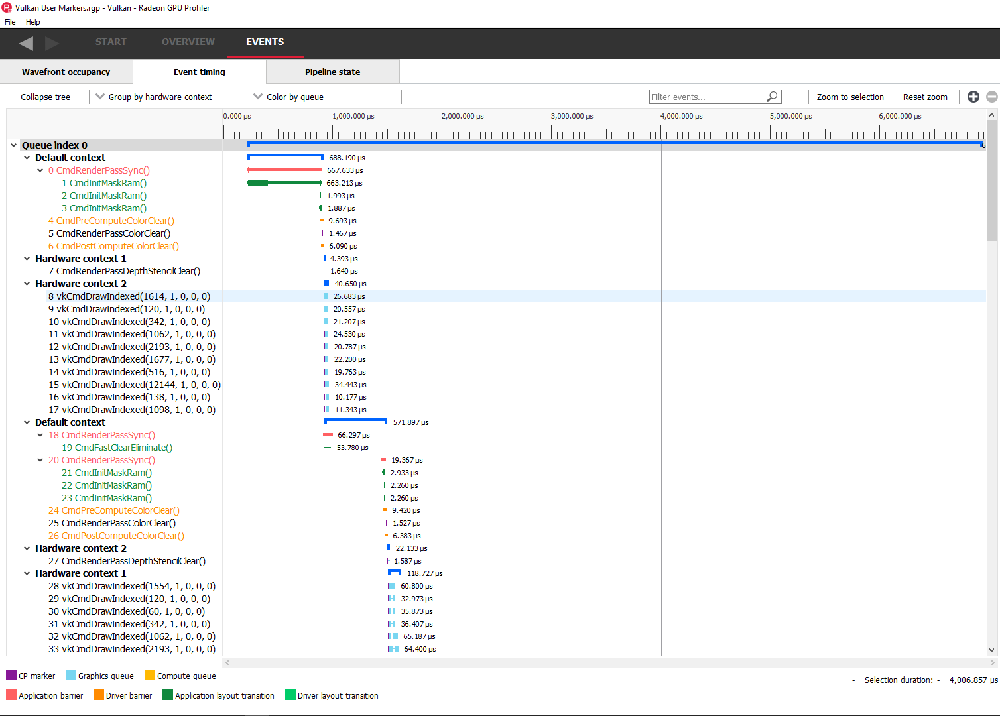

**Color modes**

The events can be rendered using different color schemes in the same manor
as in the Wavefront occupancy view.

The user can also right-click on any of the events and navigate to
Wavefront occupancy or Pipeline state panes, as well as Barriers, Most
expensive events and Context rolls panes within Overview tab, and view
the selected event in these panes, as well as in the side panels.

In addition, the user can zoom into an event using the “Zoom to
selection” option from this context menu.

Below is a screenshot of what the right-click context menu looks like.

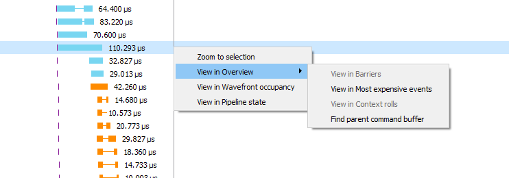

**Wavefront occupancy and event timing window synchronization**

Normally, adjusting the time window in one of these views (by zooming in
and scrolling) doesn’t affect the other window. This can be useful in
some cases when tracking more than one item. However, it is sometimes
useful to lock both the event timing and wavefront occupancy views to
the same visible time window. There is an option to control this in the
‘General’ tab of the Settings section called **Sync event time
windows**. With this enabled, any zooming and scrolling will in one
window will be reflected in the other. If adjustments are made in the
wavefront occupancy view, the vertical scroll bar in the event timing
view will be automatically adjusted so that there are always events
shown on screen if an event isn’t manually selected.

The anatomy of an event
-----------------------
Two examples of typical draw call events are shown below:

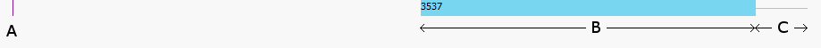
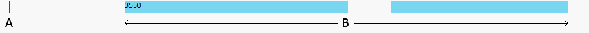

**A** shows the CP marker. This is the point the command processor in the
GPU issues work to be done. It is then queued up until the GPU can process
the workload.

**B** shows the work being done by the various shader stages. The gap between
the CP marker and the start of **B** indicates that the GPU didn't start on
the workload straight away and was busy doing other things, for example, previous
draw calls.

**C** shows any fixed-function work that needs doing after the shaders have
finished executing. This occurs when a draw call is doing depth-only rendering.
The fixed function work shown is the primitive assembly and scan conversion
of the vertices shaded by the vertex shader.

Starting with RGP 1.2 users may also obtain information about an event's
parent command buffer. When right-clicking on an event, users are presented with
a context menu containing an option to find its parent command buffer. This
will trigger RGP to navigate to the Frame Summary and focus on said parent
command buffer. Once here, users can obtain valuable system-level insight
about the surrounding context for the event in question.

Pipeline state
--------------

The pipeline state window shows the render state information for
individual events by stage. In the example below the event is a
DirectX12 DrawInstanced call using a VS, GS, and a PS. Active stages are
rendered in black and can be selected, gray stages are inactive on this
draw and cannot be selected.

The user has selected the PS stage for viewing and it is rendered in
blue to indicate this. Below the pipeline stage graphic is a summary of
the wavefront activity for this draw and the per-wavefront register
resources used by the shader.

The register values indicate the number of registers that the shader is
using. The value in parentheses is the number of registers that have
been allocated for the shader.

From this information and knowledge about the GCN architecture we can
calculate the theoretical maximum wavefront occupancy for the pixel
shader. In this case the maximum of 8 wavefronts per SIMD are
theoretically possible, but may be limited by other factors.

.. image:: media_rgp/RGP_PipelineState_1.png
  :width: 7.98168in
  :height: 4.48969in

**Grouping modes**

The grouping modes are the same is in the Event timing pane.

The user can also right-click on any of the events and navigate to
Wavefront occupancy or Event timing panes, as well as Barriers, Most
expensive events and Context rolls panes within Overview tab, and view
the selected event in these panes, as well as in the side panels. Below
is a screenshot of what the right-click context menu looks like.

.. image:: media_rgp/RGP_PipelineState_2.png
  :width: 8.57800in
  :height: 1.20282in

**Note:** The Output Merger stage of a DirectX 12 application may report
the LogicOp as D3D12\_LOGIC\_OP\_COPY, even though it is set in an
application as D3D12\_LOGIC\_OP\_NOOP. These 2 operations are
semantically the same if blending is enabled. A no-op indicates that no
transform of the data is to be performed so the output is the same as
the source.

User Debug Markers
==================

User markers can help application developers to correlate the data seen
in RGP with their application behavior.

DirectX12 User Markers
----------------------

For DirectX12, there are two recommended ways to instrument your application
with user markers that can be viewed within RGP:

1. using Microsoft® PIX3 event instrumentation, or
2. using the debug marker support in AMD GPU Services (AGS) Library.

Using PIX3 event instrumentation for DirectX12 user debug markers
-----------------------------------------------------------------

If your application has been instrumented with PIX3 user markers, then
to view the markers within RGP is a simple matter of recompiling the source code
of the application with a slightly modified PIX header file to include AMD header files.

The currently supported PIX3 event instrumentation for RGP are:
::

  void PIXBeginEvent(ID3D12GraphicsCommandList* commandList, ...)
  void PIXEndEvent(ID3D12GraphicsCommandList* commandList)
  void PIXSetMarker(ID3D12GraphicsCommandList* commandList, ...)

The steps to update the PIX header file are:

1. Copy the entire ``samples\AMDDxExt`` folder provided in the RGP package to the location where the PIX header
files (``pix3.h``, ``pix3_win.h``) resides (typically at ``WinPixEventRuntime.[x.x]\Include\WinPixEventRuntime``).

2. Update the content of ``pix3.h`` file to replace the inclusion of ``pix3_win.h`` with ``AMDDxExt\AmdPix3.h`` file.
For example:
::

  #if defined(XBOX) || defined(_XBOX_ONE) || defined(_DURANGO)
  #include "pix3_xbox.h"
  #else
  //#include "pix3_win.h"
  #include "AMDDxExt\AmdPix3.h"
  #endif

3. Recompile the application.  Note that the RGP user markers are only enabled when the corresponding
PIX event instrumentation is also enabled with one of the preprocessor symbols:
**USE_PIX**, **DBG**, **_DEBUG**, **PROFILE**, or **PROFILE_BUILD**.

The PIX3 event instrumentation within the application continues to be usable for
`Microsoft PIX tool`_ without additional side effects or overhead.

To find a more complete description of how to use the PIX event instrumentation, refer to
https://blogs.msdn.microsoft.com/pix/winpixeventruntime/.

See many examples of using PIX event instrumentation at https://github.com/Microsoft/DirectX-Graphics-Samples.

Using AGS for DirectX12 user debug markers
------------------------------------------

The AMD GPU Services (AGS) library provides software developers
with the ability to query AMD GPU software and hardware state
information that is not normally available through standard operating
systems or graphic APIs. AGS includes support for querying graphics
driver version info, GPU performance, Crossfire™ (AMD’s multi-GPU
rendering technology) configuration info, and Eyefinity (AMD’s
multi-display rendering technology) configuration info. AGS also exposes
the explicit Crossfire API extension, GCN shader extensions, and
additional extensions supported in the AMD drivers for DirectX® 11 and
DirectX 12. One of the latest features in AGS is the support for DirectX
12 user debug markers.

User markers can be inserted into your application using AGS function
calls. The inserted user markers can then be viewed within RGP. The main
steps to obtaining user markers are described below.

Articles and blogs about AGS can be found here:
https://gpuopen.com/gaming-product/amd-gpu-services-ags-library/

Additional API documentation for AGS can be found at:
https://gpuopen-librariesandsdks.github.io/ags/

Download AGS
~~~~~~~~~~~~

Download the AGS library from:
https://github.com/GPUOpen-LibrariesAndSDKs/AGS_SDK/

The library consists of pre-built Windows libraries, DLLs, sample and
documentation. You will need to use files in the following two dirs.

-  Headers: AGS\_SDK-master\\ags\_lib\\inc

-  Libraries: AGS\_SDK-master\\ags\_lib\\lib

Integrate AGS header, libs, and DLL into your project
~~~~~~~~~~~~~~~~~~~~~~~~~~~~~~~~~~~~~~~~~~~~~~~~~~~~~

AGS requires one header (``amd\ags.h``) to be included in your source code.
Add the location of the AGS header to the Visual Studio project settings
and include the header in the relevant code files.

#include "amd\_ags.h"

Link your exe against correct AGS library for your project (32 or 64bit,
MD, MT, DLL, or UWP DLL).

+--------------+-------------------------------+--------------------------------+-----------------------------------------------------+
|              | **Library Name**              | **AGS Runtime DLL required**   | **Library Type**                                    |
+==============+===============================+================================+=====================================================+
| **64 Bit**   | amd\_ags\_uwp\_x64.lib        | amd\_ags\_uwp\_x64.dll         | UWP                                                 |
+--------------+-------------------------------+--------------------------------+-----------------------------------------------------+
|              | amd\_ags\_x64.lib             | amd\_ags\_x64.dll              | DLL                                                 |
+--------------+-------------------------------+--------------------------------+-----------------------------------------------------+
|              | amd\_ags\_x64\_2015\_MD.lib   | NA                             | VS2015 Lib (multithreaded dll runtime library)      |
+--------------+-------------------------------+--------------------------------+-----------------------------------------------------+
|              | amd\_ags\_x64\_2015\_MT.lib   | NA                             | VS2015 Lib (multithreaded static runtime library)   |
+--------------+-------------------------------+--------------------------------+-----------------------------------------------------+
|              | amd\_ags\_x64\_2017\_MD.lib   | NA                             | VS2017 Lib (multithreaded dll runtime library)      |
+--------------+-------------------------------+--------------------------------+-----------------------------------------------------+
|              | amd\_ags\_x64\_2017\_MT.lib   | NA                             | VS2017 Multithreaded static                         |
+--------------+-------------------------------+--------------------------------+-----------------------------------------------------+
| **32 Bit**   | amd\_ags\_uwp\_x86.lib        | amd\_ags\_uwp\_x86.dll         | UWP                                                 |
+--------------+-------------------------------+--------------------------------+-----------------------------------------------------+
|              | amd\_ags\_x86.lib             | amd\_ags\_x86.dll              | DLL                                                 |
+--------------+-------------------------------+--------------------------------+-----------------------------------------------------+
|              | amd\_ags\_x86\_2015\_MD.lib   | NA                             | VS2015 Lib (multithreaded dll runtime library)      |
+--------------+-------------------------------+--------------------------------+-----------------------------------------------------+
|              | amd\_ags\_x86\_2015\_MT.lib   | NA                             | VS2015 Lib (multithreaded static runtime library)   |
+--------------+-------------------------------+--------------------------------+-----------------------------------------------------+
|              | amd\_ags\_x86\_2017\_MD.lib   | NA                             | VS2017 Lib (multithreaded dll runtime library)      |
+--------------+-------------------------------+--------------------------------+-----------------------------------------------------+
|              | amd\_ags\_x86\_2017\_MT.lib   | NA                             | VS2017 Lib (multithreaded static runtime library)   |
+--------------+-------------------------------+--------------------------------+-----------------------------------------------------+

Initialize AGS
~~~~~~~~~~~~~~

When you have your project building the first thing to do is to initialize the AGS context.
::

  // Specify if memory allocation callbacks are required, and the type of crossfire support
  AGSConfiguration config = {};

  // Initialize AGS
  AGSReturnCode agsInitReturn = agsInit(&m_AGSContext, &config, &m_AmdgpuInfo);

  // Check to see if AGS was started
  if (agsInitReturn != AGS_SUCCESS)
  {
    printf("\\nError: AGS Library was NOT initialized - Return Code %d\\n", agsInitReturn);
  }

Initialize the DirectX12 Extension
~~~~~~~~~~~~~~~~~~~~~~~~~~~~~~~~~~

Once the AGS extension has been successfully created we need to create the DirectX12 extension as follows:
::

	// Initialize the DX12 extension on the device
	unsigned int flags = 0;

	AGSReturnCode dxInitReturn = agsDriverExtensionsDX12_Init(m_AGSContext, m_device.Get(), &flags);

	// Check to see if the DX12 extension was created
	if (agsInitReturn != AGS_SUCCESS)
	{
		printf("AGS DX12 extension was NOT initialized - Return Code %d\\n",agsInitReturn);
	}
	else
	{
		printf("AGS DX12 extension was initialized.\\n");
		// Check to see if user markers are supported in the current driver
		if (flags & AGS_DX12_EXTENSION_USER_MARKERS)
		{
			printf("AGS_DX12_EXTENSION_USER_MARKERS are supported.\\n");
		}
		else
		{
			printf("AGS_DX12_EXTENSION_USER_MARKERS are NOT supported.\\n");
		}
	}

Please note that the above code checks if the driver is capable of
supporting user markers by testing the output flags produced by the
creation of the DirectX12 extension. This step may fail on older
drivers.

Insert Markers in Application
~~~~~~~~~~~~~~~~~~~~~~~~~~~~~

The main functions provided by AGS for marking applications are:
::

  agsDriverExtensionsDX12_PushMarker;
  agsDriverExtensionsDX12_PopMarker;
  agsDriverExtensionsDX12_SetMarker;

The below example shows how a draw call can be enclosed within a “Draw
Particles” user marker, followed by inserting a marker.
::

  // Push a marker
  agsDriverExtensionsDX12_PushMarker(m_AGSContext, pCommandList, "DrawParticles");

  // This draw call will be in the “Draw Particles” User Marker
  pCommandList->DrawInstanced(ParticleCount, 1, 0, 0);

  // Pop a marker
  agsDriverExtensionsDX12_PopMarker(m_AGSContext, pCommandList);

  // Insert a marker
  agsDriverExtensionsDX12_SetMarker(m_AGSContext, pCommandList, "Finished Drawing Particles");

Vulkan User Markers
-------------------

Vulkan has support for user debug markers please read the following
article for details:

https://www.saschawillems.de/?page_id=2017

See code sample at:

https://github.com/SaschaWillems/Vulkan/blob/master/examples/debugmarker/debugmarker.cpp

Viewing User Markers
--------------------

The RGP file captured for a frame of the above application contains many
user markers. The user markers can be seen in the “Event timing” and
“Pipeline state” views when you choose the “Group by User Marker” option
as shown below.

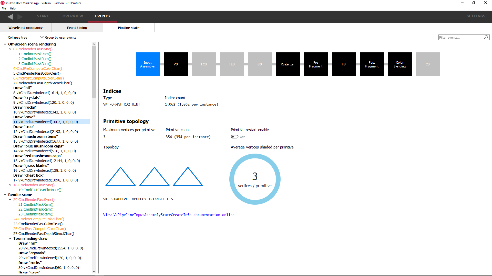

"Draw Particles" User marker with the draw calls enclosed in the User
Marker

User markers can also be seen in the wavefront occupancy view when you
color by User Events. Coloring by user events is also possible in the
event timing view. As seen below, the draw calls enclosed by the User
marker change color to purple. The events not enclosed by User Markers
are shown in gray. The coloration is only affected by the Push/PopMarker
combination; the SetMarker has no effect on the user event color since
these markers simply mark a particular moment in time.

The full user even hierarchy is also visible on the third line of the
side pane when clicking on individual events. If the event does not
contain a user event hierarchy, nothing will be shown.

.. image:: media_rgp/RGP_UserMarkers_2.png
  :width: 10.08435in
  :height: 5.51488in

Events enclosed by user markers are colored in the wavefront occupancy
view. They are also visible in the side panel.

RenderDoc & Radeon GPU Profiler interop BETA
============================================

Prior to version 1.2, users were expected to generate profiles by pairing
Radeon Developer Panel with their native application. This new feature
empowers RenderDoc to also generate profiles, plus allowing users to correlate
between events across both tools.

Intended usage
--------------

We encourage users to use both Radeon Developer Panel and RenderDoc to obtain
profiling data. The former will produce the best data for performance analysis,
and the latter can be used to pinpoint which elements of a frame consume
the most GPU time. Consider this interop feature as a supplement instead of a
replacement for profile generation.

Obtaining a profile from RenderDoc
----------------------------------

First, load RenderDoc and obtain a trace as usual. Next, create a new profile
for that trace as shown below:

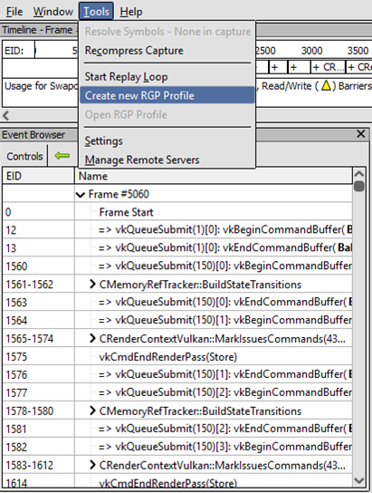

This will kick off the profiling process, which will embed a new profile into
the RenderDoc trace file. If this is the first time doing this, RenderDoc will
bring up a prompt to allow specification of a path to Radeon GPU Profiler. Once
profiling is complete, RenderDoc will launch Radeon GPU Profiler and the new
profile will be ready for analysis.

**NOTE:**
Be sure to close RGP if RenderDoc is restarted.  Otherwise, the restarted
RenderDoc instance will be unable to open a connection to the AMD-Developer-Service
API and will not be able to generate RGP Profiles.

Also, when running on Linux, if RenderDoc does not shutdown cleanly, it may be
necessary to wait a few minutes for the AMD-Developer-Service API connection to
close before restarting RenderDoc.

These are known issues that will be resolved in a future release.

The following command can be executed from a terminal window to determine if the
AMD-Developer-Service named pipe is still opened:

netstat -p | grep "AMD"

Navigating between events
-------------------------

Navigating between events in both tools is done via context menus. For example,
in Radeon GPU Profiler one would right click on an event and select
"Select RenderDoc event" as shown below:

.. image:: media_rgp/RGP_RDC_Interop_2.png
  :width: 10.0in
  :height: 5.0in

This will cause both tools to communicate with and trigger selection of that
same event in RenderDoc, as shown here:

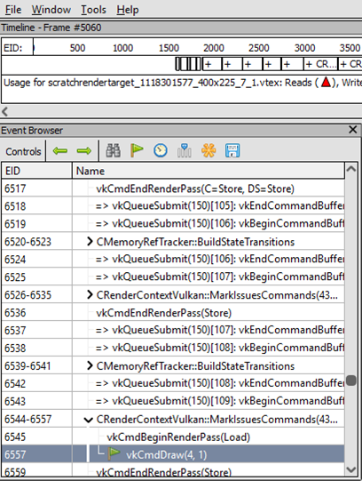

At this point, users may use RenderDoc’s frame debugging capabilities to
inspect the event in question.

Next, users may follow the same procedure to go back to RGP. This is achieved
by right clicking an event in the Event Browser and selecting "Select RGP Event"
as show below:

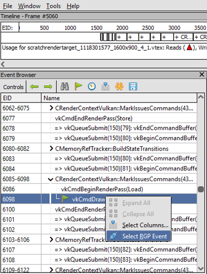

This will cause both tools to communicate and trigger selection of that same
event in Radeon GPU Profiler, as shown here:

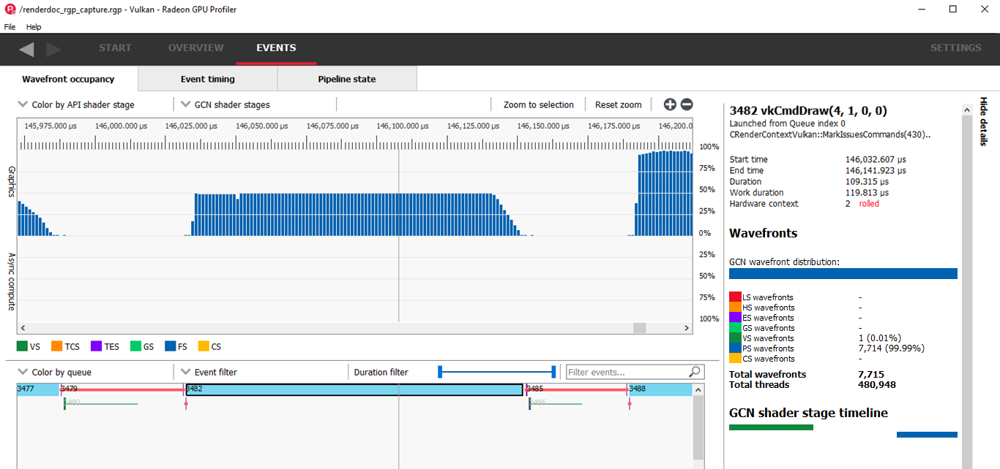

Please be aware that both tools use different numbering schemes to label
their events. It is therefore expected for the same event to have a different
ID in each tool.

**NOTE:** You may get a Windows firewall alert when connecting RGP to
RenderDoc. This is normal behavior as RenderDoc and RGP need to communicate
with each other (via a socket). This in no way indicates that the RGP or
RenderDoc are trying to communicate to an AMD server over the internet. These
tools do not attempt to connect to a remote AMD server of any description and
do not send personal or system information over remote connections.

Known limitations
-----------------

-  Users may correlate GPU work (draws/dispatches) across both tools.
   Note that this excludes entry points such as copies, barriers, clears,
   and indirect draw/dispatch.

-  Since the RenderDoc replayer serializes entry points, generated profiles
   could appear CPU bound. This can be seen as gaps in the wavefront
   occupancy view, which may not be present when obtaining the profile
   using Radeon Developer Panel.

-  Creating consecutive RGP profiles from the same RenderDoc instance
   sometimes fails. This occurs if users obtain multiple RenderDoc captures
   of the same application prior to triggering a second profile. To work
   around this, start a fresh instance of RenderDoc with the desired trace
   to profile.

-  In some cases profiles originating from RenderDoc contain no GPU events.
   To work around this, repeat the profiling process again via
   "Tools --> Create new RGP Profile"

-  The System Activity view for a RenderDoc profile will likely mismatch that
   of a native profile. This is due to different command buffer submission
   patterns between the replayer and native application.

-  Vulkan-specific: During image creation, RenderDoc sometimes forces additional
   usage/flags that may have not been present as per the native application.
   This effectively disables hardware tiling optimizations which are by default
   enabled during native app runtime.

-  Vulkan-specific: The RenderDoc replayer does not support playback of
   compute work on the async compute queue. This means that the profile will
   show all compute work running on the graphics queue.

-  Vulkan-specific: In some cases native profiles will contain color/depth
   clears which may not be present in the RenderDoc profile.

-  DX12-specific: The RenderDoc replayer will sometimes inject CopyBufferRegion
   calls as part of an optimization to Map/Unmap. These will be visible as
   tall spikes of compute work in the wavefront occupancy view.

-  If an RGP profile opened by RenderDoc is left running and RenderDoc is restarted,
   the InterOp connection between the two can't be re-established. In this case, the
   "Create new RGP Profile" menu option will remain disabled after opening a new
   RenderDoc trace. This is due to a named pipe left open.  To resolve the issue,
   close RGP then restart RenderDoc.
   For Linux only, a similar situation can occur if the RenderDoc process does not
   shutdown cleanly. If this occurs, it may be necessary to wait a few minutes for
   the connection to be removed before restarting RenderDoc.

.. _Microsoft PIX tool: https://blogs.msdn.microsoft.com/pix/introduction/
