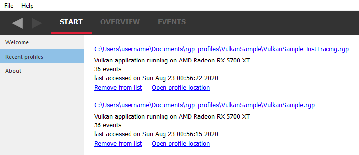

The Radeon™ GPU Profiler
========================

The Radeon GPU Profiler is a performance tool that can be used by
developers to optimize DirectX12©, Vulkan© and OpenCL© applications for AMD RDNA
and GCN hardware. It is part of a suite of tools comprised of the following
software:

-  **Radeon Developer Mode Driver** - This is shipped as part of the AMD
   public Adrenaline driver and supports the developer mode features required for
   profiling.

-  **Radeon Developer Service (RDS)** - A system tray application that
   unlocks the Developer Mode Driver features and supports
   communications with high level tools. A headless version is also
   available called RadeonDeveloperServiceCLI.

-  **Radeon Developer Panel (RDP)** - A GUI application that allows the
   developer to configure driver settings and generate profiler data
   from DirectX12, Vulkan and OpenCL applications.

-  **Radeon GPU Profiler (RGP)** - A GUI tool used to visualize and
   analyze the profile data.

   This document describes how to generate a profile using the Radeon
   Developer Panel and how the Radeon GPU Profiler can be used to
   examine the output profiles. The Radeon GPU Profiler is currently
   designed to work with compute applications and frame based graphics
   applications. It is specifically designed to address the issues that
   developers are dealing with in the move from traditional graphics
   APIs to explicit APIs. It also provides the visualization of GCN
   hardware specific information allowing the developer to tune an
   application to the full potential of the architecture. The tool
   provides unique visualizations of queue synchronization using fences
   and semaphores, asynchronous compute, and barrier timings. Currently,
   it supports the explicit graphics APIs (DirectX12 and Vulkan), compute
   APIs (OpenCL) and will NOT work with older graphics APIs such as
   DirectX11 or OpenGL.

Supported graphics APIs, RDNA and GCN hardware, and operating systems
---------------------------------------------------------------------

**Supported APIs**

-  DirectX12

-  Vulkan

\ **Supported RDNA and GCN hardware**

-  AMD Radeon RX 5500 series

-  AMD Radeon RX 5700 and RX 5700 XT

-  AMD Radeon VII

-  AMD RX Vega 64 and RX Vega 56

-  AMD Ryzen™ Processors with Radeon Vega Graphics

-  AMD Radeon R9 Fury and Nano series

-  AMD Radeon RX 400 and RX 500 series

-  AMD Tonga R9 285, R9 380

\ **Supported Operating Systems**

-  Windows 10

-  Windows 7

-  Ubuntu 18.04.3 LTS

Supported compute APIs, GCN hardware, and operating systems
------------------------------------------------------------

**Supported APIs**

-  OpenCL

\ **Supported GCN hardware**

-  AMD Radeon VII

-  AMD RX Vega 64 and RX Vega 56

-  AMD Ryzen Processors with Radeon Vega Graphics

\ **Supported Operating Systems**

-  Windows 10

-  Windows 7

-  Ubuntu 18.04.3 LTS

Radeon GPU Profiler - Quick Start
=================================

How to generate a profile
-------------------------

The first thing you will need to do is generate a profile. Currently,
this is done via the Radeon Developer Panel. Read the documentation
provided with this distribution for information on how to create a profile.
This can be obtained from within the Radeon Developer Panel or from the
link on the Radeon GPU Profiler "Welcome" view.

Starting the Radeon GPU Profiler
--------------------------------

The following executables can be found in the download directory.

.. image:: media_rgp/RGP_Executables.png

Start **RadeonGPUProfiler.exe** (this is the tool used to view profile
data).

How to load a profile
---------------------

There are a few ways to load a profile into RGP.

1) Use the “File/Open profile” pull down menu, or the “File/Recent
   profile” pull down menu item.

.. image:: media_rgp/RGP_FileLoad.png

.. image:: media_rgp/RGP_FileRecent.png

2) Go to the “Welcome” view and click on the “Open a Radeon GPU
   Profile…”

3) Go to the “Welcome” view and click on a profile that you have
   previously loaded in the Recent list.

.. image:: media_rgp/RGP_Welcome.png

4) Go to the Recent profiles view to see a full list of all your recent
   profiles.

   Notice that there is additional information provided for each profile when
   viewed in this pane, such as the GPU the profile was taken on, the date when
   the capture was performed and whether or not an API PSO was specified. This
   is a useful reminder of how to find the events with the appropriate API PSO
   hash in the tool.

5) Load a profile into a new instance of the **Radeon GPU Profiler**
   from the **Radeon Developer Panel**. Select a profile in the list and
   click on “Open profile”.

.. image:: media_rgp/RDP_OpenProfile.png

6) Drag and drop a profile onto the **Radeon GPU Profiler** executable,
   or, onto an already open RGP instance.

The Radeon GPU Profiler user interface
--------------------------------------

There are four main menus in the Radeon GPU Profiler and each has a
number of sub-windows. The two main UIs that deal with the analysis of
the profile data are within the **Overview** and **Events** sections.

1. **Start**

   a. **Welcome** - Shows links to help documentation, and a list of
      recently opened profiles, and a sample profile.

   b. **Recent profiles** - Displays a list of the recently opened
      profiles.

   c. **About** - Shows build information about RGP and useful links.

2. **Overview**

   a. **Frame Summary** - Contains a summary of the structure of the
      graphics frame. This overview section is not available for OpenCL profiles.

   b. **Profile Summary** - Contains a summary of the structure of the OpenCL profile.

   c. **Pipelines** - Details of the pipeline usage in the profile.

   d. **Barriers** - Details of the barrier usage in the profile.

   e. **Most expensive events** - List of the most expensive events.

   f. **Context rolls** - Details of the hardware context register usage.
      This overview section is not available for OpenCL profiles.

   g. **Render/depth targets** - Overview of render targets used throughout
      the graphics frame. This overview section is not available for OpenCL profiles.

   h. **Device Configuration** - Information about the GPU the profile
      was generated on.

3. **Events**

   a. **Wavefront occupancy** - Shows detailed information about
      wavefront occupancy and event timings.

   b. **Event timing** - Tree view of profile events and their timing
      data.

   c. **Pipeline state** - Tree view of profile events and their
      graphics/compute pipeline state.

4. **Settings**

   a. **General** - Adjust desired time units, state buckets, GPU boundness
      percentage, and wavefront view detail levels.

   b. **Themes and colors** - Customize colors for graphics API and
      hardware data.

   c. **Keyboard shortcuts** - Shortcuts for navigating the wavefront
      occupancy UI.

Settings
========

.. include:: Settings.rst

Overview Windows
================

.. include:: FrameSummary.rst

.. include:: ProfileSummary.rst

.. include:: Barriers.rst

Context rolls
-------------

**NOTE**: This UI is only available for DirectX and Vulkan profiles.

Context rolling is a hardware feature specific to the GCN graphics
architecture and needs to be taken into consideration when optimizing
draws for AMD GPUs. Each draw requires a set of hardware context
registers that describe the rendering state for that specific draw. When
a new draw that requires a different render state enters the pipeline,
an additional set of context registers is required. The process of
assigning a set of context registers is called context rolling. A set of
context registers follows the draw through the graphics pipeline until
it is completed. On completion of the draw, that associated set of
registers is free to be used by the next incoming draw.

On GCN hardware there are 8 logical banks of context registers, of which
only seven are available for draws. The worst-case scenario is that 8
subsequent draws each require a unique set of context registers. In this
scenario the last draw has to wait for the first draw to finish before
it can use the context registers. This causes a stall that can be
measured and visualized by RGP.

.. image:: media_rgp/RGP_ContextRolls_1.png

In the example above, a DirectX 12 application, we can see that there
are 223 context rolls in the frame and none of them are redundant.
The Radeon GPU Profiler compares the context register values across state
changes to calculate if the context roll was redundant. Redundant context
rolls can be caused by the application and the driver. Ineffective draw
batching can be a cause on the application’s end.

In addition, the meter shows the number of context rolls as a percentage
of the number of draw calls, giving a visual indication of how efficient
the frame is with regards to changing state. A lower percentage indicates
that, on average, more draw calls are sharing state across the frame.
This meter also shows a breakdown of Active vs. Redundant context rolls.

The chart to the right shows the number of events in each context.

The table underneath shows the state from the API's perspective, and
which parts of the state were involved in context rolls. The first column
indicates how many context rolls it was involved in. The second column
indicates how many of these changes were redundant with respect to the state
(the state was written with the exact same value or another piece of state
was changed). The next column indicates the number of context rolls that were
completely redundant (the whole context was redundant, not just the state).
The final column shows the number of context rolls of this state where this
was the only thing that changed in the event.

.. image:: media_rgp/RGP_ContextRolls_2.png

Selecting an API-state shows all the draw calls in the second table,
called the Events table, that rolled context due to this state
changing, with or without other states changing too.

The search box in the top-right corner of the state table filters
the state tree in real-time as you type. Only the state containing the
search text string will be shown.

**NOTE**: Selecting an event in this list will select the same event in
the other Event windows.

The user can also right-click on any of the rows and navigate to
Wavefront occupancy, Event timing or Pipeline state panes and view the
event represented by the selected row in these panes, as well as in the
side panels. Below is a screenshot of what the right-click context menu
looks like.

.. image:: media_rgp/RGP_ContextRolls_3.png

**NOTE**: When selecting events on the event panes and using the
right-click context menu to jump between panes, the option to "View in
context rolls" will only be available if the selected event is currently
present in the events table on the context rolls pane.

Most expensive events
---------------------

The Most Expensive events UI allows the developer to quickly locate the
most expensive events by duration. At the top of the window is a
histogram of the event durations. The least expensive events are to the
left of the graph and the most expensive to the right. A blue summary
bar with an arrow points to the bucket that is the most costly by time.
The events in this bucket are most in need of optimization. The double
slider below the chart can be used to select different regions of the
histogram. The summary and table below will update as the double
slider’s position is changed. In the example below we can see that the
most expensive 5% of events take 44% of the frame time.

Below the histogram is a summary of the frame. In this case, the top 10%
of events take 70% of the frame time, with 56% of the selected region
consisting of graphics events and 44% async compute events.

The table below the summary shows a list of the events in the selected
region with the most expensive at the top of the list.

.. image:: media_rgp/RGP_MostExpensiveEvents_1.png

**NOTE**: Selecting an event in this list will select the same event in
the other Event windows.

The user can also right-click on any of the rows and navigate to
Wavefront occupancy, Event timing or Pipeline state panes and view the
event represented by the selected row in these panes, as well as in the
side panels. Below is a screenshot of what the right-click context menu
looks like.

.. image:: media_rgp/RGP_MostExpensiveEvents_2.png

Render/depth targets
--------------------

**NOTE**: This UI is only available for DirectX and Vulkan profiles.

This UI provides an overview of all buffers that have been used as render
targets in draw calls throughout the frame.

.. image:: media_rgp/RGP_RendertargetsOverview_1.png

The screen is split into two sections, a timeline view and a treeview listing:

.. image:: media_rgp/RGP_RendertargetsOverview_2.png
..

  The graphical timeline view illustrates the usage of render targets over
  the duration of the frame. Other events like copies, clears and barriers are shown
  at the bottom of this view.

Zoom controls can be used to focus in on a section of the timeline. More
information on zoom controls can be found under the
:ref:`Zoom Controls <zoom_controls>` section. Each solid block in this
view represents a series of events that overlap and draw to the same
render target within the same pass. A single click on one of these
highlights the corresponding entry in the treeview.

.. image:: media_rgp/RGP_RendertargetsOverview_3.png
..
  The treeview shows a listing of all render targets and their properties found in the frame.

This section lists all of the render targets found in the frame. Based on the active
grouping mode it either shows a top-level listing of render targets or passes.
The grouping can be configured in two ways:

- **Group by target** The top level consists of all render targets found in the frame, plus
  per-frame stats. Child entries show *per-pass* stats for each render target.
- **Group by pass** The top level consists of all passes found in the frame. Child
  entries show per-pass stats for each render target.

Here are the currently available columns:

- **Name** The name of the render target. Currently this is sequential and based on the
  first occurrence of each render target in the frame.
- **Format** The format of each render target.
- **Width** Width of the render target.
- **Height** Height of the render target.
- **Draw calls** Number of draw calls that output to this render target.
- **Compression** Indicates whether compression is enabled for this render target or not.
- **Sample count** MSAA sample count of the render target.
- **Out of order draw calls** Number of out of order draw calls issued to this render target.
  This column is not shown for traces taken on RDNA GPUs.
- **Duration** The total duration of all the events that rendered to the render target. For
  example, if 3 events write to a depth buffer the duration will be the sum of these 3 event
  durations.

The rows in the table can be sorted by clicking on a column header.

**NOTE:**

- Selecting any item in either the timeline view or the treeview will select the corresponding
  item in the other view.
- Selecting any item in either the timeline view or the treeview will select the earliest event
  represented by that item  in other sections of the tool.

.. include:: Pipelines.rst

Device configuration
--------------------

This UI reports the GPU configuration of the system that was used to
generate the profile. The Radeon Developer Panel can retrieve profiles
from remote systems so the GPU details can be different from the system
that you are using to view the data. The clock frequencies refer to the
clock frequency running when the capture was taken. The number in
parentheses represents the peak clock frequency the graphics hardware
can run at.

.. image:: media_rgp/RGP_DeviceConfiguration.png

Events Windows
==============

This section of RGP is where users will perform most analysis at the
event level. An RGP event is simply an API call within a command buffer
that was issued by either the application or the driver.

The event windows allow searching of the event string. The event string
consists of the event index, the API call and parameters. Only events
containing the search string will be displayed. This works for the whole
event string, not just the event index. For example, if the search string
is '8', event 31 may be displayed if any of its parameters contain '8'.

.. include:: WavefrontOccupancy.rst

.. include:: EventTiming.rst

.. include:: PipelineState.rst

.. include:: InstructionTiming.rst

.. _zoom_controls:

Zoom Controls
=============

Time based graphs in RGP provide Zoom controls for adjusting the time scale that is
viewable on screen. The following set of zoom icons are displayed above each graph that
supports zooming:

.. |ZoomResetRef| image:: media_rgp/RGP_zoom_reset.png
.. |ZoomInRef| image:: media_rgp/RGP_zoom_in.png

|ZoomSelectionRef| **Zoom to selection**
----------------------------------------
When **Zoom to selection** is clicked, the zoom level is increased to a selected
region or selected event. A selection region is set by holding down the
left mouse button while the mouse is on the graph and dragging the mouse
either left or right.  A colored overlay will highlight the selected region
on the graph.  For graphs that support it, an event may be selected by
clicking on it with the mouse (either the left or right button).
**Zoom to selection** can also be activated by right clicking on a selection on the
graph and choosing the **Zoom to selection** context menu option.  Zooming
to a selected event can be accomplished by simply double clicking the event.
Pressing the **Z** shortcut key while holding down the **CTRL** key activates
**Zoom to selection** as well.

|ZoomResetRef| **Zoom reset**
-----------------------------
When **Zoom reset** is clicked, the zoom level is returned to the original level
to reveal the entire time span on the graph. The zoom level can also be reset
using the **H** shortcut key.

|ZoomInRef| **Zoom in**
-----------------------
Increases the zoom level incrementally to display a shorter time span on the
graph. The zoom level is increased each time this icon is clicked until the
maximum zoom level is reached. Alternatively, holding down the **CTRL** key
and scrolling the mouse wheel up while the mouse pointer is over the graph
will also zoom in for a more detailed view. Zooming in can be activated with
the **A** shortcut key. To zoom in quickly at a 10x rate, press the **S**
shortcut key.

|ZoomOutRef| **Zoom out**
-------------------------
Decreases the zoom level incrementally to display a longer time span on the
graph. The zoom level is decreased each time this icon is clicked until the
minimum zoom level is reached (i.e. the full available time region).
Alternatively, holding down the **CTRL** key and scrolling the mouse wheel down
while the mouse pointer is over the graph will also zoom in for more detailed
view. Zooming out can be activated with the **Z** shortcut key. To zoom out
quickly at a 10x rate, press the **X** shortcut key.

Zoom Panning
------------

When zoomed in on a graph region, the view can be shifted left or right by using
the horizontal scroll bar.  The view can also be scrolled by dragging the mouse
left or right while holding down the **spacebar** and the left mouse button.
Left and right arrow keys can be used to scroll as well.

.. _zoom_synchronization:

Synchronized Zoom
-----------------

Normally, adjusting the view of a time based graph (by zooming in and
scrolling) doesn’t affect graphs on other panes. This can be useful in
some cases when tracking more than one item. However, it is sometimes
useful to lock both the event timing and wavefront occupancy views to
the same visible time window. There is an option to control this in the
‘General’ tab of the Settings section called **Sync event time windows**.
With this enabled, any zooming and scrolling in one window will be reflected
in the other. If adjustments are made in the wavefront occupancy view, the
vertical scroll bar in the event timing view will be automatically adjusted
so that there are always events shown on screen if an event isn’t manually
selected.

User Debug Markers
==================

User markers can help application developers to correlate the data seen
in RGP with their application behavior. User Markers are presently not supported for OpenCL.

DirectX12 User Markers
----------------------

For DirectX12, there are two recommended ways to instrument your application
with user markers that can be viewed within RGP:

1. using Microsoft® PIX3 event instrumentation, or
2. using the debug marker support in AMD GPU Services (AGS) Library.

Using PIX3 event instrumentation for DirectX12 user debug markers
-----------------------------------------------------------------

If your application has been instrumented with PIX3 user markers, then
to view the markers within RGP is a simple matter of recompiling the source code
of the application with a slightly modified PIX header file to include AMD header files.

The currently supported PIX3 event instrumentation for RGP are:
::

  void PIXBeginEvent(ID3D12GraphicsCommandList* commandList, ...)
  void PIXEndEvent(ID3D12GraphicsCommandList* commandList)
  void PIXSetMarker(ID3D12GraphicsCommandList* commandList, ...)

The steps to update the PIX header file are:

1. Copy the entire ``samples\AMDDxExt`` folder provided in the RGP package to the location where the PIX header
files (``pix3.h``, ``pix3_win.h``) resides (typically at ``WinPixEventRuntime.[x.x]\Include\WinPixEventRuntime``).

2. Update the content of ``pix3.h`` file to replace the inclusion of ``pix3_win.h`` with ``AMDDxExt\AmdPix3.h`` file.
For example:
::

  #if defined(XBOX) || defined(_XBOX_ONE) || defined(_DURANGO)
  #include "pix3_xbox.h"
  #else
  //#include "pix3_win.h"
  #include "AMDDxExt\AmdPix3.h"
  #endif

3. Recompile the application.  Note that the RGP user markers are only enabled when the corresponding
PIX event instrumentation is also enabled with one of the preprocessor symbols:
**USE_PIX**, **DBG**, **_DEBUG**, **PROFILE**, or **PROFILE_BUILD**.

The PIX3 event instrumentation within the application continues to be usable for
`Microsoft PIX tool`_ without additional side effects or overhead.

To find a more complete description of how to use the PIX event instrumentation, refer to
https://blogs.msdn.microsoft.com/pix/winpixeventruntime/.

See many examples of using PIX event instrumentation at https://github.com/Microsoft/DirectX-Graphics-Samples.

Using AGS for DirectX12 user debug markers
------------------------------------------

The AMD GPU Services (AGS) library provides software developers
with the ability to query AMD GPU software and hardware state
information that is not normally available through standard operating
systems or graphic APIs. AGS includes support for querying graphics
driver version info, GPU performance, Crossfire™ (AMD’s multi-GPU
rendering technology) configuration info, and Eyefinity (AMD’s
multi-display rendering technology) configuration info. AGS also exposes
the explicit Crossfire API extension, GCN shader extensions, and
additional extensions supported in the AMD drivers for DirectX® 11 and
DirectX 12. One of the latest features in AGS is the support for DirectX
12 user debug markers.

User markers can be inserted into your application using AGS function
calls. The inserted user markers can then be viewed within RGP. The main
steps to obtaining user markers are described below.

Articles and blogs about AGS can be found here:
https://gpuopen.com/gaming-product/amd-gpu-services-ags-library/

Additional API documentation for AGS can be found at:
https://gpuopen-librariesandsdks.github.io/ags/

Download AGS
~~~~~~~~~~~~

Download the AGS library from:
https://github.com/GPUOpen-LibrariesAndSDKs/AGS_SDK/

The library consists of pre-built Windows libraries, DLLs, sample and
documentation. You will need to use files in the following two dirs.

-  Headers: AGS\_SDK-master\\ags\_lib\\inc

-  Libraries: AGS\_SDK-master\\ags\_lib\\lib

Integrate AGS header, libs, and DLL into your project
~~~~~~~~~~~~~~~~~~~~~~~~~~~~~~~~~~~~~~~~~~~~~~~~~~~~~

AGS requires one header (``amd\ags.h``) to be included in your source code.
Add the location of the AGS header to the Visual Studio project settings
and include the header in the relevant code files.

#include "amd\_ags.h"

Link your exe against correct AGS library for your project (32 or 64bit,
MD, MT, DLL, or UWP DLL).

+--------------+-------------------------------+--------------------------------+-----------------------------------------------------+
|              | **Library Name**              | **AGS Runtime DLL required**   | **Library Type**                                    |
+==============+===============================+================================+=====================================================+
| **64 Bit**   | amd\_ags\_uwp\_x64.lib        | amd\_ags\_uwp\_x64.dll         | UWP                                                 |
+--------------+-------------------------------+--------------------------------+-----------------------------------------------------+
|              | amd\_ags\_x64.lib             | amd\_ags\_x64.dll              | DLL                                                 |
+--------------+-------------------------------+--------------------------------+-----------------------------------------------------+
|              | amd\_ags\_x64\_2015\_MD.lib   | NA                             | VS2015 Lib (multithreaded dll runtime library)      |
+--------------+-------------------------------+--------------------------------+-----------------------------------------------------+
|              | amd\_ags\_x64\_2015\_MT.lib   | NA                             | VS2015 Lib (multithreaded static runtime library)   |
+--------------+-------------------------------+--------------------------------+-----------------------------------------------------+
|              | amd\_ags\_x64\_2017\_MD.lib   | NA                             | VS2017 Lib (multithreaded dll runtime library)      |
+--------------+-------------------------------+--------------------------------+-----------------------------------------------------+
|              | amd\_ags\_x64\_2017\_MT.lib   | NA                             | VS2017 Multithreaded static                         |
+--------------+-------------------------------+--------------------------------+-----------------------------------------------------+
| **32 Bit**   | amd\_ags\_uwp\_x86.lib        | amd\_ags\_uwp\_x86.dll         | UWP                                                 |
+--------------+-------------------------------+--------------------------------+-----------------------------------------------------+
|              | amd\_ags\_x86.lib             | amd\_ags\_x86.dll              | DLL                                                 |
+--------------+-------------------------------+--------------------------------+-----------------------------------------------------+
|              | amd\_ags\_x86\_2015\_MD.lib   | NA                             | VS2015 Lib (multithreaded dll runtime library)      |
+--------------+-------------------------------+--------------------------------+-----------------------------------------------------+
|              | amd\_ags\_x86\_2015\_MT.lib   | NA                             | VS2015 Lib (multithreaded static runtime library)   |
+--------------+-------------------------------+--------------------------------+-----------------------------------------------------+
|              | amd\_ags\_x86\_2017\_MD.lib   | NA                             | VS2017 Lib (multithreaded dll runtime library)      |
+--------------+-------------------------------+--------------------------------+-----------------------------------------------------+
|              | amd\_ags\_x86\_2017\_MT.lib   | NA                             | VS2017 Lib (multithreaded static runtime library)   |
+--------------+-------------------------------+--------------------------------+-----------------------------------------------------+

Initialize AGS
~~~~~~~~~~~~~~

When you have your project building the first thing to do is to initialize the AGS context.
::

  // Specify if memory allocation callbacks are required, and the type of crossfire support
  AGSConfiguration config = {};

  // Initialize AGS
  AGSReturnCode agsInitReturn = agsInit(&m_AGSContext, &config, &m_AmdgpuInfo);

  // Check to see if AGS was started
  if (agsInitReturn != AGS_SUCCESS)
  {
    printf("\\nError: AGS Library was NOT initialized - Return Code %d\\n", agsInitReturn);
  }

Initialize the DirectX12 Extension
~~~~~~~~~~~~~~~~~~~~~~~~~~~~~~~~~~

Once the AGS extension has been successfully created we need to create the DirectX12 extension as follows:
::

	// Initialize the DX12 extension on the device
	unsigned int flags = 0;

	AGSReturnCode dxInitReturn = agsDriverExtensionsDX12_Init(m_AGSContext, m_device.Get(), &flags);

	// Check to see if the DX12 extension was created
	if (agsInitReturn != AGS_SUCCESS)
	{
		printf("AGS DX12 extension was NOT initialized - Return Code %d\\n",agsInitReturn);
	}
	else
	{
		printf("AGS DX12 extension was initialized.\\n");
		// Check to see if user markers are supported in the current driver
		if (flags & AGS_DX12_EXTENSION_USER_MARKERS)
		{
			printf("AGS_DX12_EXTENSION_USER_MARKERS are supported.\\n");
		}
		else
		{
			printf("AGS_DX12_EXTENSION_USER_MARKERS are NOT supported.\\n");
		}
	}

Please note that the above code checks if the driver is capable of
supporting user markers by testing the output flags produced by the
creation of the DirectX12 extension. This step may fail on older
drivers.

Insert Markers in Application
~~~~~~~~~~~~~~~~~~~~~~~~~~~~~

The main functions provided by AGS for marking applications are:
::

  agsDriverExtensionsDX12_PushMarker;
  agsDriverExtensionsDX12_PopMarker;
  agsDriverExtensionsDX12_SetMarker;

The below example shows how a draw call can be enclosed within a “Draw
Particles” user marker, followed by inserting a marker.
::

  // Push a marker
  agsDriverExtensionsDX12_PushMarker(m_AGSContext, pCommandList, "DrawParticles");

  // This draw call will be in the “Draw Particles” User Marker
  pCommandList->DrawInstanced(ParticleCount, 1, 0, 0);

  // Pop a marker
  agsDriverExtensionsDX12_PopMarker(m_AGSContext, pCommandList);

  // Insert a marker
  agsDriverExtensionsDX12_SetMarker(m_AGSContext, pCommandList, "Finished Drawing Particles");

Vulkan User Markers
-------------------

Debug Marker Extension
~~~~~~~~~~~~~~~~~~~~~~
Vulkan has support for user debug markers using the ``VK_EXT_debug_marker`` extension. Please read the following
article for details:

https://www.saschawillems.de/blog/2016/05/28/tutorial-on-using-vulkans-vk_ext_debug_marker-with-renderdoc/

See code sample at:

https://github.com/SaschaWillems/Vulkan/blob/master/examples/debugmarker/debugmarker.cpp

Debug Utils Extension
~~~~~~~~~~~~~~~~~~~~~
The debug marker extension ``VK_EXT_debug_marker`` has been replaced with a new extension ``VK_EXT_debug_utils`` that provides additional support to narrow down the location of a debug message in complicated applications. The following document describes the capabilities of the new extension.

https://www.lunarg.com/wp-content/uploads/2018/05/Vulkan-Debug-Utils_05_18_v1.pdf

Both ``VK_EXT_debug_marker`` and ``VK_EXT_debug_utils`` extensions are supported in RGP.
Inserting user markers via these extensions should generate user events in your RGP profile which you can visualize.

Viewing User Markers
--------------------

The RGP file captured for a frame of the above application contains many
user markers. The user markers can be seen in the “Event timing” and
“Pipeline state” views when you choose the “Group by User Marker” option
as shown below.

.. image:: media_rgp/RGP_UserMarkers_1.png

"Draw Particles" User marker with the draw calls enclosed in the User
Marker

User markers can also be seen in the wavefront occupancy view when you
color by user events. Coloring by user events is also possible in the
event timing view. As seen below, the draw calls enclosed by the user
marker change color to purple. The events not enclosed by user markers
are shown in gray. The coloration is only affected by the Push/PopMarker
combination; the SetMarker has no effect on the user event color since
these markers simply mark a particular moment in time.

Additionally, the user event names are displayed at the top of the event
timeline view.

The full user event hierarchy is also visible on the third line of the
side pane when clicking on individual events. If the event does not
contain a user event hierarchy, nothing will be shown.

.. image:: media_rgp/RGP_UserMarkers_2.png

Events enclosed by user markers are colored in the wavefront occupancy
view. They are also visible in the side panel.

RenderDoc & Radeon GPU Profiler interop BETA
============================================

In addition to the typical use case where RGP profiles are generated
using Radeon Developer Panel, profiles can also be generated using
`RenderDoc <https://renderdoc.org/>`_. When an RGP profile is generated
by RenderDoc, events can be correlated across both tools.
This feature is only supported for DirectX12 and Vulkan.

Intended usage
--------------

We encourage users to use both Radeon Developer Panel and RenderDoc to obtain
profiling data. The former will produce the best data for performance analysis,
and the latter can be used to pinpoint which elements of a frame consume
the most GPU time. Consider this interop feature as a supplement instead of a
replacement for profile generation.

Obtaining a profile from RenderDoc
----------------------------------

First, load RenderDoc and obtain a trace as usual. Next, create a new profile
for that trace as shown below:

.. image:: media_rgp/RGP_RDC_Interop_1.png

This will kick off the profiling process, which will embed a new profile into
the RenderDoc trace file. If this is the first time doing this, RenderDoc will
bring up a prompt to allow specification of a path to Radeon GPU Profiler. Once
profiling is complete, RenderDoc will launch Radeon GPU Profiler and the new
profile will be ready for analysis.

Navigating between events
-------------------------

Navigating between events in both tools is done via context menus. For example,
in Radeon GPU Profiler one would right click on an event and select
"Select RenderDoc event" as shown below:

.. image:: media_rgp/RGP_RDC_Interop_2.png

This will cause both tools to communicate with and trigger selection of that
same event in RenderDoc, as shown here:

.. image:: media_rgp/RGP_RDC_Interop_3.png

At this point, users may use RenderDoc’s frame debugging capabilities to
inspect the event in question.

Next, users may follow the same procedure to go back to RGP. This is achieved
by right clicking an event in the Event Browser and selecting "Select RGP Event"
as show below:

.. image:: media_rgp/RGP_RDC_Interop_4.png

This will cause both tools to communicate and trigger selection of that same
event in Radeon GPU Profiler, as shown here:

.. image:: media_rgp/RGP_RDC_Interop_5.png

Please be aware that both tools use different numbering schemes to label
their events. It is therefore expected for the same event to have a different
ID in each tool.

**NOTE:** You may get a Windows firewall alert when connecting RGP to
RenderDoc. This is normal behavior as RenderDoc and RGP need to communicate
with each other (via a socket). This in no way indicates that the RGP or
RenderDoc are trying to communicate to an AMD server over the internet. These
tools do not attempt to connect to a remote AMD server of any description and
do not send personal or system information over remote connections.

Known limitations
-----------------

-  Users may correlate GPU work (draws/dispatches) across both tools.
   Note that this excludes entry points such as copies, barriers, clears,
   and indirect draw/dispatch.

-  Since the RenderDoc replayer serializes entry points, generated profiles
   could appear CPU bound. This can be seen as gaps in the wavefront
   occupancy view, which may not be present when obtaining the profile
   using Radeon Developer Panel.

-  Creating consecutive RGP profiles from the same RenderDoc instance
   sometimes fails. This occurs if users obtain multiple RenderDoc captures
   of the same application prior to triggering a second profile. To work
   around this, start a fresh instance of RenderDoc with the desired trace
   to profile.

-  In some cases profiles originating from RenderDoc contain no GPU events.
   To work around this, repeat the profiling process again via
   "Tools --> Create new RGP Profile"

-  The System Activity view for a RenderDoc profile will likely mismatch that
   of a native profile. This is due to different command buffer submission
   patterns between the replayer and native application.

-  Vulkan-specific: During image creation, RenderDoc sometimes forces additional
   usage/flags that may have not been present as per the native application.
   This effectively disables hardware tiling optimizations which are by default
   enabled during native app runtime.

-  Vulkan-specific: The RenderDoc replayer does not support playback of
   compute work on the async compute queue. This means that the profile will
   show all compute work running on the graphics queue.

-  Vulkan-specific: In some cases native profiles will contain color/depth
   clears which may not be present in the RenderDoc profile.

-  DX12-specific: The RenderDoc replayer will sometimes inject CopyBufferRegion
   calls as part of an optimization to Map/Unmap. These will be visible as
   tall spikes of compute work in the wavefront occupancy view.

-  If an RGP profile opened by RenderDoc is left running and RenderDoc is restarted,
   the interop connection between the two can't be re-established. In this case, the
   "Create new RGP Profile" menu option will remain disabled after opening a new
   RenderDoc trace. This is caused by a named pipe having been left open.  To resolve
   the issue, close RGP, and then restart RenderDoc.
   On Linux, a similar situation can occur if the RenderDoc process does not
   shutdown cleanly. If this occurs, it may be necessary to wait a few minutes for
   the connection to be removed before restarting RenderDoc.
   The following command can be executed from a terminal window to determine if the
   named pipe is still opened:

   - netstat -p | grep "AMD"

.. _Microsoft PIX tool: https://blogs.msdn.microsoft.com/pix/introduction/
