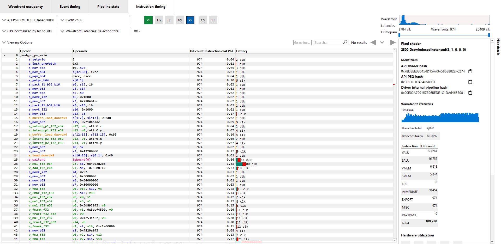
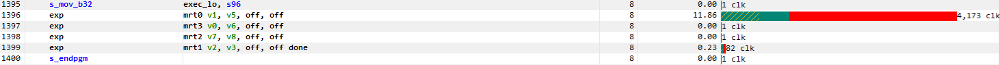
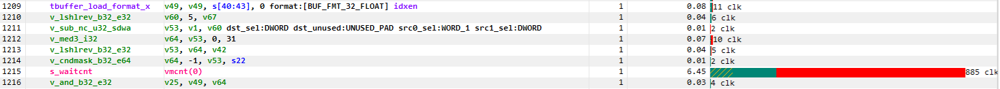
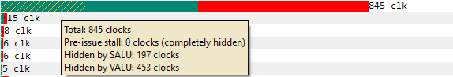
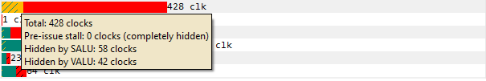
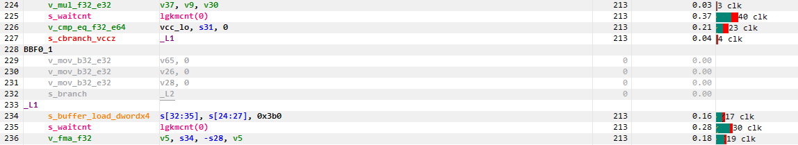
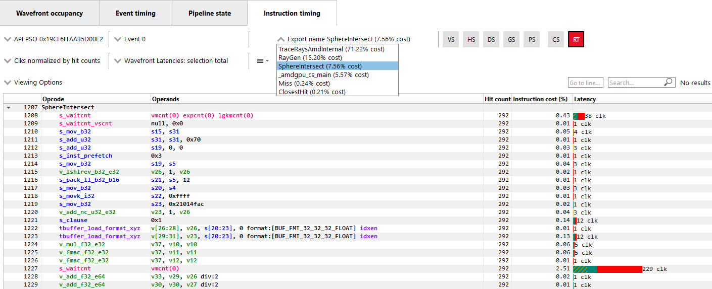
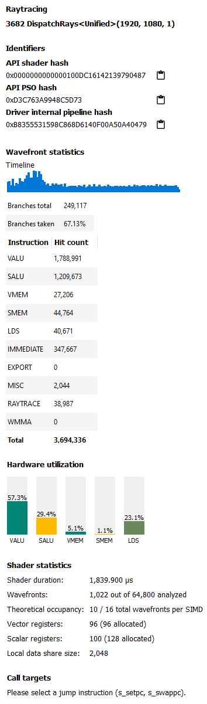

Instruction Timing
------------------

The Instruction Timing pane shows the average issue latency of each instruction of a single shader.
The Instruction Timing information is generated using hardware support on AMD RDNA and GCN GPUs.
Generating Instruction Timing does not require recompilation of shaders or insertion of any
instrumentation into shaders.

The Instruction Timing pane shows RDNA or GCN ISA. For a description of ISA, refer to the shader
programming guides at
`GPUOpen <https://gpuopen.com/documentation/amd-isa-documentation/>`_.
The Instruction Timing view for a shader is shown below.

\ **Latency**

Each shader line in the Instruction Timing view shows the time taken between the issue of an
instruction and the one after that. To provide information on what Latency means some sample
ISA statements are shown below.

**Best Case Instruction Issue:** In the below image, we see five instructions. The *1 clk*
denotes the latency between the issue of the *s_add_u32* instruction and the issue of the following
*s_and_b32* instruction. Similarly, the interval between the issue of *v_rcp_f32_e32*
and *s_add_u32* instruction is 2 clocks. This example shows an ideal performance case where each
instruction is issued at an interval of 1-2 clocks.

.. image:: media_rgp/rgp_instruction_timing_example_1.png

**Delays in Instruction Issue:** In the below image, we see three export instructions. The
*exp pos0* has a rather long interval of 16,616 clocks. This can be expected since the
*exp pos0* instruction's issue can be delayed for reasons such as unavailable memory resources
which may be in use by other wavefronts. As a result, there is a long duration in the instruction.
Since the latency waiting for memory resources was seen for the first export instruction,
the subsequent export, *exp param0* has a much shorter duration.

**Waitcounts and Instruction Issue:** In the below image, we see seven instructions. There are
two scalar buffer loads and three scalar ALU instructions, all of which issue with little latency.
We then see a *s_waitcnt* instruction. The *s_waitcnt* has a longer issue interval of 2,088 clocks.
The short latencies of the previous *s_buffer_load_dword* instructions may seem counter intuitive
since those are memory load instructions. However, this is expected as *s_waitcnt* is a shader
instruction used for synchronization to wait for previous instructions, such as the previous buffer
loads, to finish. The *s_waitcnt* instruction will issue and then wait (in this
case 2,088 clocks) until the next instruction which is the *v_add_f32_e64* can be issued.

By default, the Latency between any two instructions is an average of the latency measured per hit
for that instruction. The latency can also be displayed as an average per wavefront or as a total
across all wavefronts. This can be toggled using the normalization mode drop down shown below.

.. image:: media_rgp/rgp_instruction_timing_normalization_mode.png

The number of clock cycles shown for a given instruction is also represented by a bar. The length of
the bar corresponds to the number of clock cycles worth of latency for an instruction. Different colors
are used in the bars to indicate which parts of an instruction's latency were hidden by work performed
on other wave slots while the subsequent instruction was waiting to be issued on its slot. This can
be seen in the image below.

Solid green indicates how much of a given instruction's latency was hidden by VALU work. Solid yellow
indicates how much latency was hidden by SALU or SMEM work. A diagonal hatch pattern made up of both
green and yellow indicates how much latency was hidden by both VALU and SALU work. Finally, red indicates
how much latency was not hidden by other work being done on the GPU. It is likely that bars
with large red segments indicate a stall occurring while the shader is executing. When the mouse
hovers over a row in the Latency column, a tooltip appears showing the exact breakdown of that
instruction's latency.

In the image above, the total latency of the instruction is 853 clocks. Of those 853 clocks, 209 clocks
worth of latency are hidden by SALU work on other slots and 554 clocks worth of latency are hidden by
VALU work. The 209 clocks where both SALU and VALU work was being done is shown using the hatch pattern.
The segment between 209 and 554 clocks is shown as green since only VALU work is being done. The segment
between 554 and 853 clocks is shown as red since there is no other work being done. Since there is more
VALU work being done at the same time, green is more prevalent than yellow in this bar.

Contrast this with the image below, where an instruction is shown where more latency is hidden by SALU
work. In this case, yellow is more prevalent than green.

\ **Hit Count**

The *Hit count* for each instruction shows the number of times the instruction was executed for the
selected event. Any basic blocks that have a hit count of zero will be displayed as disabled in the
Instruction timing view, as shown below.

\ **Instruction Cost Percent**

The *Instruction Cost* for each ISA instruction shows the percentage of the Total Issue Latency of
the whole shader. For shaders with branches where consecutive instructions can have varying hit
counts, the Instruction Cost incorporates the extra hit counts for that instruction. This allows us
to find the hot-spot in the shader.

The Instruction Cost for an ISA instruction is calculated as follows:

*Instruction Cost = 100 * (Sum of All Latencies for ISA Instruction) / (Sum of All Latencies for
the shader)*

\ **Filtering wavefronts**

By default the *Latency*, *Hit count* and *Instruction cost* values are calculated using all
wavefronts that have been analyzed for a given shader. Information about the fastest wavefront and
the slowest wavefront can also be displayed, providing insight into any outliers in terms of
performance. The *Wavefront latencies* drop down (shown below) can be used to toggle between showing
all wavefronts, the fastest wavefront and the slowest wavefront.

.. image:: media_rgp/rgp_instruction_timing_wavefront_latencies.png

It is also possible to filter which wavefronts are analyzed using the *Wavefront Latencies Histogram*
(shown below).

.. image:: media_rgp/rgp_instruction_timing_wavefront_latencies_histogram.png

This histogram provides a visual representation of the full set of wavefronts for the current shader.
The fastest wavefronts are on the left side of the histogram and the slowest wavefronts are on the
right. Latency values increase moving from left to right. The height of each bar in the histogram
gives a relative indication of how many wavefronts correspond to each set of latency values represented
by the bars.

Below the histogram is a slider control that can be used to filter wavefronts. The two sliders allow
you to specify a clock range for the wavefronts to analyze. Only wavefronts that fall into the specified
range will contribute to the Latency, Hit count and Instruction cost percentage values displayed. If a
range is set, the *fastest in selection* and "slowest in selection" filters will show information from
the fastest and slowest waves within that range.

The histogram only appears when there is more than one wavefront analyzed for the selected shader.

\ **Instruction Timing Capture Granularity**

Instruction Timing information is generated for the whole RGP profile, but data is limited to a
single shader engine. Only waves executed by a single shader engine contribute to the hit counts
and timing information shown in the Instruction timing pane. Please see the Radeon Developer Panel
documentation for more information on how to capture instruction timing information.

To view all the events that have Instruction Timing information, the developer can choose the
"Color by Instruction Timing" option in the Wavefront Occupancy or the Event Timing views.

\ **Availability of Instruction Timing**

In certain cases it is possible that the Instruction Timing information may not be available for
all events. The main reasons why Instruction Timing information may not be present
for an event are described below.

\ **Hardware Architecture and Draw Scheduling**: Instruction Timing information is only sampled
from some of the compute units on a single shader engine of the GPU. As a result, it is possible
for events with very few waves to not have instruction data. This can happen if the
GPU schedules the waves on a shader engine or compute unit that doesn't have instruction trace enabled.

\ **Internal Events**: It should be noted that it is not possible to view Instruction Timing
information for internal events such as Clear().

\ **Navigation**

The Instruction Timing for an event can be accessed by right clicking on that event and choosing
the "View In Instruction Timing" option. Since it is common to use the same shader in multiple
events, RGP provides an easy way to toggle between multiple events that use the same shader using
the event drop down shown below.

.. image:: media_rgp/rgp_instruction_timing_2.png

This allows the developer to study the behavior of the shader for different events. It is
recommended to use the keyboard shortcuts, (Shift + Up and Shift + Down) to change API PSO
selection and (Shift + Left and Shift + Right) to move across different events using the same
shader.

\ **Navigation of Raytracing events**

For certain Raytracing events, an additional **Export name** drop down will be available. Whether
or not this drop down is shown depends on the compilation mode chosen by the AMD driver and compiler
for the selected event. There are two possible compilation modes: **Unified** and **Indirect**. The
compilation mode chosen for a particular event will be evident in the event name: events which use
the Unified mode will have a **<Unified>** suffix, while events which use the Indirect mode will have
an **<Indirect>** suffix. In the case of DirectX Raytracing, the full event names are
**DispatchRays<Unified>** and **DispatchRays<Indirect>**. For Vulkan, the full event names are
**vkCmdTraceRaysKHR<Unified>** or **vkCmdTraceRaysIndirectKHR<Unified>** and
**vkCmdTraceRaysKHR<Indirect>** or **vkCmdTraceRaysIndirectKHR<Indirect>**. The main difference
between these two compilation modes has to do with how the individual shaders in the raytracing
pipeline are compiled. In Unified mode, the individual shaders are inlined into a single shader,
resulting in a single set of ISA. In Indirect mode, the individual shaders are compiled separately,
and the functions in each shader end up as their own set of ISA instructions. Function call
instructions are generated in the ISA to allow one function to call another.

The way the ISA code is presented in the Instruction timing UI follows the way the driver and compiler
handle the shaders. For Unified mode, there is a single stream of ISA and the Instruction timing view
treats it as a single shader. For Indirect mode, there are multiple streams of instructions, one for
each shader in the raytracing pipeline. The instruction streams and their associated costs are displayed
per-shader and appear one after the other in the Instruction timing view. Only shader functions with
non-zero cost are displayed in the Instruction timing view. Shaders with zero cost can still be viewed
in the Pipeline state pane.

To help with navigation among the various shader functions, the **Export name** drop down is available
for any events that use the indirect compilation mode. This drop down allows the developer to toggle
between the multiple shaders. The drop down contains the list of exports along with their Instruction
cost. The exports will be sorted by the Instruction cost. Ctrl + Shift + Up and Ctrl + Shift + Down
can be used to move among the list of Export names. This **Export name** drop down is shown below.

Display of line numbers can be toggled using (Ctrl + Shift + L) and lines can be navigated to
directly using the (Ctrl + G) shortcut

\ **Search and Go to Line**

Individual instructions can be searched for and the developer can navigate directly to a specific
line using the controls displayed below.

\ **Instruction Timing Side Panel**

The Instruction Timing side panel provides additional information about the shader shown.

The main sections in the side panel are:

\ **Identifiers**: This section includes multiple hashes that can be used to identify the shaders
used and the pipeline that they are a part of.

\ **Wavefront Statistics**: The wavefront statistics provide information about the selected range
of wavefronts. As such, the information displayed depends on both the selected mode in the
**Wavefront latencies** drop down as well as the range selected in the **Wavefront Latencies Histogram**.

The **Timeline** provides a visual representation of when the selected wavefronts were executed. When
the Histogram is used to limit the range of wavefronts, the Timeline is updated such that waves that
do not fall within the specified range are displayed as grey. Only waves that fall within the range are
displayed as blue. This allows you to see where particular waves were executed. For instance, it might
be expected that slower waves were executed early on if, for instance, memory caches were not yet warm.
Using the Timeline in conjunction with the Histogram can help determine where a bottleneck might be.

The **Branches** table denotes the number of branch instructions in the shader and the percentage of
the total number of branches that were taken by the shader.

The **Instruction Types** table provides information about the dynamic instruction mix of the
shader's execution. The columns denote the different types of instructions supported by RDNA and GCN.
The counts denote the number of instructions of each category.

Each category's count denote the instruction count for that shader's invocation in the event.
Different executions of the same shader could have different Instruction statistics based on
factors such as the number of wavefronts launched for the shader and loop parameters. The
instruction categories are briefly described below. Please see the Shader Programming Guides for
more details.

- VALU: Includes vector ALU instructions

- SALU: Includes scalar ALU instructions

- VMEM: Includes vector memory and flat memory instructions

- SMEM: Includes scalar memory instructions

- LDS: Includes Local Data Share instructions

- IMMEDIATE: Includes the immediate instructions such as s_nop and s_waitcnt.

- EXPORT: Includes export instructions

- MISC: Includes other miscellaneous instructions such as s_endpgm

- RAYTRACE: Includes the BVH instructions used during raytracing.

The instruction types table provides a useful summary of the shader's structure especially for very
long shaders.

\ **Hardware Utilization**: The Hardware utilization bar charts show the utilization of each
functional unit of the GPU on a per-shader basis.

It should be noted that utilization shown is only for the shader being viewed. For example, in the
image shown, the VALU utilization of the shader is 67.6%. This means that the Raytracing shader shown
used 67.6% of the VALU capacity of the GPU. Other shaders may be concurrently executing on the GPU.
Their usage of the VALU is not considered when showing the bar charts.

A functional unit's utilization is calculated as follows:

*Utilization % = 100 * (Hit Count of all instructions executed on the functional unit) / (Duration
of analyzed wavefronts)*

\ **Shader Statistics**: The shader statistics section provides useful information about the shader

- Shader Duration: This denotes the execution duration of the whole shader. It can be correlated
  with the timings seen for the same shader in other RGP views such as the Wavefront Occupancy and
  the Event Timing views.

- Wavefronts: This denotes the total number of wavefronts in the shader and the number of
  wavefronts analyzed as part of building the Instruction Timing visualizations. It is expected that
  not all waves in the shader will be analyzed. This is for the same reasons described above when
  discussing the availability of Instruction Timing.

- Theoretical Occupancy: From the register information and knowledge about the GPU architecture we
  can calculate the theoretical maximum wavefront occupancy for the shader.

- Vector and Scalar Registers: The register values indicate the number of registers that the shader
  is using. The value in parentheses is the number of registers that have been allocated for the
  shader.

- Local Data Share Size: This value indicates how many bytes of local data share are used by the
  shader. This is only displayed for Compute Shaders.

\ **Call Targets**: While viewing data for an **<Indirect>** raytracing event, a Call targets list
is displayed in the side panel whenever a "s_swappc" or "s_setpc" instruction with a non-zero hit count
is selected. In the ISA view, a glyph is displayed next to any such instruction. For a "s_swappc"
instruction, the Call targets list shows the names of the exports that control may jump to, along
with a hit count indicating how many times each target was called. For a "s_setpc" instruction, the
Call targets list shows the name of the export that control will return to.

.. image:: media_rgp/rgp_instruction_timing_call_targets.png

\ **Instruction Timing for RDNA**

On RDNA GPUs, Instruction Timing can include certain instructions with a hit count of 0. Usually
this will be an instruction called *s_code_end* and may also be present after the shader's
*s_endpgm* instruction. This is expected since this is an instruction added by the compiler to
allow for instruction prefetching or for padding purposes. The hardware does not execute this
instruction.

Such instructions may also be present in the ISA view in the Pipeline state pane.

\ **Note**

Instruction timing data is currently unavailable for OpenCL.
