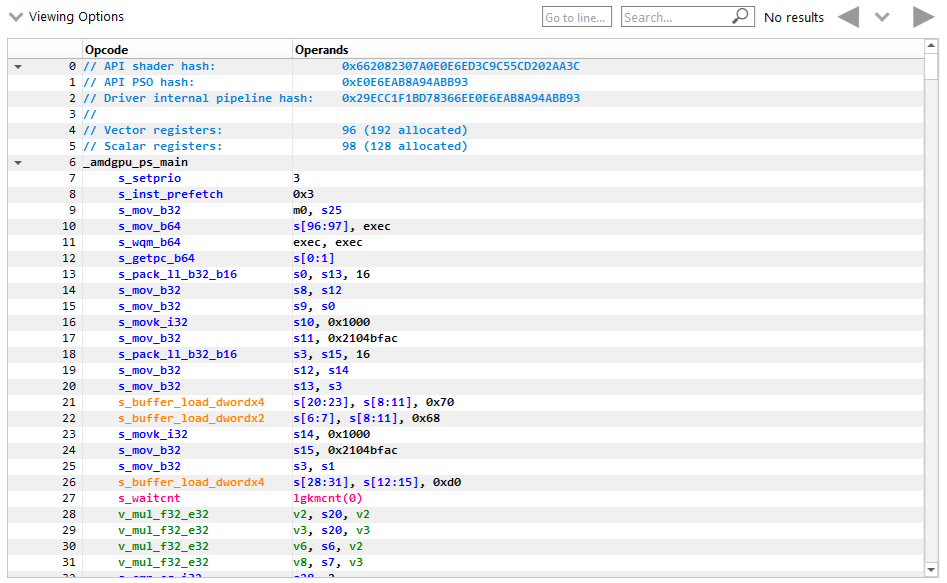
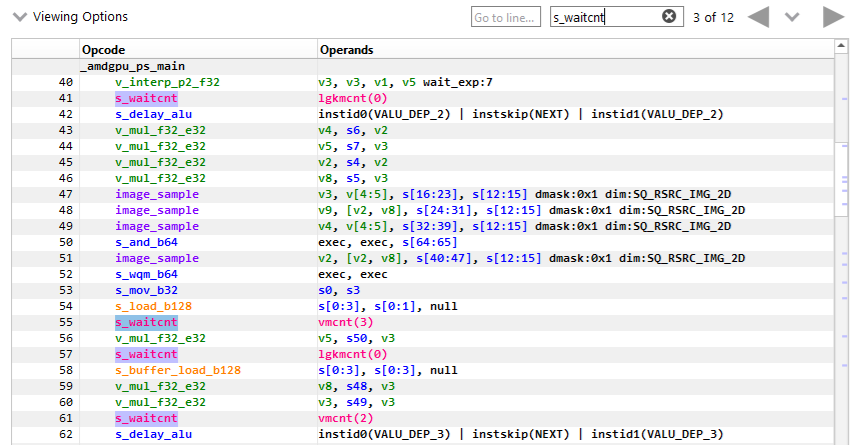

.. _isa_view:

ISA View
========

Several views in RGP display ISA for API shader stages.
ISA is displayed for a single shader stage at a time using the 
same color coding scheme and tree structure.

ISA views appear in the **Pipeline state** pane and in the **Instruction timing** pane.

Basic blocks can be expanded and collapsed individually or all at once.
To expand or collapse a single block, click on the arrow on the left side of
the instruction line. To expand or collapse all blocks in a shader at once, use the
(Ctrl + Right) or (Ctrl + Left) shortcut, respectively.

.. image:: media_rgp/rgp_isa_view_blocks_collapsed.png

Tokens can be selected and highlighted to see other instances of the selected token (instruction opcodes, registers and constants).

Basic blocks referenced by a branch instruction(s) can be clicked to scroll to the branch instruction(s).
Similarly, the block referenced in the branch instruction can be clicked to scroll to the block.
Branch navigations are recorded and can be replayed using the navigation history.

Columns can be customized by using the Viewing Options dropdown to show or hide them.
They can also be rearranged by clicking on the column header and dragging them to a new location.

.. image:: media_rgp/rgp_isa_view_customize_columns.png

Text in any column can be searched for and the developer can navigate directly to a specific
line using the controls displayed below.

.. image:: media_rgp/rgp_instruction_timing_find.png

Both the Search command (Ctrl + F) and the Go to line command (Ctrl + G) can be invoked using keystrokes.

Text in the isa viewer that matches the current search text is highlighted. The vertical
scroll bar will also indicate the location of all matches, giving you a visual
indicator of where in the shader the various matches can be found.

Hovering the mouse over opcodes will show a tooltip with the opcode's explanation, after a short delay.

The display of line numbers can be toggled using a keyboard shortcut (Ctrl + Alt + L).