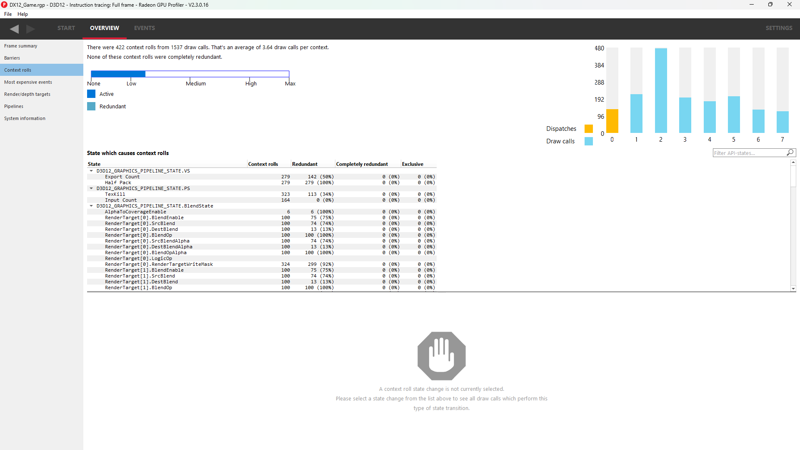
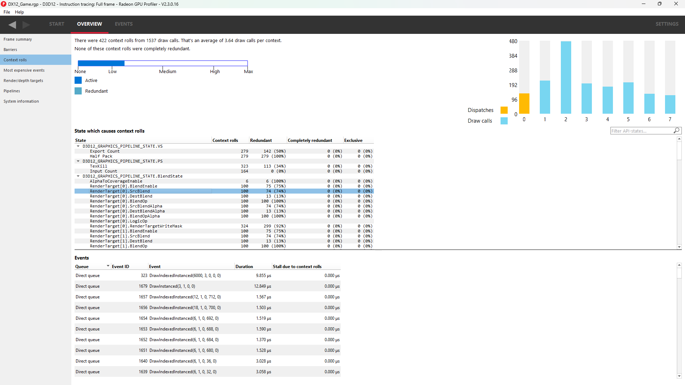
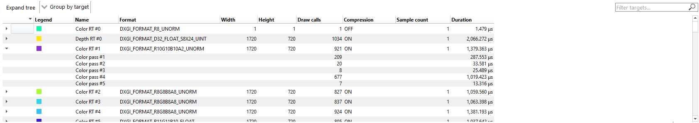
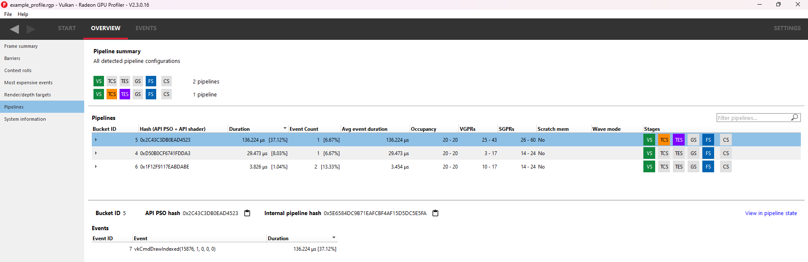
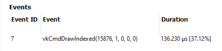
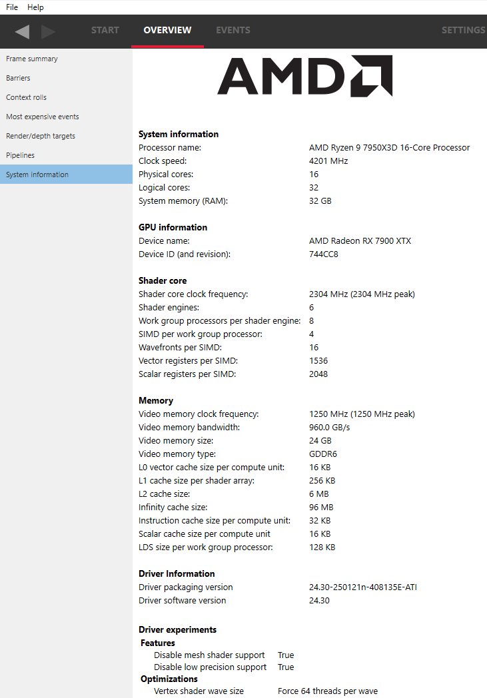

Overview Windows
================

Frame summary (Frame-based profiles)
------------------------------------

This window describes the structure of a profile from a number of
different perspectives. Frame-based profiles refers to profiles captured from
DirectX12 and Vulkan graphics applications that call Present.

The System activity section displays a system-level view of sync
operations and when command buffers were submitted to the GPU. Speaking
in general terms, all profiles contain two types of data: command buffer
timing data and SQTT timing data. This pane displays the former, and the
rest of RGP displays the latter.

Along the top, we find a series of controls:

-  **GPU and CPU based frames:** Controls how to display frame
   boundaries, which are also bracketed by black markers. The difference
   in time between both modes can help to visualize latency between
   workload submission and execution. The driver provides each command
   buffer with a frame number, a CPU submit timestamp, a GPU start
   timestamp, and a GPU end timestamp.

   -  **GPU-based frames:** Interprets frame boundaries to begin when
      a present finished on the GPU.

   -  **CPU-based frames:** Interprets frame boundaries to begin when
      a present was submitted on the CPU.

-  **Workload views:** Provide different ways to view the same data:

   -  **Command buffers:** Shows a list of all command buffers in a
      submission. Disabling this will condense all command buffers into
      a single submission block which also specifies the number of
      contained command buffers.

   -  **Sync objects**: Toggles whether to display signals and waits.

   -  **Sequential**: An alternate view which shows data linearly as
      opposed to stacked. The dark right-most portion of command buffers
      and submits indicates execution time on the GPU.

   -  **GPU only**: A flat view of the data which represents solely GPU
      work. This helps visualize parallelism among all GPU queues.

-  **CPU submission markers:** Draw vertical lines to help visualize
   when the CPU issued certain types of workloads to the GPU.

-  **Zoom controls:** Consistent with the rest of the tool, these allow
   users to drill down into points of interest. More information can be
   found under the :ref:`Zoom Controls<zoom_controls>` section.

In the middle, we find the actual view. Each queue (Graphics,
Compute, Copy) gets its own section. The alternating grey and white
backgrounds indicate frame boundaries. The blue region indicates
which command buffers were profiled with SQTT data, for more detailed
event analysis in other sections of the tool. Note that command
buffers are visualized using two shades of the same color. The
lighter shade represents time spent prior to reaching the GPU, and
the darker shade represents actual execution.

Please note that the view is interactive, making it possible for users to
select and highlight command buffers, sync objects, and submission
points.

Users can correlate between command buffer timing data and SQTT data by
right-clicking on a command buffer within the "Detailed GPU events" region.
This will bring up a context menu which contains three menu items for
finding the first event within the selected command buffer. Selecting one
of the menu items will navigate to the appropriate pane and set focus on
the specified event.

Along the bottom, we find information about user selections:

-  **Submit time:** Specifies when work was issued by the CPU

-  **Submit duration:** Specifies the full duration of the submit

-  **Enqueue duration:** Specifies how long the work was queued before
   beginning on the GPU

-  **GPU duration:** Specifies how long the GPU took to execute it.

Below the queue timings view we find the following summary:

.. image:: media_rgp/rgp_frame_summary_2.png
..

This shows an interpretation of queue timings data to determine which
processor is the bottleneck. By default, if the GPU is idle more than
5% of the time then the profile is considered to be CPU-bound. This
percentage may be adjusted in RGP settings.

Please note that the values displayed for **Frame duration** and
**Frame rate** are sourced from SQTT data. In other words, they are
based on duration and shader clock frequency used in other RGP panes
such as Wavefront occupancy.

The **Profiling overhead** shows the amount of profiling data that was
written to video memory by the hardware while gathering the RGP profile.
The profiling overhead is also expressed in terms of memory bandwidth used
to write the data. The profiling overhead is comprised of both SQTT data
and the cache counter data collected while profiling.

The **Queue submissions** and **Command buffers** pie charts show the
number of queue submissions and command buffers in the frame broken down
by the Direct and Compute queues. Compute submissions are colored in yellow
and graphics submissions are colored in light blue. The **Sync Primitives**
section counts how many unique signal and wait objects were detected
throughout the profile. Please note that only signals and waits from queue
operations are included in the profile data. For instance, any Vulkan
signals originating from vkAcquireNextImageKHR will not appear since that is
not a queue operation.

.. image:: media_rgp/rgp_frame_summary_3.png
..

The **Event statistics** pie chart and table show the event counts
colored by type. In the above example there are 281 Dispatch and
1,633 DrawIndexedInstanced events. The **Instanced primitives**
histogram shows the number of events that drew N (1 to 16+)
instances. In the example above we see that most events drew just a
single instance, whereas a lesser number of events drew 2-9 and 16
instances.

.. image:: media_rgp/rgp_frame_summary_4.png
..

**Geometry breakdown** gives a summary of the vertices,
shaded primitives, shaded pixels, and instanced primitives. In the
above example we can see that the GS is being used to expand the
number of shaded primitives. Also, looking at the **Rendered
primitives** histogram we can see that one draw uses between 0 and 1K
primitives, and the other draw call uses 11k or more primitives. This
makes sense given that the profile is from the D3D12nBodyGravity SDK
sample.

**NOTE**: The **Geometry breakdown** table and the **Rendered primitives**
histogram are hidden if there are no rendered primitives in the profile,
and the **Instanced primitives** histogram is hidden if there are no
instanced primitives in the profile.

Profile summary (Non frame-based profiles)
------------------------------------------

This window describes the structure of a profile from a number of
different perspectives. Non frame-based profiles refers to profiles captured from OpenCL,
HIP or pure-compute DirectX and Vulkan applications.

.. image:: media_rgp/rgp_profile_summary_1.png

The System activity section displays a system-level view of when command buffers were submitted to the GPU.
Speaking in general terms, all profiles contain two types of data: command buffer
timing data and SQTT timing data. This pane displays the former, and the
rest of RGP displays the latter. For OpenCL applications multiple dispatches that can be submitted
without host synchronization are grouped into command buffers automatically by the OpenCL driver.
This grouping reduces submission overhead.

Along the top, we find a series of controls:

-  **Workload views:** Provide different ways to view the same data:

    -  **Command buffers:**: Only for pure-compute DirectX and Vulkan profiles. See description in
       the **Frame summary** section.

   -  **Sync objects**: Only for pure-compute DirectX and Vulkan profiles. See description in
       the **Frame summary** section.

   -  **Sequential**: An alternate view which shows data linearly as
      opposed to stacked. The dark right-most portion of command buffers
      and submits indicates execution time on the GPU.

   -  **GPU only**: A flat view of the data which represents solely GPU
      work. This helps visualize parallelism among all GPU queues.

-  **CPU submission markers:** Draw vertical lines to help visualize
   when the CPU issued certain types of workloads to the GPU.

-  **Zoom controls:** Consistent with the rest of the tool, these allow
   users to drill down into points of interest. See the section entitled
   :ref:`Zoom Controls<zoom_controls>` for more information.

In the middle, we find the actual view. Each queue applicable to non frame-based profiles (Compute, Copy)
gets its own section. Note that command buffers are visualized using two shades of the
same color. The lighter shade represents time spent prior to reaching the GPU, and
the darker shade represents actual execution.

Please note that the view is interactive, making it possible for users to
select and highlight command buffers, sync objects, and submission
points.

Along the bottom, we find information about user selections:

-  **Submit time:** Specifies when work was issued by the CPU

-  **Submit duration:** Specifies the full duration of the submit

-  **Enqueue duration:** Specifies how long the work was queued before
   beginning on the GPU

-  **GPU duration:** Specifies how long the GPU took to execute it.

   Below the queue timings view we find the following summary:

..

This shows an interpretation of queue timings data to determine which
processor is the bottleneck. By default, if the GPU is idle more than
5% of the time then the profile is considered to be CPU-bound. This
percentage may be adjusted in RGP settings.

Please note that the value displayed for **Profile duration** is sourced
from SQTT data. In other words, it is based on duration and shader clock
frequency used in other RGP panes such as Wavefront occupancy.

The **Profiling overhead** shows the amount of SQTT data that was written
to video memory by the hardware while gathering the RGP profile. The
profiling overhead is also expressed in terms of memory bandwidth used
to write the SQTT data.

For pure-compute DirectX and Vulkan applications, the **Queue submissions**, **Command buffers**,
and **Sync Primitives** pie charts are visible. See the **Frame summary** section for more information.

The **Event statistics** pie chart and table show the event counts. For OpenCL, 
the items are colored by OpenCL API type. For HIP, the items are colored by
either kernel name (for dispatches) or HIP API type (for other events). Events for pure-compute DirectX
and Vulkan applications are colored by type similar to frame-based applications.
In the example below, there are 89 clEnqueueNDRangeKernel calls and 7
clEnqueueFillBuffer calls. The meaning of CmdBarrier() is explained in the
Barriers section.

.. image:: media_rgp/rgp_profile_summary_3.png
..

Barriers
--------

The developer is now responsible for the use of barriers in their
application to control when resources are ready for use in specific
parts of the frame. Poor usage of barriers can lead to poor performance
but the effects on the frame are not easily visible to the developer -
until now. The Barriers UI gives the developer a list of barriers in use
on the graphics queue, including the additional barriers inserted by the
driver.

Note that in older profiles or if the barrier origin isn't known, all
barriers and layout transitions will be shown as 'N/A'. Using an up-to-date
display driver will ensure that this information is available.

The summary at the top left of the UI quickly lets
the developer know if there is an issue with barrier usage in the frame.
When calculating the percentage, only portions of a barrier's duration
which are not overlapped by one or more events from any queue are taken
into consideration. For instance, if a barrier has a duration of 100 ns,
but 80 ns of that barrier's duration are overlapped by other events (on
the same queue or on a different queue), then only 20 ns of that
particular barrier contributes to the percentage calculation.
In the case shown above, the barrier usage is taking up 0% of the frame.

This summary also displays the average number of barriers
per draw or dispatch and the average number of
events per barrier issue.

The table shows the following information:

#. **Event Numbers** - ID of the barrier - selecting an event in this
   UI will select it on the other Events windows

#. **Duration** - Lifetime of the barrier

#. **Drain time** - This is the amount of time the barrier spends waiting
   for the pipeline to drain, or work to finish. Once the pipeline is empty,
   new wavefronts can be dispatched

#. **Stalls** - The type of stalls associated with the barrier - where
   in the graphics pipe we need the work to drain from

#. **Layout transitions** - A blue check box indicates if the barrier is
   associated with a layout transition. There are six columns indicating the
   type of layout transition. These are described in the Layout transition
   section below.

#. **Invalidated** - A list of invalidated caches

#. **Flushed** - A list of flushed caches

#. **Barrier type** - Whether the barrier originated from the application
   or from the driver (or 'N/A' if unknown)

#. **Reason for barrier** - In the case of driver-inserted barriers, a brief
   description of why this barrier was inserted

   The rows in the table can be sorted by clicking on a column header.

   **NOTE**: Selecting a barrier in this list will select the same event
   in the other Event windows.

   The user can also right-click on any of the rows and navigate to
   the Wavefront occupancy, Event timing, Instruction timing or Pipeline
   state panes and view the event represented by the selected row in these
   panes, as well as in the side panels. The user can also see the parent
   command buffer in the Frame summary pane or navigate to the Render/depth
   targets view and view the event in the timeline.

   Below is a screenshot of what the right-click context menu looks like:

.. image:: media_rgp/rgp_barriers_2.png

.. rubric:: Layout Transitions

The following Layout Transition columns are shown in the Barriers table:

#. **Depth/Stencil Decompress**: This barrier is emitted when a depth/stencil
   surface is decompressed. Depth/stencil surfaces are often stored compressed
   to reduce bandwidth to and from the color and depth hardware units.
#. **HiZ Range Resummarize**: This barrier is emitted when a depth/stencil buffer,
   which has corresponding hierarchical Z-buffer data, is modified. This barrier
   ensures that the modified data is reflected into the hiZ-buffer, allowing for
   correct culling and depth testing.
#. **DCC Decompress**: This barrier is emitted when `Delta Color Compression` compressed
   color data needs to be decompressed.
#. **FMask Decompress**: This barrier is emitted when FMask data is decompressed.
   FMask is used to compress MSAA surfaces. These surfaces must be decompressed
   before they can be read by texture hardware units.
#. **Fast Clear Eliminate**: This barrier is emitted when the driver performs a fast clear.
   For fast clears, a barrier is needed to read the clear color before filling the
   render target. Clearing to specific values (typically 0.0 or 1.0) may allow the GPU to
   skip the eliminate operation.
#. **Init Mask RAM**: This barrier is emitted when the driver uses a shader to initialize
   memory used for compression.

See `https://gpuopen.com/dcc-overview/ <https://gpuopen.com/dcc-overview/>`_ for more information
on what may cause a **DCC Decompress** or what "clear" values can be used to skip **Fast Clear Eliminates**.

.. rubric:: Barriers and OpenCL/HIP

Barriers for OpenCL or HIP profiles provide visibility into how the driver scheduled
dispatches to the GPU and dependencies between kernel dispatches. These barriers
are the same synchronization primitives used by DirectX12 and Vulkan that are described above.

The barriers shown in an OpenCL or HIP profile correspond to the barriers
inserted by the OpenCL or HIP driver for one of the following reasons.

#. **Data Dependencies** - There are data dependencies between subsequent dispatches. For
   example, reading the results of a previous kernel dispatch. This causes barriers to be inserted
   so that caches can be invalidated.

#. **Queue Profiling** - (OpenCL-specific) The application has enabled profiling CL_QUEUE_PROFILING_ENABLE
   property when creating a command queue. This causes barriers to be inserted so that timestamps can be
   recorded.

OpenCL command queues process dispatches one after another and it is common for a
subsequent kernel dispatch to use the results of a previous kernel dispatch. For this reason, it
can be expected that an RGP profile will have a large number of barriers.

A barrier from a typical HIP application is shown below.

As we see, the time taken due to barriers is typically very small since inter-dispatch dependencies only cause cache invalidations.

It should be noted that the meaning of barriers in RGP for OpenCL/HIP is different from
OpenCL or HIP built-in synchronization APIs. For example, barriers that appear in an
OpenCL RGP profile are not related to the OpenCL synchronization APIs based on cl_event
or cl_barrier. For this reason, the barriers seen in OpenCL/HIP profiles are displayed
as **CmdBarrier()** which is not a part of the OpenCL or HIP API. For these profiles,
RGP does not currently show API-specific events or host synchronization.

Context rolls
-------------

**NOTE**: This UI is only available for DirectX and Vulkan profiles.

Context rolling is a hardware feature specific to the RDNA and GCN graphics
architecture and needs to be taken into consideration when optimizing
draws for AMD GPUs. Each draw requires a set of hardware context
registers that describe the rendering state for that specific draw. When
a new draw that requires a different render state enters the pipeline,
an additional set of context registers is required. The process of
assigning a set of context registers is called context rolling. A set of
context registers follows the draw through the graphics pipeline until
it is completed. On completion of the draw, that associated set of
registers is free to be used by the next incoming draw.

On RDNA and GCN hardware there are 8 logical banks of context registers,
of which only seven are available for draws. The worst-case scenario is
that 8 subsequent draws each require a unique set of context registers.
In this scenario the last draw has to wait for the first draw to finish
before it can use the context registers. This causes a stall that can be
measured and visualized by RGP. On RDNA2 hardware, while there are still
8 banks of context registers, one entire bank, typically bank 2, is
reserved by the hardware and will typically appear completely empty in the
Context rolls pane.

In the example above, a DirectX 12 application, we can see that there
are 223 context rolls in the frame and none of them are redundant.
The Radeon GPU Profiler compares the context register values across state
changes to calculate if the context roll was redundant. Redundant context
rolls can be caused by the application and the driver. Ineffective draw
batching can be a cause on the application’s end.

In addition, the meter shows the number of context rolls as a percentage
of the number of draw calls, giving a visual indication of how efficient
the frame is with regards to changing state. A lower percentage indicates
that, on average, more draw calls are sharing state across the frame.
This meter also shows a breakdown of Active vs. Redundant context rolls.

The chart to the right shows the number of events in each context.

The table underneath shows the state from the API's perspective, and
which parts of the state were involved in context rolls. The first column
indicates how many context rolls it was involved in. The second column
indicates how many of these changes were redundant with respect to the state
(the state was written with the exact same value or another piece of state
was changed). The next column indicates the number of context rolls that were
completely redundant (the whole context was redundant, not just the state).
The final column shows the number of context rolls of this state where this
was the only thing that changed in the event.

Selecting an API-state shows all the draw calls in the second table,
called the Events table, that rolled context due to this state
changing, with or without other states changing too.

The **Filter API-states...** field in the top-right corner of the state table filters
the state tree in real-time as you type. Only the state containing the
filter text string will be shown.

**NOTE**: Selecting an event in this list will select the same event in
the other Event windows.

The user can also right-click on any of the rows and navigate to
Wavefront occupancy, Event timing or Pipeline state panes and view the
event represented by the selected row in these panes, as well as in the
side panels. Below is a screenshot of what the right-click context menu
looks like.

**NOTE**: When selecting events on the event panes and using the
right-click context menu to jump between panes, the option to "View in
context rolls" will only be available if the selected event is currently
present in the events table on the context rolls pane.

In the events panes selecting the "context rolls" option from the "Color 
By" drop down box in the Wavefront occupancy event timeline or the Event 
timing pane shows all events that have had their context rolled from the
previous event.

Most expensive events
---------------------

The Most Expensive events UI allows the developer to quickly locate the
most expensive events by duration. At the top of the window is a
histogram of the event durations. The least expensive events are to the
left of the graph and the most expensive to the right. A blue summary
bar with an arrow points to the bucket that is the most costly by time.
The events in this bucket are most in need of optimization. The double
slider below the chart can be used to select different regions of the
histogram. The summary and table below will update as the double
slider’s position is changed. In the example below we can see that the
most expensive 5% of events take 51% of the frame time.

Below the histogram is a summary of the frame. In this case, the top 15%
of events take 99% of the frame time, with 52% of the selected region
consisting of graphics events and 48% async compute events.

The table below the summary shows a list of the events in the selected
region with the most expensive at the top of the list.

**NOTE**: Selecting an event in this list will select the same event in
the other Event windows.

The user can also right-click on any of the rows and navigate to
Wavefront occupancy, Event timing or Pipeline state panes and view the
event represented by the selected row in these panes, as well as in the
side panels. Below is a screenshot of what the right-click context menu
looks like.

The :ref:`API Shader Stage Control <api_shader_stage_control>` shown in
the last column of the table indicates which API shader stages are active
in the pipeline used by the given event.

Render/depth targets
--------------------

**NOTE**: This UI is only available for DirectX and Vulkan profiles.

This UI provides an overview of all buffers that have been used as render
targets in draw calls throughout the frame.

The screen is split into two sections, a timeline view and a tree view listing:

The graphical timeline view illustrates the usage of render targets over
the duration of the frame. Other events like dispatches, ray trace dispatches,
copies, clears and barriers are shown at the bottom of this view.

Zoom controls can be used to focus in on a section of the timeline. More
information on zoom controls can be found under the
:ref:`Zoom Controls <zoom_controls>` section. Each solid block in this
view represents a series of events that overlap and draw to the same
render target within the same pass. A single click on one of these
highlights the corresponding entry in the tree view.

This section lists all of the render targets and their properties found in the frame.
Based on the active grouping mode it either shows a top-level listing of render targets
or passes. The grouping can be configured in two ways:

- **Group by target** The top level consists of all render targets found in the frame, plus
  per-frame stats. Child entries show *per-pass* stats for each render target.
- **Group by pass** The top level consists of all passes found in the frame. Child
  entries show per-pass stats for each render target.

Here are the currently available columns:

- **Legend** The color of the render target in the timeline.
- **Name** The name of the render target. Currently this is sequential and based on the
  first occurrence of each render target in the frame.
- **Format** The format of each render target.
- **Width** Width of the render target.
- **Height** Height of the render target.
- **Draw calls** Number of draw calls that output to this render target.
- **Compression** Indicates whether compression is enabled for this render target or not.
- **Sample count** MSAA sample count of the render target.
- **Out of order draw calls** Number of out of order draw calls issued to this render target.
  This column is not shown for profiles taken on RDNA GPUs.
- **Duration** The total duration of all the events that rendered to the render target. For
  example, if 3 events write to a depth buffer the duration will be the sum of these 3 event
  durations.

The rows in the table can be sorted by clicking on a column header.

**NOTE:**

- Selecting any item in either the timeline view or the tree view will select the corresponding
  item in the other view.
- Selecting any item in either the timeline view or the tree view will select the earliest event
  represented by that item in other sections of the tool.

Pipelines
---------

This overview pane provides details of the pipeline usage in the profile.

The pane is divided into three sections:

**Pipeline summary** - Displays a list of each pipeline API configuration
found in the profile.

**Pipelines** - Displays a table with an entry for each pipeline found in
the profile and child entries for each shader stage active in the pipeline.

**Events** - Displays all events that use the selected pipeline
in the **Pipelines** table.

.. rubric:: Pipeline summary

.. image:: media_rgp/rgp_pipeline_summary_2.png

The pipeline summary section displays all **unique** pipeline configurations
colored by API shader stage.

- **Unique** is defined as having the same active API shader stages

Next to each configuration is a count of how many pipelines in
the profile matched the configuration.

.. rubric:: Pipelines

.. image:: media_rgp/rgp_pipeline_summary_3.png

The Pipelines section contains a table with an entry for each pipeline found
in the profile.

Each entry in the table displays the following information:

1. **Bucket ID** - ID to match pipeline to event state bucket used
   for grouping in other panes.
2. **Hash** - 128-bit pipeline hash and API shader hash.
3. **Duration** - The pipeline duration is the sum of the durations of
   all events which use this pipeline (overlapped areas only counted once).
   The shader stage duration displayed for child items in the table is the
   sum of the stage-specific shader durations for all events which use this
   pipeline (overlapped areas are only counted once).
4. **Event count** - Number of events which use the pipeline and
   percentage out of total number of events in profile.
5. **Avg event duration** - Average duration of events using
   this pipeline in the profile.
6. **Occupancy** - Occupancy range and per-shader-stage occupancy for each pipeline.
7. **VGPRs** - VGPR range and per-shader-stage VGPR usage for each pipeline.
8. **SGPRs** - SGPR range and per-shader-stage SGPR usage for each pipeline.
9. **Scratch mem** - Yes/No to indicate if the pipeline uses scratch memory.
10. **Wave mode** -- wave32/wave64 to indicate the mode of the shader. This column
    only appears for devices that support wave32 vs. wave64.
11. **Stages** - The :ref:`API Shader Stage Control <api_shader_stage_control>`
    indicating which stages are active for given pipeline.

The **Filter pipelines...** field can be used to filter items in the list by the API PSO hash.
The Pipelines table can be sorted by clicking on a column header.

Right-clicking a pipeline in the pipeline summary section displays a context menu giving the 
option to "Analyze pipeline in Radeon GPU Analyzer." Selecting the option saves the pipeline
in a binary format and opens the binary file in the Radeon GPU Analyzer. See the section 
:ref:`Radeon GPU Analyzer and Radeon GPU Profiler interop<rga_rgp_interop>` for more 
information.

Below the table, the Bucket ID, API PSO hash and Driver internal pipeline
hash for the currently-selected pipeline is displayed. There is also a quick link to
view the selected pipeline in the Pipeline state view. This will navigate to the
Pipeline state view for the first event associated with the pipeline.

.. rubric:: Events

The Events table displays all events which use the currently-selected
pipeline in the **Pipelines** table.

Each entry in the table displays the following information:

1. **Event ID** - ID for event
2. **Event** - Event text displaying the API or Driver call for event
3. **Duration** - Time event spent during frame in profile

The Events table can be sorted by clicking on a column header.

As with all event lists in RGP, the user can right-click
to quickly navigate to the event in other panes.

.. image:: media_rgp/rgp_pipeline_summary_5.png

System information
------------------

This UI reports the configuration of the system that was used to
generate the profile. The Radeon Developer Panel can capture profiles
on remote systems so the system details can be different from the system
that you are using to view the data. The GPU clock frequencies refer to the
clock frequency running when the capture was taken. The number in
parentheses represents the peak clock frequency the graphics hardware
can run at.

In addition, if any driver experiments were enabled when the profile was captured
they will be displayed here under the section labeled **Driver experiments**.
Hovering over a driver experiment name or value with the mouse pointer displays a
tooltip describing that item.

