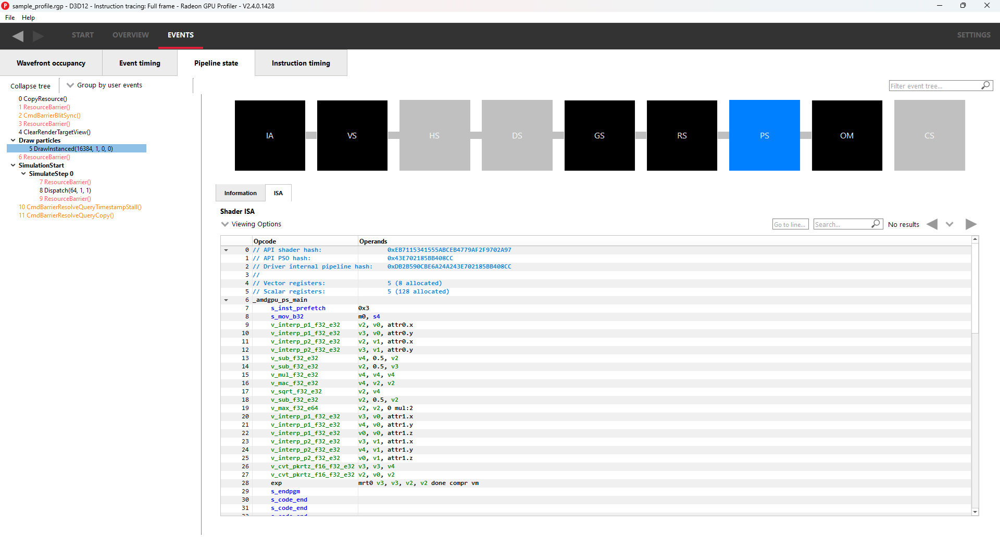
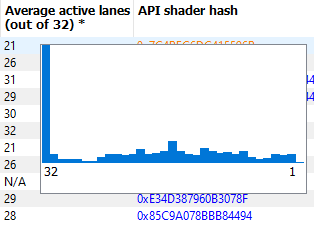

Pipeline state
--------------

The pipeline state window shows the render state information for
individual events by stage. In the example below the event is a
DirectX12 DrawInstanced call using a VS, GS, and a PS. Active stages are
rendered in black and can be selected, grey stages are inactive on this
draw and cannot be selected.

The user has selected the PS stage for viewing and it is rendered in
blue to indicate this. Below is a tabbed display to allow switching between
a summary of the wavefront activity for this draw and the per-wavefront
register resources used by the shader, and the shader ISA disassembly.

The register values indicate the number of registers that the shader is
using. The value in parentheses is the number of registers that have
been allocated for the shader.

From this information and knowledge about the RDNA or GCN architecture we
can calculate the theoretical maximum wavefront occupancy for the pixel
shader. In this case the maximum of 8 wavefronts per SIMD are
theoretically possible, but may be limited by other factors.

.. image:: media_rgp/rgp_pipeline_state_1.png

Switching to the ISA tab will show the shader code at the ISA level. At the
top, some general information will be given, such as the number of registers
used and allocated and the various hash values for this event.

More information on the ISA tab can be found under the :ref:`ISA View <isa_view>` section.

**Grouping modes**

The grouping modes are the same as in the Event timing pane.

The user can also right-click on any of the events and navigate to the
Wavefront occupancy or Event timing panes, as well as the Barriers, Most
expensive events, Context rolls, Render/depth targets, and Pipelines panes
within the Overview tab. The user can view the selected event in these panes,
as well as in the side panels. Below is a screenshot of what the right-click
context menu looks like.

.. image:: media_rgp/rgp_pipeline_state_2.png

**Note:** The Output Merger stage of a DirectX 12 application may report
the LogicOp as D3D12\_LOGIC\_OP\_COPY, even though it is set in an
application as D3D12\_LOGIC\_OP\_NOOP. These 2 operations are
semantically the same if blending is enabled. A no-op indicates that no
transform of the data is to be performed so the output is the same as
the source.

**Note:** For OpenCL or HIP applications, the pipeline state does not show the
graphics specific stages since they are not active during compute dispatches.

\ **Raytracing events**

For raytracing events, there are two possible compilation modes: **Unified**
and **Indirect**. The AMD driver and compiler will choose the mode for each
raytracing event. The compilation mode chosen for a particular event will be
evident in the event name: events which use the Unified mode will have a
**<Unified>** suffix, while events which use the Indirect mode will have an
**<Indirect>** suffix. In the case of DirectX Raytracing, the full event names
are **DispatchRays<Unified>** or **ExecuteIndirect<Rays><Unified>** and
**DispatchRays<Indirect>** or **ExecuteIndirect<Rays><Indirect>**. For Vulkan,
the full event names are **vkCmdTraceRaysKHR<Unified>** or **vkCmdTraceRaysIndirectKHR<Unified>**
and **vkCmdTraceRaysKHR<Indirect>** or **vkCmdTraceRaysIndirectKHR<Indirect>**.
The main difference between these two compilation modes has to do with how the
individual shaders in the raytracing pipeline are compiled. In Unified mode,
the individual shaders are inlined into a single shader, resulting in a
single set of ISA. In Indirect mode, the individual shaders are compiled
separately, and the functions in each shader end up as their own set of ISA
instructions. Function call instructions are generated in the ISA to allow one
function to call another. For the indirect mode, the overall occupancy of the
event is affected by the resource usage of all shaders, even those that have
a zero call count. Even if the shader function that uses the highest number of
vector registers is not actually executed, the fact that it uses the most
registers means that it could be the reason for lower overall occupancy for the
event.

When selecting a raytracing event that uses the indirect compilation mode,
the Pipeline state pane will look a bit different.

.. image:: media_rgp/rgp_pipeline_state_raytracing_1.png

There are three tabs available: **Shader table**, **ISA**, and **Information**.

The Shader table tab contains two main parts: an interactive flowchart
representing the raytracing pipeline and a table containing the list of
shader functions. Each shader function has an associated type. This type can be
**Ray generation**, **Traversal**, **Intersection**, **Any hit**,
**Closest hit**, **Miss** or **Callable**. The shader table lists each shader
function, its type, resource usage statistics, instruction timing statistics,
and both the API shader hash and the Internal pipeline hash. You can filter the
table by shader type using the **Shader types** combo box. You can also filter
the table by Export name using the **Filter shaders...** field. If you click on
any hyperlinked text in the shader table, it will navigate to the ISA tab and
show the ISA for the selected shader function. You can also use the right-click
context menu to navigate to either the ISA tab or to the Instruction timing
view.

If the **Enable shader instrumentation** checkbox was checked in Radeon
Developer Panel when the profile was captured, the table will also include
a column showing the number of average active lanes for each shader function,
across all calls made to the function. The number of active lanes is sampled
near the beginning of execution for each shader, giving an indication of the
amount of thread divergence in the entire raytracing pipeline. When hovering
the mouse over a cell in this column, a tooltip will be displayed to show the
distribution of the number of active lanes for individual calls. This can
give an indication of how many different execution paths through the pipeline
were taken at runtime. Please note that enabling this setting in the Radeon
Developer Panel may cause additional runtime overhead for the application that
is being profiled.

The flowchart gives a visual representation of the raytracing pipeline, as well as
shows the relative percent cost of the shader functions in each stage. The percentage
bars are color-coded as follows: Red indicates that a stage contains shaders that
represent over 50% of the total cost for the event. Orange indicates that a stage
contains shaders whose total cost is in the range of 10% to 50%, and green indicates
that a stage's total cost is less than 10%.

The flowchart also provides a quick way to filter the shader table. When a stage is
clicked, the table will only show shader functions from that stage. You can filter
more than one stage by holding down the CTRL key and clicking additional stages.
Selected stages are shown as blue, unselected stages are shown as black, and
disabled stages (stages with no corresponding shader functions) are shown as grey.
You can remove all filters by clicking in any whitespace area in the flowchart.

Both the table and the flowchart will contain a full set of data for profiles
captured with Instruction tracing enabled. For profiles captured without Instruction
tracing, several columns in the table will show **N/A** instead of actual data.
Similarly, the flowchart will not show the percent bars for profiles captured without
Instruction tracing enabled.

The following screenshot shows how this view will look when Instruction timing data
is not available.

.. image:: media_rgp/rgp_pipeline_state_raytracing_2.png

The ISA tab will also look different for raytracing events that use the indirect
compilation mode. In addition to the normal ISA listing, there is also a drop down
combo box that allows for viewing the ISA from a different shader function. For the
selected shader function, the corresponding row from the shader table is also
displayed for reference.

.. image:: media_rgp/rgp_pipeline_state_raytracing_3.png
