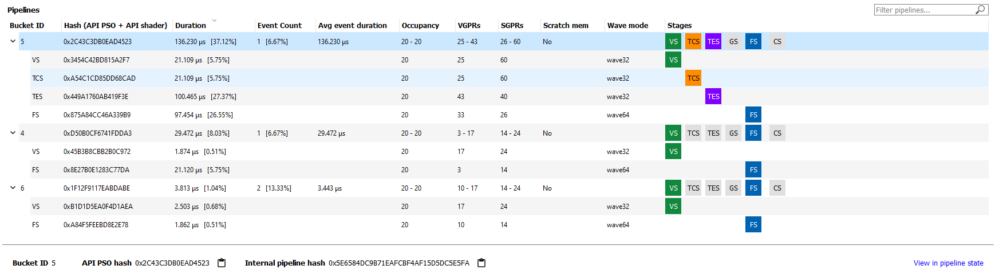
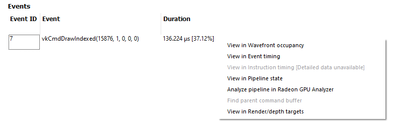

Pipelines
---------

This overview pane provides details of the pipeline usage in the profile.

.. image:: media_rgp/rgp_pipeline_summary_1.png

The pane is divided into three sections:

**Pipeline summary** - Displays a list of each pipeline API configuration
found in the profile.

**Pipelines** - Displays a table with an entry for each pipeline found in
the profile and child entries for each shader stage active in the pipeline.

**Events** - Displays all events that use the selected pipeline
in the **Pipelines** table.

Pipeline summary
~~~~~~~~~~~~~~~~

.. image:: media_rgp/rgp_pipeline_summary_2.png

The pipeline summary section displays all **unique** pipeline configurations
colored by API shader stage.

- **Unique** is defined as having the same active API shader stages

Next to each configuration is a count of how many pipelines in
the profile matched the configuration.

Pipelines
~~~~~~~~~

The Pipelines section contains a table with an entry for each pipeline found
in the profile.

Each entry in the table displays the following information:

1. **Bucket ID** - ID to match pipeline to event state bucket used
   for grouping in other panes.
2. **Hash** - 128-bit pipeline hash and API shader hash.
3. **Duration** - The pipeline duration is the sum of the durations of
   all events which use this pipeline (overlapped areas only counted once).
   The shader stage duration displayed for child items in the table is the
   sum of the stage-specific shader durations for all events which use this
   pipeline (overlapped areas are only counted once).
4. **Event count** - Number of events which use the pipeline and
   percentage out of total number of events in profile.
5. **Avg event duration** - Average duration of events using
   this pipeline in the profile.
6. **Occupancy** - Occupancy range and per-shader-stage occupancy for each pipeline.
7. **VGPRs** - VGPR range and per-shader-stage VGPR usage for each pipeline.
8. **SGPRs** - SGPR range and per-shader-stage SGPR usage for each pipeline.
9. **Scratch mem** - Yes/No to indicate if the pipeline uses scratch memory.
10. **Wave mode** -- wave32/wave64 to indicate the mode of the shader. This column
    only appears for devices that support wave32 vs. wave64.
11. **Stages** - The :ref:`API Shader Stage Control <api_shader_stage_control>`
    indicating which stages are active for given pipeline.

The **Filter pipelines...** field can be used to filter items in the list by the API PSO hash.
The Pipelines table can be sorted by clicking on a column header.

Below the table, the Bucket ID, API PSO hash and Driver internal pipeline
hash for the currently-selected pipeline is displayed. There is also a quick link to
view the selected pipeline in the Pipeline State view. This will navigate to the
Pipeline State view for the first event associated with the pipeline.

Events
~~~~~~

.. image:: media_rgp/rgp_pipeline_summary_4.png

The Events table displays all events which use the currently-selected
pipeline in the **Pipelines** table.

Each entry in the table displays the following information:

1. **Event ID** - ID for event
2. **Event** - Event text displaying the API or Driver call for event
3. **Duration** - Time event spent during frame in profile

The Events table can be sorted by clicking on a column header.

As with all event lists in RGP, the user can right-click
to quickly navigate to the event in other panes.

