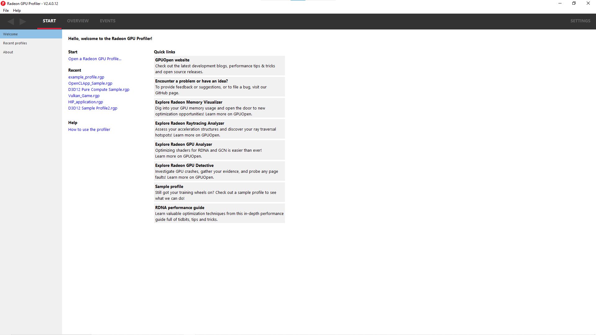
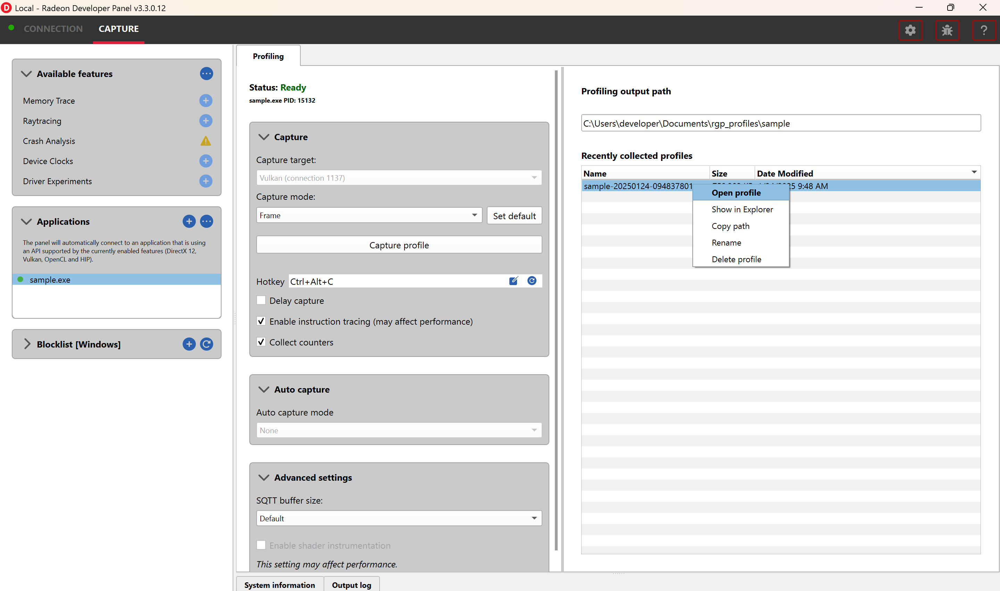

Radeon GPU Profiler - Quick Start
=================================

How to generate a profile
-------------------------

The first thing you will need to do is generate a profile. Currently,
this is done via the Radeon Developer Panel. Read the documentation
provided with this distribution for information on how to capture a profile.
This can be obtained from within the Radeon Developer Panel or from the
link on the Radeon GPU Profiler "Welcome" view. The Radeon Developer Panel
documentation can also be viewed online at:
https://radeon-developer-panel.readthedocs.io/en/latest/

Starting the Radeon GPU Profiler
--------------------------------

The following executables can be found in the download directory.

.. image:: media_rgp/rgp_executables.png

Start **RadeonGPUProfiler.exe** (this is the tool used to view profile
data).

How to load a profile
---------------------

There are a few ways to load a profile into RGP.

1) Use the "File/Open profile" pull down menu item, or the
   "File/Recent profiles" pull down menu item.

.. image:: media_rgp/rgp_file_load.png

.. image:: media_rgp/rgp_file_recent.png

2) Go to the "Welcome" view and click on the "Open a Radeon GPU
   Profile…" link.

3) Go to the "Welcome" view and click on a profile that you have
   previously loaded in the Recent list.

4) Go to the Recent profiles view to see a full list of all your recent
   profiles.

   Notice that there is additional information provided for each profile when
   viewed in this pane, such as the GPU the profile was taken on, the date when
   the capture was performed and the number of events contained in the profile.

.. image:: media_rgp/rgp_recent_profiles.png

5) Load a profile into a new instance of the **Radeon GPU Profiler**
   from the **Radeon Developer Panel**. Select a profile in the list and
   click on "Open profile".

6) Drag and drop a profile onto the **Radeon GPU Profiler** executable,
   or onto an already open RGP instance.

The Radeon GPU Profiler user interface
--------------------------------------

There are four main menus in the Radeon GPU Profiler and each has a
number of sub-windows. The two main UIs that deal with the analysis of
the profile data are within the **Overview** and **Events** sections.

1. **Start**

   a. **Welcome** - Shows links to help documentation, and a list of
      recently opened profiles, and a sample profile.

   b. **Recent profiles** - Displays a list of the recently opened
      profiles.

   c. **About** - Shows build information about RGP and useful links.

2. **Overview**

   a. **Frame Summary** - Contains a summary of the structure of the
      graphics frame. This overview section is not available for OpenCL or HIP profiles.

   b. **Profile Summary** - Contains a summary of the structure of the OpenCL of HIP profile.

   c. **Barriers** - Details of the barrier usage in the profile.

   d. **Context rolls** - Details of the hardware context register usage.
      This overview section is not available for OpenCL or HIP profiles.

   e. **Most expensive events** - List of the most expensive events.

   f. **Render/depth targets** - Overview of render targets used throughout
      the graphics frame. This overview section is not available for OpenCL or HIP profiles.

   g. **Pipelines** - Details of the pipeline usage in the profile.

   h. **Device configuration** - Information about the GPU the profile
      was generated on.

3. **Events**

   a. **Wavefront occupancy** - Shows detailed information about
      wavefront occupancy and event timings.

   b. **Event timing** - Tree view of profile events and their timing
      data.

   c. **Pipeline state** - Tree view of profile events and their
      graphics/compute pipeline state.

   d. **Instruction timing** - Shows detailed instruction timing
      information for each instruction of a single shader.

4. **Settings**

   a. **General** - Adjust desired time units, state buckets, GPU boundness
      percentage, and wavefront view detail levels.

   b. **Themes and colors** - Customize colors for graphics API and
      hardware data.

   c. **Keyboard shortcuts** - Shortcuts for navigating various parts of the UI.