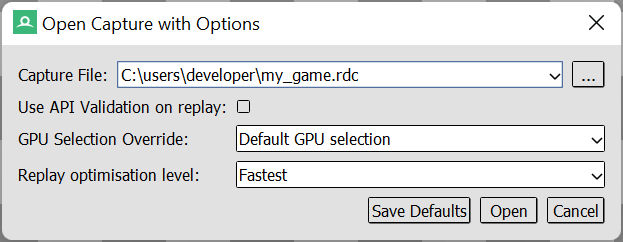
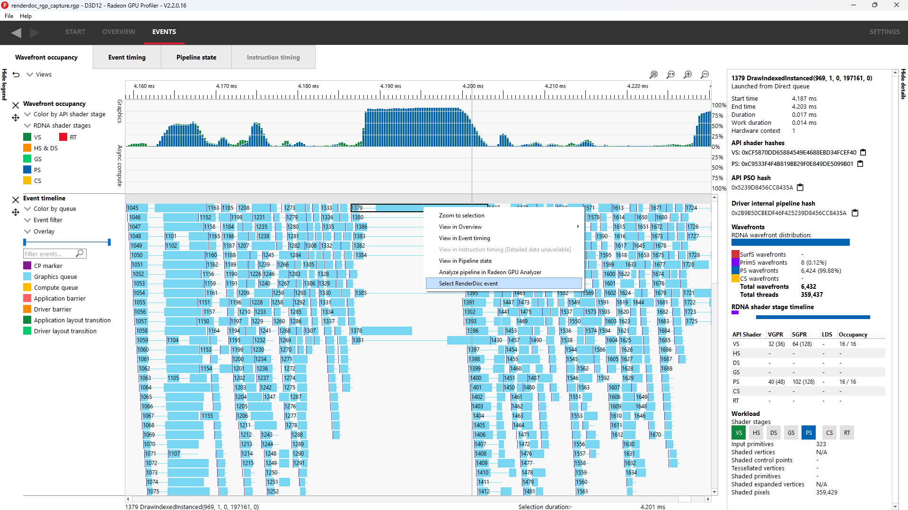
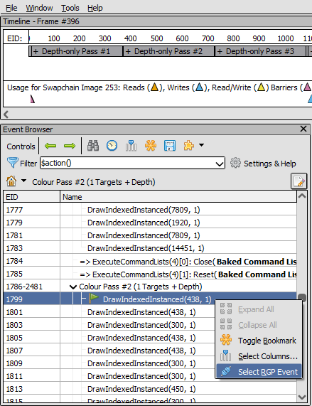
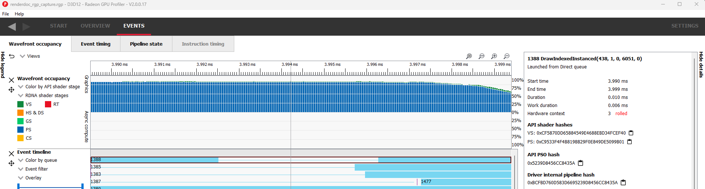

RenderDoc & Radeon GPU Profiler interop BETA
============================================

In addition to the typical use case where RGP profiles are generated
using Radeon Developer Panel, profiles can also be generated using
`RenderDoc <https://renderdoc.org/>`_. When an RGP profile is generated
by RenderDoc, events can be correlated across both tools.
This feature is only supported for DirectX12 and Vulkan.

Intended usage
--------------

When RenderDoc replays a captured frame, there are expected differences in
performance when compared to a normal run of the application. Therefore, when a
profile is generated by RenderDoc, the overall profile data may not accurately
reflect the true performance of the application. For a more accurate
representation of the overall application performance, a profile should be
captured directly from the application using the Radeon Developer Panel.

The profile data generated from a RenderDoc capture, along with the supported
interoperability features, can be useful in helping to determine which elements
of a frame consume the most GPU time. Therefore, users are encouraged to
leverage both methods of generating profile data when analyzing performance.

Obtaining a profile from RenderDoc
----------------------------------

First, load RenderDoc and capture a frame as usual. When loading the capture into
RenderDoc, make sure to use the **Open Capture with Options** menu item (under the
main **File** menu in the RenderDoc user interface) and set the **Replay optimisation
level** setting to **Fastest**. Without this setting, extra events that were not in
the original frame may appear in the profile, as RenderDoc may insert extra events as
part of its other replay levels. There may also be some RenderDoc captures that are
unable to generate a profile if another replay level is used.

The **Replay optimisation level** setting can also be set globally for all captures
in RenderDoc's **Settings** dialog:

Next, make sure that the **Core** settings are configured to allow Radeon GPU Profiler
Integration:

Finally, create a new profile for the loaded capture as shown below:

This will kick off the profiling process, which will embed a new profile into
the RenderDoc capture file. If this is the first time doing this, RenderDoc will
bring up a prompt to allow specification of a path to Radeon GPU Profiler. Once
profiling is complete, RenderDoc will launch Radeon GPU Profiler and the new
profile will be ready for analysis.

Navigating between events
-------------------------

Navigating between events in both tools is done via context menus. For example,
in Radeon GPU Profiler one would right click on an event and select
"Select RenderDoc event" as shown below:

This will cause both tools to communicate with and trigger selection of that
same event in RenderDoc, as shown here:

At this point, users may use RenderDoc’s frame debugging capabilities to
inspect the event in question.

Next, users may follow the same procedure to go back to RGP. This is achieved
by right clicking an event in the Event Browser and selecting "Select RGP Event"
as show below:

This will cause both tools to communicate and trigger selection of that same
event in Radeon GPU Profiler, as shown here:

Please be aware that both tools use different numbering schemes to label
their events. It is therefore expected for the same event to have a different
ID in each tool.

**NOTE:** You may get a Windows firewall alert when connecting RGP to
RenderDoc. This is normal behavior as RenderDoc and RGP need to communicate
with each other (via a socket). This in no way indicates that the RGP or
RenderDoc are trying to communicate to an AMD server over the internet. These
tools do not attempt to connect to a remote AMD server of any description and
do not send personal or system information over remote connections.

Known limitations
-----------------

-  Users may correlate GPU work (draws/dispatches) across both tools.
   Note that this excludes entry points such as copies, barriers, clears,
   and indirect draw/dispatch.

-  Since the RenderDoc replayer serializes entry points, generated profiles
   could appear CPU bound. This can be seen as gaps in the wavefront
   occupancy view, which may not be present when obtaining the profile
   using Radeon Developer Panel.

-  Creating consecutive RGP profiles from the same RenderDoc instance
   sometimes fails. This occurs if users obtain multiple RenderDoc captures
   of the same application prior to triggering a second profile. To work
   around this, start a fresh instance of RenderDoc with the desired capture
   to profile.

-  In some cases profiles originating from RenderDoc contain no GPU events.
   To work around this, repeat the profiling process again via
   "Tools --> Create new RGP Profile"

-  The System Activity view for a RenderDoc profile will likely mismatch that
   of a native profile. This is due to different command buffer submission
   patterns between the replayer and native application.

-  Vulkan-specific: During image creation, RenderDoc sometimes forces additional
   usage/flags that may have not been present as per the native application.
   This effectively disables hardware tiling optimizations which are by default
   enabled during native app runtime.

-  Vulkan-specific: The RenderDoc replayer does not support playback of
   compute work on the async compute queue. This means that the profile will
   show all compute work running on the graphics queue.

-  Vulkan-specific: In some cases native profiles will contain color/depth
   clears which may not be present in the RenderDoc profile.

-  DX12-specific: The RenderDoc replayer will sometimes inject CopyBufferRegion
   calls as part of an optimization to Map/Unmap. These will be visible as
   tall spikes of compute work in the wavefront occupancy view.

-  If an RGP profile opened by RenderDoc is left running and RenderDoc is restarted,
   the interop connection between the two can't be re-established. In this case, the
   "Create new RGP Profile" menu option will remain disabled after opening a new
   RenderDoc capture. This is caused by a named pipe having been left open. To resolve
   the issue, close RGP, and then restart RenderDoc.
   On Linux®, a similar situation can occur if the RenderDoc process does not
   shutdown cleanly. If this occurs, it may be necessary to wait a few minutes for
   the connection to be removed before restarting RenderDoc.
   The following command can be executed from a terminal window to determine if the
   named pipe is still opened:

   - netstat -p | grep "AMD"