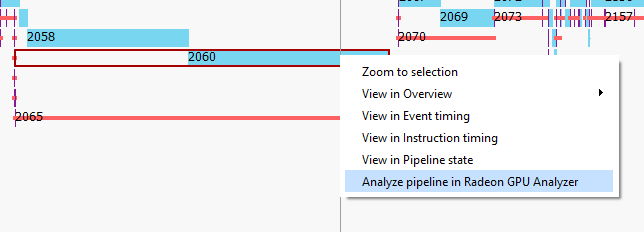
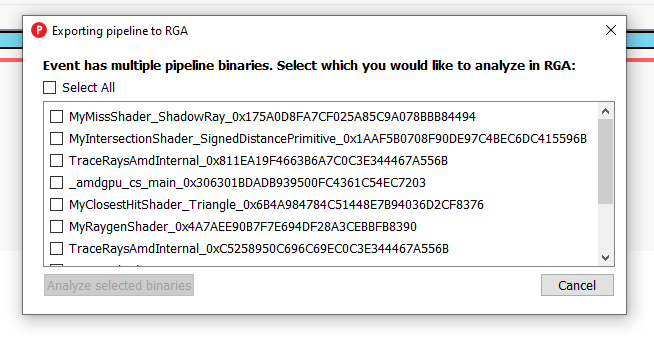
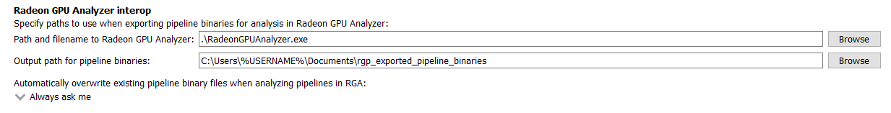
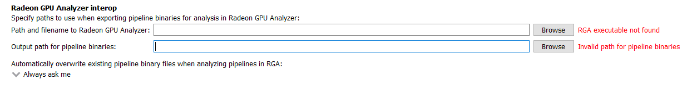
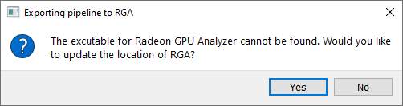
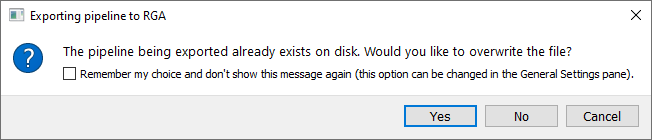
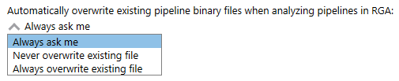

.. _rga_rgp_interop:

Radeon GPU Analyzer and Radeon GPU Profiler interop
===================================================

The Radeon GPU Analyzer now supports opening pipeline binary files in its binary analysis mode. 
Users can create and open these binary files directly from RGP and view them in RGA. To export 
a pipeline binary for analysis in RGA right-click an event in any RGP pane that contains events 
and select "Analyze pipeline in Radeon GPU Analyzer" in the context menu options.

Some events such as indirect raytracing events can have multiple pipeline binaries. To select 
which pipeline binary to analyze in RGA right-click a specific binary in the pipeline state 
shader table for ray tracing events and select the context menu option to analyze that pipeline 
binary. Alternatively, right-click the event anywhere in RGP and select "Analyze pipeline in 
Radeon GPU Analyzer" to open a window to pick from the full list of pipeline binaries in that event.
Pushing the "Analyze selected binaries" button will save and open all binaries that were checked in
the list in RGA. Keep in mind opening a large number of pipeline binaries in RGA may take some time.

The location of the Radeon GPU Analyzer executable file as well as the location where pipeline 
binaries are saved can be changed in the Radeon GPU Analyzer interop section of the general settings.

If either the executable file or pipeline binary file path cannot be found an error message will 
be displayed next to the corresponding setting.

Selecting a pipeline binary for analysis while either of these file paths are invalid will open up 
a message prompt to select a valid file path.

If the pipeline binary being exported already exists on disk a message prompt will appear asking 
if the file should be overwritten or directly opened in RGA without being overwritten. Select the 
checkbox in the message prompt to save the selected option for the future and not see this message 
again.

This setting can be changed at any time from the Radeon GPU Analyzer interop section of the 
general settings.

