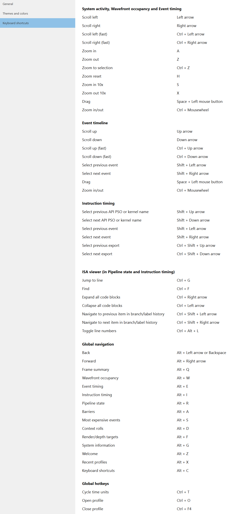

General
-------
**Check for updates on startup:** Radeon GPU Profiler will check for an available update
during startup. If an update is available, a notification will appear on the Welcome page

**Units:** This tells the profiler whether to work in clocks, nanoseconds, microseconds,
or milliseconds. Refer to the keyboard binding in the section below to quickly
toggle between these time units.

**State buckets:** Specify how the profiler should generate its own state buckets.
This can be based off a combination of shader base address, depth buffer address,
render target address and API PSO hash.

**Sync event time windows:** Keep the Wavefront occupancy and Event timing
panes in sync while browsing through different time ranges.

**Processor boundness:** Specific to the Frame summary and Profile summary, this value will tell
RGP at which point to consider an application as being GPU bound or CPU bound.

**Wavefront occupancy detail:** Increase the visual quality of wavefronts in
the Wavefront occupancy pane. This allows users to see a more accurate
representation of GPU occupancy at the expense of some profiler performance.

Themes and colors
-----------------
The profiler makes heavy use of coloring to display its information.
This pane allows users to thoroughly customize those colors.

**NOTE**: There are some coloring modes in RGP that use randomly-generated colors. These
are the **Color by event**, **Color by API PSO** and **Color by user events** modes. In
some situations, the randomly-generated colors can cause two very similar colors to be
displayed near each other in the user interface, making it hard to distinguish between
the similar colors. In order to alleviate this issue, the **Random color seed** setting
allows the random seed to be altered, generating a different set of random colors.

Keyboard shortcuts
------------------

Here users will find the **Keyboard shortcuts** pane:

The **System activity, Wavefront occupancy and Event timing** shortcuts
are specific to zooming and panning operations that can be performed
within the Frame summary and Events subtabs. See the section entitled
:ref:`Zoom Controls <zoom_controls>` for more information.

.. image:: media_rgp/rgp_tabs_1.png

.. image:: media_rgp/rgp_tabs_2.png

The **Event timeline** section refers to panning and event selection
operations for the bottom graph within the Wavefront occupancy view.

The **Instruction timing** section refers to keystrokes to change
API PSO, event and export selection.

The **ISA Viewer (in Pipeline state and Instruction timing)** section
refers to keystrokes to jump to a specific instruction, search for
text, expand or collapse blocks of code, traverse through navigation
history and toggle line numbers.

The **Global navigation** section refers to keystrokes that aid user
navigation, and are always detected regardless of which pane is visible.

The **Global hotkeys** section refers to any hotkeys available anywhere
in the product. Pressing *CTRL* + *T* allows the user to quickly cycle
through the different time units (cycles, milliseconds, microseconds
or nanoseconds) from any pane, rather than having to go to the settings.
The user can also open or close a profile from any pane using the
Global hotkeys.

We encourage all users to adopt these keystrokes while using RGP.

UI Navigation
-------------

In an effort to improve workflow, RGP supports keyboard shortcuts and
back and forward history to quickly navigate throughout the UI.

Back and forward navigation
~~~~~~~~~~~~~~~~~~~~~~~~~~~

RGP tracks navigation history, which allows users to navigate back and
forward between all of RGP’s panes. This is achieved using global
navigation **hotkeys** shown above, or the back and forward **buttons**
shown below:

.. image:: media_rgp/rgp_navigation.png

Currently, back and forward navigation is restricted to pane switches
and moving between events within a pane.
