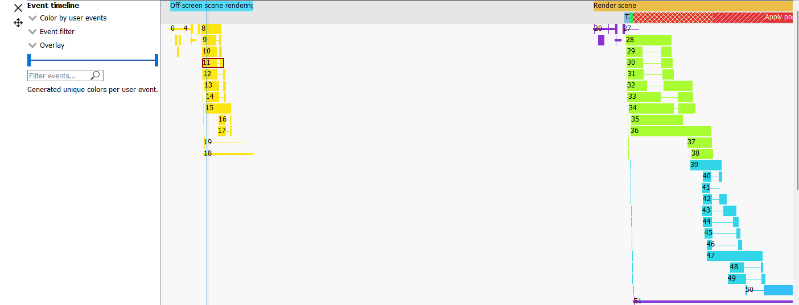

User Debug Markers
==================

User markers can help application developers to correlate the data seen
in RGP with their application behavior. User Markers are currently
not supported for OpenCL or HIP.

DirectX12 User Markers
----------------------

For DirectX12, there are two recommended ways to instrument your application
with user markers that can be viewed within RGP:

1. using Microsoft® PIX3 event instrumentation, or
2. using the debug marker support in AMD GPU Services (AGS) Library.

.. rubric:: Using PIX3 event instrumentation for DirectX12 user debug markers

If your application has been instrumented with PIX3 user markers, then
to view the markers within RGP is a simple matter of recompiling the source code
of the application with a slightly modified PIX header file. The steps described here
require a WinPixEventRuntime version of at least 1.0.200127001.

The PIX3 event instrumentation functions supported by RGP are:
::

  void PIXBeginEvent(ID3D12GraphicsCommandList* commandList, ...)
  void PIXEndEvent(ID3D12GraphicsCommandList* commandList)
  void PIXSetMarker(ID3D12GraphicsCommandList* commandList, ...)

The steps to update the PIX header file are:

1. Copy the entire ``samples\AmdDxExt`` folder provided in the RGP package to the location where the PIX header
files (``pix3.h``, ``pix3_win.h``) reside (typically at ``WinPixEventRuntime.[x.x]\Include\WinPixEventRuntime``).

2. Add ``#include "AmdDxExt\AmdPix3.h"`` to the top of ``PIXEvents.h``:

When using WinPixEventRuntime version 1.0.210209001 or newer:
::

  #if defined(USE_PIX) || !defined(PIX_XBOX)
    #define PIX_CONTEXT_EMIT_CPU_EVENTS
  
    #ifndef PIX_XBOX
      #include "AmdDxExt\AmdPix3.h"
      #define PIX_AMD_EXT
    #endif
  #endif  

When using WinPixEventRuntime version 1.0.200127001:
::

  #include "PIXEventsCommon.h"

  #if defined(XBOX) || defined(_XBOX_ONE) || defined(_DURANGO)
  # define PIX_XBOX
  #else
  #include "AmdDxExt\AmdPix3.h"
  #endif

3. Update the ``PIXEvents.h`` file to add an ``Rgp`` prefix to the the existing calls to PIXBeginEventOnContextCpu,
PIXEndEventOnContextCpu and PIXSetMarkerOnContextCpu:

When using WinPixEventRuntime version 1.0.231030001 or newer:
::

  #ifdef PIX_CONTEXT_EMIT_CPU_EVENTS
  #ifdef PIX_AMD_EXT
    RgpPIXBeginEventOnContextCpu(destination, eventSize, context, color, formatString, args...);
  #else
    PIXBeginEventOnContextCpu(destination, eventSize, context, color, formatString, args...);
  #endif
  #endif

::

  #ifdef PIX_CONTEXT_EMIT_CPU_EVENTS
  #ifdef PIX_AMD_EXT
    RgpPIXSetMarkerOnContextCpu(destination, eventSize, context, color, formatString, args...);
  #else
    PIXSetMarkerOnContextCpu(destination, eventSize, context, color, formatString, args...);
  #endif
  #endif

::

  #ifdef PIX_CONTEXT_EMIT_CPU_EVENTS
  #ifdef PIX_AMD_EXT
    RgpPIXEndEventOnContextCpu(destination, context);
  #else
    destination = PIXEndEventOnContextCpu(context);
  #endif
  #endif

When using WinPixEventRuntime version 1.0.210209001 up to 1.0.230302001:
::

  #ifdef PIX_CONTEXT_EMIT_CPU_EVENTS
  #ifdef PIX_AMD_EXT
    RgpPIXBeginEventOnContextCpuLegacy(context, color, formatString, args...);
  #else
    PIXBeginEventOnContextCpu(context, color, formatString, args...);
  #endif
  #endif

::

  #ifdef PIX_CONTEXT_EMIT_CPU_EVENTS
  #ifdef PIX_AMD_EXT
    RgpPIXSetMarkerOnContextCpuLegacy(context, color, formatString, args...);
  #else
    PIXSetMarkerOnContextCpu(context, color, formatString, args...);
  #endif
  #endif

::

  #ifdef PIX_CONTEXT_EMIT_CPU_EVENTS
  #ifdef PIX_AMD_EXT
    RgpPIXEndEventOnContextCpuLegacy(context);
  #else
    PIXEndEventOnContextCpu(context);
  #endif
  #endif

When using WinPixEventRuntime version 1.0.200127001:
::

  #if PIX_XBOX
    PIXBeginEvent(color, formatString, args...);
  #else
  #ifdef PIX_AMD_EXT
    RgpPIXBeginEventOnContextCpuLegacy(context, color, formatString, args...);
  #else
    PIXBeginEventOnContextCpu(context, color, formatString, args...);
  #endif
  #endif

::

  #if PIX_XBOX
    PIXEndEvent();
  #else
  #ifdef PIX_AMD_EXT
     RgpPIXEndEventOnContextCpuLegacy(context);
  #else
     PIXEndEventOnContextCpu(context);
  #endif
  #endif

::

  #if PIX_XBOX
    PIXSetMarker(color, formatString, args...);
  #else
  #ifdef PIX_AMD_EXT
    RgpPIXSetMarkerOnContextCpuLegacy(context, color, formatString, args...);
  #else
    PIXSetMarkerOnContextCpu(context, color, formatString, args...);
  #endif
  #endif

4. Recompile the application. Note that the RGP user markers are only enabled when the corresponding
PIX event instrumentation is also enabled with one of the preprocessor symbols:
``USE_PIX``, ``DBG``, ``_DEBUG``, ``PROFILE``, or ``PROFILE_BUILD``.

The PIX3 event instrumentation within the application continues to be usable for
`Microsoft PIX tool`_ without additional side effects or overhead.

To find a more complete description of how to use the PIX event instrumentation, refer to
https://blogs.msdn.microsoft.com/pix/winpixeventruntime/.

See many examples of using PIX event instrumentation at https://github.com/Microsoft/DirectX-Graphics-Samples.

.. rubric:: Using AGS for DirectX12 user debug markers

The AMD GPU Services (AGS) library provides software developers
with the ability to query AMD GPU software and hardware state
information that is not normally available through standard operating
systems or graphic APIs. AGS includes support for querying graphics
driver version info, GPU performance, CrossFire™ (AMD’s multi-GPU
rendering technology) configuration info, and Eyefinity (AMD’s
multi-display rendering technology) configuration info. AGS also exposes
the explicit Crossfire API extension, GCN shader extensions, and
additional extensions supported in the AMD drivers for DirectX® 11 and
DirectX 12. One of the features in AGS is the support for DirectX 12
user debug markers.

User markers can be inserted into your application using AGS function
calls. The inserted user markers can then be viewed within RGP. The main
steps to obtaining user markers are described below.

Articles and blogs about AGS can be found here:
https://gpuopen.com/amd-gpu-services-ags-library/

Additional API documentation for AGS can be found at:
https://gpuopen-librariesandsdks.github.io/ags/

.. rubric:: Download AGS

Download the AGS library from:
https://github.com/GPUOpen-LibrariesAndSDKs/AGS_SDK/

The library consists of pre-built Windows libraries, DLLs, sample and
documentation. You will need to use files in the following two dirs.

-  Headers: AGS\_SDK-master\\ags\_lib\\inc

-  Libraries: AGS\_SDK-master\\ags\_lib\\lib

.. rubric:: Integrate AGS header, libs, and DLL into your project

AGS requires one header (``amd_ags.h``) to be included in your source code.
Add the location of the AGS header to the Visual Studio project settings
and include the header in the relevant code files.

#include "amd\_ags.h"

Link your exe against correct AGS library for your project (32 or 64bit,
MD or MT static library, debug or release, or DLL).

+--------------+-------------------------------+--------------------------------+-----------------------------------------------------------+
|              | **Library Name**              | **AGS Runtime DLL required**   | **Library Type**                                          |
+==============+===============================+================================+===========================================================+
| **64 Bit**   | amd\_ags\_x64.lib             | amd\_ags\_x64.dll              | DLL                                                       |
+--------------+-------------------------------+--------------------------------+-----------------------------------------------------------+
|              | amd\_ags\_x64\_2015\_MD.lib   | NA                             | VS2015 Lib (multithreaded dll runtime library)            |
+--------------+-------------------------------+--------------------------------+-----------------------------------------------------------+
|              | amd\_ags\_x64\_2015\_MT.lib   | NA                             | VS2015 Lib (multithreaded static runtime library)         |
+--------------+-------------------------------+--------------------------------+-----------------------------------------------------------+
|              | amd\_ags\_x64\_2015\_MDd.lib  | NA                             | VS2015 Lib (debug multithreaded dll runtime library)      |
+--------------+-------------------------------+--------------------------------+-----------------------------------------------------------+
|              | amd\_ags\_x64\_2015\_MTd.lib  | NA                             | VS2015 Lib (debug multithreaded static runtime library)   |
+--------------+-------------------------------+--------------------------------+-----------------------------------------------------------+
|              | amd\_ags\_x64\_2017\_MD.lib   | NA                             | VS2017 Lib (multithreaded dll runtime library)            |
+--------------+-------------------------------+--------------------------------+-----------------------------------------------------------+
|              | amd\_ags\_x64\_2017\_MT.lib   | NA                             | VS2017 Lib (multithreaded static runtime library          |
+--------------+-------------------------------+--------------------------------+-----------------------------------------------------------+
|              | amd\_ags\_x64\_2017\_MDd.lib  | NA                             | VS2017 Lib (debug multithreaded dll runtime library)      |
+--------------+-------------------------------+--------------------------------+-----------------------------------------------------------+
|              | amd\_ags\_x64\_2017\_MTd.lib  | NA                             | VS2017 Lib (debug multithreaded static runtime library)   |
+--------------+-------------------------------+--------------------------------+-----------------------------------------------------------+
|              | amd\_ags\_x64\_2019\_MD.lib   | NA                             | VS2019 Lib (multithreaded dll runtime library)            |
+--------------+-------------------------------+--------------------------------+-----------------------------------------------------------+
|              | amd\_ags\_x64\_2019\_MT.lib   | NA                             | VS2019 Lib (multithreaded static runtime library          |
+--------------+-------------------------------+--------------------------------+-----------------------------------------------------------+
|              | amd\_ags\_x64\_2019\_MDd.lib  | NA                             | VS2019 Lib (debug multithreaded dll runtime library)      |
+--------------+-------------------------------+--------------------------------+-----------------------------------------------------------+
|              | amd\_ags\_x64\_2019\_MTd.lib  | NA                             | VS2019 Lib (debug multithreaded static runtime library)   |
+--------------+-------------------------------+--------------------------------+-----------------------------------------------------------+
| **32 Bit**   | amd\_ags\_x86.lib             | amd\_ags\_x86.dll              | DLL                                                       |
+--------------+-------------------------------+--------------------------------+-----------------------------------------------------------+
|              | amd\_ags\_x86\_2015\_MD.lib   | NA                             | VS2015 Lib (multithreaded dll runtime library)            |
+--------------+-------------------------------+--------------------------------+-----------------------------------------------------------+
|              | amd\_ags\_x86\_2015\_MT.lib   | NA                             | VS2015 Lib (multithreaded static runtime library)         |
+--------------+-------------------------------+--------------------------------+-----------------------------------------------------------+
|              | amd\_ags\_x86\_2015\_MDd.lib  | NA                             | VS2015 Lib (debug multithreaded dll runtime library)      |
+--------------+-------------------------------+--------------------------------+-----------------------------------------------------------+
|              | amd\_ags\_x86\_2015\_MTd.lib  | NA                             | VS2015 Lib (debug multithreaded static runtime library)   |
+--------------+-------------------------------+--------------------------------+-----------------------------------------------------------+
|              | amd\_ags\_x86\_2017\_MD.lib   | NA                             | VS2017 Lib (multithreaded dll runtime library)            |
+--------------+-------------------------------+--------------------------------+-----------------------------------------------------------+
|              | amd\_ags\_x86\_2017\_MT.lib   | NA                             | VS2017 Lib (multithreaded static runtime library)         |
+--------------+-------------------------------+--------------------------------+-----------------------------------------------------------+
|              | amd\_ags\_x86\_2017\_MDd.lib  | NA                             | VS2017 Lib (debug multithreaded dll runtime library)      |
+--------------+-------------------------------+--------------------------------+-----------------------------------------------------------+
|              | amd\_ags\_x86\_2017\_MTd.lib  | NA                             | VS2017 Lib (debug multithreaded static runtime library)   |
+--------------+-------------------------------+--------------------------------+-----------------------------------------------------------+
|              | amd\_ags\_x86\_2019\_MD.lib   | NA                             | VS2019 Lib (multithreaded dll runtime library)            |
+--------------+-------------------------------+--------------------------------+-----------------------------------------------------------+
|              | amd\_ags\_x86\_2019\_MT.lib   | NA                             | VS2019 Lib (multithreaded static runtime library          |
+--------------+-------------------------------+--------------------------------+-----------------------------------------------------------+
|              | amd\_ags\_x86\_2019\_MDd.lib  | NA                             | VS2019 Lib (debug multithreaded dll runtime library)      |
+--------------+-------------------------------+--------------------------------+-----------------------------------------------------------+
|              | amd\_ags\_x86\_2019\_MTd.lib  | NA                             | VS2019 Lib (debug multithreaded static runtime library)   |
+--------------+-------------------------------+--------------------------------+-----------------------------------------------------------+

.. rubric:: Initialize AGS

When you have your project building the first thing to do is to initialize the AGS context.
::

	// Specify AGS configuration (optional memory allocation callbacks)
	AGSConfiguration config = {};

	// Initialize AGS
	AGSReturnCode agsInitReturn = agsInitialize(AGS_MAKE_VERSION(AMD_AGS_VERSION_MAJOR, AMD_AGS_VERSION_MINOR, AMD_AGS_VERSION_PATCH), &config, &m_AGSContext, &m_AmdgpuInfo);

	// Report error on AGS initialization failure
	if (agsInitReturn != AGS_SUCCESS)
	{
		printf("\\nError: AGS Library was NOT initialized - Return Code %d\\n", agsInitReturn);
	}

.. rubric:: Initialize the DirectX12 Extension

Once the AGS extension has been successfully created we need to create the DirectX12 extension as follows:
::

	// Create the device using AGS
	AGSDX12DeviceCreationParams dxCreateParams = {hardwareAdapter.Get(), __uuidof(ID3D12Device), D3D_FEATURE_LEVEL_11_0};
	AGSDX12ReturnedParams dxReturnedParams;
	AGSReturnCode dxInitReturn = agsDriverExtensionsDX12_CreateDevice(m_AGSContext, &dxCreateParams, nullptr, &dxReturnedParams);

	// Report error on AGS DX12 device creation failure
	if (dxInitReturn != AGS_SUCCESS)
	{
		printf("Error: AGS DX12 extension could not create a device - Return Code %d\n", agsInitReturn);
	}
	else
	{
		printf("AGS DX12 device was created.\n");
		m_device = dxReturnedParams.pDevice;

		// Check whether user markers are supported by the current driver
		if (dxReturnedParams.extensionsSupported.userMarkers == 1)
		{
			printf("AGS_DX12_EXTENSION_USER_MARKERS are supported.\n");
		}
		else
		{
			printf("AGS_DX12_EXTENSION_USER_MARKERS are NOT supported.\n");
		}
	}

Please note that the above code checks if the driver is capable of
supporting user markers by looking at the extensions supported by
the driver. This step may fail on older drivers.

.. rubric:: Insert Markers in Application

The main functions provided by AGS for marking applications are:
::

  agsDriverExtensionsDX12_PushMarker;
  agsDriverExtensionsDX12_PopMarker;
  agsDriverExtensionsDX12_SetMarker;

The below example shows how a draw call can be enclosed within a "Draw
Particles" user marker, followed by inserting a marker.
::

  // Push a marker
  agsDriverExtensionsDX12_PushMarker(m_AGSContext, pCommandList, "DrawParticles");

  // This draw call will be in the "Draw Particles" User Marker
  pCommandList->DrawInstanced(ParticleCount, 1, 0, 0);

  // Pop a marker
  agsDriverExtensionsDX12_PopMarker(m_AGSContext, pCommandList);

  // Insert a marker
  agsDriverExtensionsDX12_SetMarker(m_AGSContext, pCommandList, "Finished Drawing Particles");

Vulkan User Markers
-------------------

.. rubric:: Debug Utils Extension

Vulkan has support for user debug markers using the ``VK_EXT_debug_utils`` extension.
Documentation on this extension can be seen here:

https://www.lunarg.com/wp-content/uploads/2018/05/Vulkan-Debug-Utils_05_18_v1.pdf

A code sample can be seen at:

https://github.com/SaschaWillems/Vulkan/blob/master/examples/debugutils/debugutils.cpp

.. rubric:: Debug Marker Extension

An older, deprecated extension, ``VK_EXT_debug_marker``, also exists. The following
article has details on this older extension:

https://www.saschawillems.de/blog/2016/05/28/tutorial-on-using-vulkans-vk_ext_debug_marker-with-renderdoc/

Both ``VK_EXT_debug_utils`` and ``VK_EXT_debug_marker`` extensions are supported in RGP.
Inserting user markers via these extensions should generate user events in your RGP profile
which can be viewed in the RGP user interface.

Viewing User Markers
--------------------

The RGP file captured for a frame of the above application contains many
user markers. The user markers can be seen in the "Event timing" and
"Pipeline state" views when you choose the "Group by User Marker" option
as shown below.

"Draw Particles" User marker with the draw calls enclosed in the User
Marker

User markers can also be seen in the wavefront occupancy view when you
color by user events. Coloring by user events is also possible in the
event timing view. As seen below, any events enclosed by the same user
marker will be shown with the same color. Any events not enclosed by user markers
are shown in grey. The coloration is only affected by the Push/PopMarker
combination; the SetMarker has no effect on the user event color since
these markers simply mark a particular moment in time.

Additionally, the user event names are displayed in an Overlay at the top
of the event timeline view.

The full user event hierarchy is also visible on the third line of the
side pane when clicking on individual events. If the event does not
contain a user event hierarchy, nothing will be shown.

Events enclosed by user markers are colored in the wavefront occupancy
view. They are also visible in the side panel.

.. _Microsoft PIX tool: https://blogs.msdn.microsoft.com/pix/introduction/