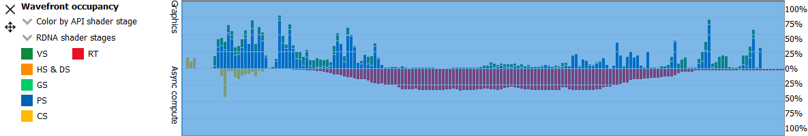
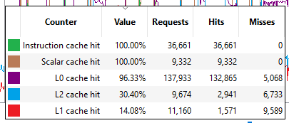
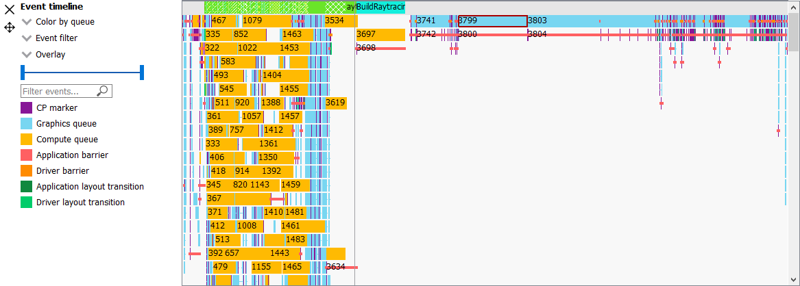
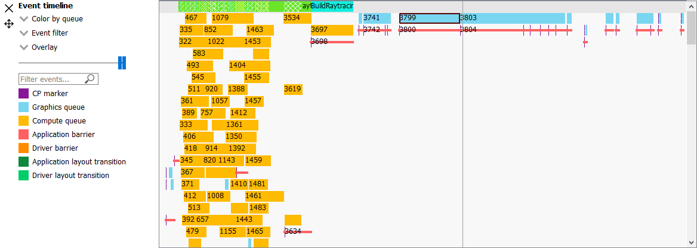
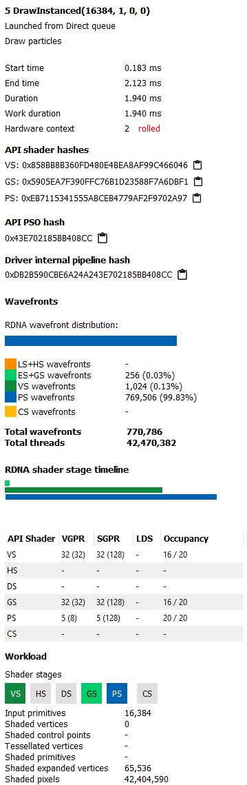

Wavefront occupancy
-------------------

This section presents users with an interactive timeline that shows GPU
utilization, GPU cache counter data, and all events in the profile.

.. image:: media_rgp/rgp_wavefront_occupancy_1.png

There are four components, the Wavefront timeline view, the Cache counter
view, the Events timeline view, and the Details panel.

\ **Wavefront timeline view**

This section shows how many wavefronts were in flight. All wavefronts
are grouped into buckets which are represented by vertical bars. The top
half shows wavefronts on the graphics queue, and the bottom half shows
wavefronts on the async compute queue.

.. image:: media_rgp/rgp_wavefront_occupancy_2.png

Users may examine regions by selecting ranges within the graph and using
the zoom buttons on the top right. Users may also hover over this view
and use mouse wheel to zoom and center in on a particular spot. A region
of wavefronts can be selected by using the mouse button to drag over the
desired region as shown below.

.. image:: media_rgp/rgp_wavefront_occupancy_3.png

You can zoom into the region by selecting Ctrl + Z, or by clicking on
“Zoom to selection” (result shown below).

You can also drag the graph if you are zoomed in. Hold down the space
bar first, then hold the mouse button down. The graph will now move with
the mouse.

Users may use the combo-box on the top left to visualize wavefronts in
different ways:

-  **Color by API stage.** Default. Shows which wavefronts
   correspond to which Vulkan/DX12 pipeline stage.

-  **Color by GCN stage.** Shows which wavefronts correspond to which
   GCN pipeline stage.

-  **Color by hardware context.** Shows which GCN context (0-7) the
   wavefronts ran on. This can be useful to visualize the amount of
   context rolls that occurred.

-  **Color by shader engine.** Shows which shader engine the wavefronts
   ran on.

-  **Color by event.** Shows which wavefronts correspond to which event
   of the profile. Each event is assigned a unique color.

-  **Color by pass.** Groups wavefronts into different passes depending
   on which render target or attachment type (color, depth-only,
   compute, raytrace). These four types are assigned a base color, and
   each pass within each type is assigned a different shade of the
   base color. This can be useful to visualize when the application
   attempted to render different portions of a scene.

-  **Color by API PSO** Shows which wavefronts correspond to which
   shader, based on the shader's API PSO hash value.

Additionally, there are filters along the top intended to help visualize
the occupancy of only certain GCN pipeline stages. Lastly, there are
colored legends on the bottom which serve as color reminders. Note these
colors can be customized within Settings.

The RGP wavefront occupancy for OpenCL has only compute in the wavefront occupancy.
This is because compute APIs such as OpenCL only dispatch compute shader waves.
For this same reason, a number of the coloring options such as hardware context
and GCN stages are not applicable for OpenCL.

.. image:: media_rgp/rgp_wavefront_occupancy_opencl.png

\ **Cache counters**

This section visualizes the cache counter data collected while profiling.
Cache counter data is only available on Radeon RX 5000 series and Radeon
RX 6000 series GPUs. While profiling, counter data is sampled at a fixed
rate, roughly one sample every 4096 clock cycles.

.. image:: media_rgp/rgp_wavefront_occupancy_counters_1.png

Each counter is presented as a line graph that shows how the value of that
particular counter varies through the frame. By correlating the counter data
with both wavefront occupancy and the events in the frame, you can get a better
understanding of how well different parts of the frame utilize the various GPU
caches.

There are currently five cache counters collected while profiling. Each cache
counter reports a hit percentage, which is the percentage of requests that hit
data already in the cache.

-  **Instruction cache hit** The percentage of read requests made that hit the data
   in the Instruction cache. The Instruction cache supplies shader code to an
   executing shader. Each request is 64 bytes in size.

- **Scalar cache hit** The percentage of read requests made from executing shader
  code that hit the data in the Scalar cache. The Scalar cache contains data that
  does not vary in each thread across the wavefront. Each request is 64 bytes in
  size.

- **L0 cache hit** The percentage of read requests that hit the data in the L0
  cache. The L0 cache contains vector data, which is data that may vary in each
  thread across the wavefront. Each request is 128 bytes in size.

- **L1 cache hit** The percentage of read or write requests that hit the data in
  the L1 cache. The L1 cache is shared across all WGPs in a single shader engine.
  Each request is 128 bytes in size.

- **L2 cache hit** The percentage of read or write requests that hit the data in
  the L2 cache. The L2 cache is shared by many blocks across the GPU, including the
  Command Processor, Geometry Engine, all WGPs, all Render Backends, and others.
  Each request is 128 bytes in size.

The description of each counter can be viewed by hovering the mouse over the
counter name in the legend below the counter graphs.

The sizes of the L0, L1 and L2 caches, which may vary depending on the GPU, are
reported in the Device Configuration Overview pane.

Users may use the **Counters** combo box on the top left to choose which counters to
include in the graph.

.. image:: media_rgp/rgp_wavefront_occupancy_counters_2.png

A tooltip will be shown when the mouse hovers over the counter graphs. This tooltip
shows the counter value of the closest point to the cursor, as well as the number
of **Requests**, **Hits**, and **Misses** associated with that point. When a region
is selected in the wavefront occupancy view, the tooltip will show aggregated data
representing the selected region. Pressing the Ctrl key on the keyboard will
temporarily hide the tooltip.

Additionally, users may click a color box in the legend. This will cause the area
under the line for the selected counter to be filled in. This can be done for one
or more counters simultaneously. In this image, the user has clicked the color boxes
for both the L1 and L1 cache hit counters.

.. image:: media_rgp/rgp_wavefront_occupancy_counters_4.png

Collection of cache counters can be disabled when capturing a profile in the
Radeon Developer Panel. In this case, the cache counter graphs will not be visible.

For a better understanding of the cache memory hierarchy for RDNA hardware, please
refer to the following visual representation. This is taken from the RDNA architecture
presentation found on gpuopen.com.

.. image:: media_rgp/rgp_rdna_cache_hierarchy.png

\ **Events timeline view**

This section shows all events in your profile. This includes both
application-issued and driver-issued submissions. Each event can consist
of one or more active shader stages and these are shown with rectangular
blocks. The longer the block, the longer the shader took to execute. If
there is more than 1 shader active, then each shader stage is connected
with a thin line to indicate they belong to the same event. This view
just shows actual shader work; it doesn't show when the event was
submitted.

Users may single-click on individual events to see detailed information
on the details pane described below. Zooming into this graph is done by
selecting the desired region in the wavefront graph above. Additionally,
zooming in on a single event can be done by selecting the event and
clicking on ‘Zoom to selection’. More information can be found under
the :ref:`Zoom Controls<zoom_controls>` section.

Users may use the **Color by** combo-box on the top left to visualize
events in different ways:

-  **Color by queue.** Default. Shows which events were submitted to
   graphics or async compute queues. In addition, the CP marker is shown
   in a unique color, as well as the barriers and layout transitions so
   they can be easily distinguished. Note that barrier and layout transitions
   originating from the driver are colored differently to those from the
   application, and this is shown in the legend below the timeline view.

-  **Color by hardware context.** Shows which events ran on which
   context. This can be useful to visualize the amount of context rolls
   that occurred.

-  **Color by event.** Will show each event in a unique color.

-  **Color by pass.** Groups events into different passes depending on
   which render target or attachment type (color, depth-only, compute).
   These three types are assigned a base color, and each pass within
   each type is assigned a different shade of the base color. This can
   be useful to visualize when the application attempted to render
   different portions of a scene.

-  **Color by command buffer.** Shows each event in a color associated
   with its command buffer, so making it easy to see events are in the same
   command buffer.

-  **Color by user events.** Will colorize each event depending on which
   user event it is surrounded by.

-  **Color by API PSO** will color events by their API PSO hash values.

-  **Color by instruction timing** will only colorize events which contain
   detailed instruction timing information. All other events will be grayed
   out.

-  **Color by ray tracing** will only colorize raytracing events. All other
   events will be grayed out.

Next to the **Color by** combo-box is the **Event filter** combo-box.
This allows the user to visualize only certain types of events on the timeline.
For example, the user can select to see draws, dispatches, clears, barriers,
layout transitions, copies, resolves, events containing instruction trace data,
and raytracing events. There is also an option to switch the CP marker on or off.
Switching the CP marker off will just show the active shader blocks.

Next to the **Event filter** combo-box is the **Overlay** combo-box. This allows
the user to select which fixed "Overlays" to show in the timeline. Overlays are
shown in one or more rows at the top of the timeline. They are useful to
visualize the various states for each event. More than one Overlay can be
enabled. The following Overlays are supported:

-  **All.** All available overlays will be shown

-  **User events.** Default. Displays all user events, if the captured frame
   contains any such events. The user events are stacked according to the
   nesting level, and a cross pattern indicates multiple overlapping user
   event regions. Moving the mouse cursor over one of the user events will
   show a tool-tip listing all user events under the cursor including timing
   information for each user event interval.

-  **Hardware context.** Displays all hardware contexts. Each hardware
   context has its own row. This allows the user to visualize the lifetime
   of each context.

-  **Command buffer.** Displays all command buffers. The command buffers are
   stacked according to the time of submission, so that if one command
   buffer is submitted before a previous command buffer has completed, the
   new command buffer will be stacked below the previous command buffer.

-  **Render target.** Displays all render targets. If more than one render
   target is active for a given time period, then the active render targets
   will be stacked. This allows the user to visualize the usage of render
   targets over the duration of the frame.

The event duration percentile filter allows users to only see events
whose durations fall within a certain percentile. For example, selecting
the rightmost-region of the slider will highlight the most expensive
events. One will also find a textbox to filter out by event name.

The same zooming and dragging that is available on the wavefront
timeline view is also available here.

Lastly, there are colored legends on the bottom which serve as color
reminders. Note these colors can be customized within Settings.

\ **Details pane**

Pressing \ **Show Details** on the top right will open a side panel with
more in-depth information. The contents of this panel will change,
depending on what the user last selected. If a single event was selected
in the Events timeline the details panel will look like below:

The Details panel for a single event contains the following data:

*  The event’s API call name

*  The queue it was launched on

*  User event hierarchy (if present)

*  Start, End, and Duration timings

*  Hardware context and if it was rolled

*  List of GCN hardware stages and wavefront counts

*  Colored bar showing wavefront distribution per GCN hardware stage

*  Total wavefront count

*  Total threads

*  GCN shader timeline graphic showing active stages and duration

*  A table showing resource usage for each API shader stage:

   * The VGPR and SGPR columns refer to the vector and scalar general
     purpose registers being used, and the number of registers that have
     been allocated shown in parentheses.

   * The LDS column refers to the amount of Local Data Store that each
     shader stage is using, reported in bytes.

   * The Occupancy column refers to the Theoretical wavefront occupancy
     for the shader. This is reported 'A / B', where A is the number of
     wavefronts that can be run and 'B' is the maximum number of wavefronts
     supported by the hardware.

   * Tooltips explaining the data are available by hovering the mouse over
     the table header.

*  Block diagram of active pipeline stages

*  Primitive, vertex, control point, and pixel counts

The ‘Duration’ shows the time from the start of the first shader to the
end of the last shader, including any space between shaders where no
actual work is done (denoted by a line connecting the shader ‘blocks’).
The ‘Work duration’ only shows the time when the shaders are actually
doing work. This is the sum of all the shader blocks, ignoring the
connecting lines where no work is being done. If there is overlap
between shaders, the overlap time is only accounted for once. If all
shaders are overlapping, then the duration will be the same as the work
duration.

If the user selects a range by clicking and dragging the mouse, the
details panel shows a summary of all the wavefront data contained in
the selected region as shown below:

.. image:: media_rgp/rgp_details_panel_2.png

If the user selects a barrier, the details panel will show information
relating to the barrier, such as the barrier flags and any layout
transitions associated with this barrier. It will also show the barrier
type (whether it came from the application or the driver). Note that the
barrier type is dependent on whether the video driver has support for
this feature. If not, then it will be indicated as 'N/A'. An example of
a user-inserted barrier is shown below:

.. image:: media_rgp/rgp_details_panel_3.png

If the driver needed to insert a barrier, a detailed reason why this barrier
was inserted is also displayed, as shown below:

.. image:: media_rgp/rgp_details_panel_5.png

If the user selects a layout transition, the details panel will show
information relating to the layout transition as shown below:

.. image:: media_rgp/rgp_details_panel_4.png

The user can also right-click on any event or overlay in the Events
timeline view and navigate to the Event timing, Pipeline state,
or Instruction timing pane, or to one of the panes in the Overview tab.
The selected event or overlay will be shown in the chosen view.

In addition, the user can zoom into an event using the “Zoom to
selection” option from this context menu.

Below is a screenshot of what the right-click context menu looks like.

.. image:: media_rgp/rgp_wavefront_occupancy_6.png
